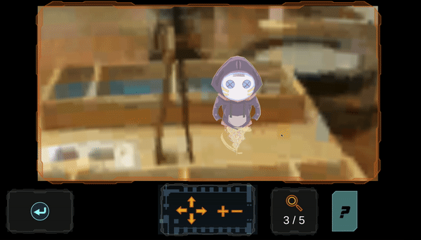

# User Interface Design & Unity Development

<cover-img>

</cover-img>

<design-meta>

###  MEDIUM

WebGL Desktop Game

###  WHEN

July, 2020

###  CLIENT
The Children's Museum of Pittsburgh

###  MY ROLE

UI Design, Unity Development

###  TEAM

Sitong Chen\
Amelia (Xi) Li\
Aiden (Chonghui) Sun

###  GOAL

Connect visitors' home computers to ARCADE Lab's AR experience at the museum

###  TOOLS

Adobe Illustrator\
Figma\
Unity

</design-meta>

<grid-container>

# OVERVIEW

MuseumLab, at the Children's Museum of Pittsburgh, has been closed for quarantine, and this includes ARCADE Lab's augmented reality works located inside.

ARCADE Lab wanted to develop a game for visitors' home computers that connected them to the AR experience at the museum.

<button-link href="https://johnchoi313.github.io/TechLab-WebGL/">VISIT GAME DEMO</button-link>

# UX SOLUTION

##  Glitches in the Museum

A spy game that casts you as a security guard, trying to remotely help some invasive glitch characters play with the activites in MuseumLab

<browser-container>

</browser-container>

Players play as a security guard seeing the closed museum space through cameras.

Colorful glitches have appeared throughout the space, and the player must find and help each of them, just as the museum would help any visitor.

<browser-container>
<figure>

<figcaption>Soundbooth Scene: Players must help the Glitch with the sound mixer</figcaption>
</figure>
</browser-container>

<text-pair>

<h4>

In my role, I developed a custom set of UI elements for Unity as well as a small set of 2D animations for the interface.

</h4>

</text-pair>

###  Players may zoom in on our characters and the photosphere, Google-Streetview style portal into the museum.

<browser-container>
<figure>

<figcaption>A Glitch was discovered!</figcaption>
</figure>
</browser-container>

Glitches are hidden at first, but a handy spyglass will reveal them!

<browser-container>
<figure>

<figcaption>Individual Camera View: Discovering a Glitch</figcaption>
</figure>
</browser-container>

Players get their daily mission brief and login when they first join, just like showing up to work as a real security guard.

<browser-container>

</browser-container>

# BACKGROUND

##  Pivot from Augmented Reality

This work is a spin-off from ARCADE Lab's augmented reality creative annotation platform in development for MuseumLab.

<text-pair>

<h4>

That project features colorful characters and a breadth of 3D world-building tools, shared in augmented reality across multiple devices. It leverages new position sensors installed at MuseumLab to accurately position objects in AR for multiple players.

</h4>

</text-pair>

<!--  -->

<h4>

These same sensors were used to place [Jordan Wong's digital mural](https://www.facebook.com/events/childrens-museum-of-pittsburgh/wongface-at-childrens-museum-of-pittsburgh/2394319897336149/) inside the museum.

</h4>

</img-pair>

# UX PROCESS

##  User Experience Design

Our first step was to model the visitor experience in a user flow diagram, from first learning about glitches appearing at the museum, to completing the game and making the final connection to a future AR experience.

  

##  Prototyping UI Design

This user flow was useful for reaching consensus with our developers for the goals of our game too!

###  We then began developing moodboards and sketching low-fi prototypes for the UI:

We chose a sci-fi aesthetic to immerse players in a world that collapses technical glitches and physical space.

###  Next, we developed mid-fi prototypes of the layout and interactions:

<full-width-image>

</full-width-image>

###  We adapted our mid-fidelity prototypes into hi-fi mockups, which we used to export assets to Unity.

<browser-container isPrototype="true">

</browser-container>

<browser-container>

</browser-container>

<button-link href="https://www.figma.com/embed?embed_host=share&url=https%3A%2F%2Fwww.figma.com%2Fproto%2Fv7lov8OfgSkTDurVtqygAU%2FARCADE-User-Flow%3Fnode-id%3D140%253A1626%26scaling%3Dmin-zoom&chrome=DOCUMENTATION">VIEW PROTOTYPE</button-link>

  

###  We aggregated these assets into a style sheet:

We used this style sheet as the basis for novel assets we created as our developers and project managers added new features to the game, including this surpise glitch to find at the game's end:

<browser-container>

</browser-container>

</grid-container>