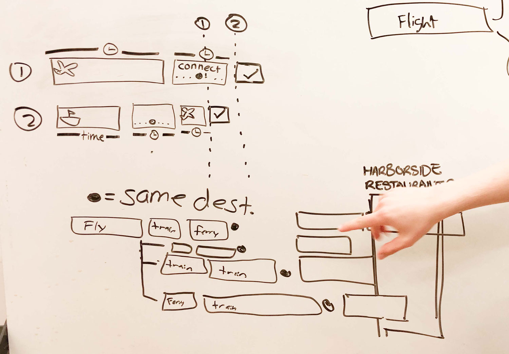

#Data Driven Display Study

<cover-img>

</cover-img>

<design-meta>

###WHAT

55" Wall-Mounted Display

###WHEN

October, 2019

###MY ROLE

Contributed to UX and UI Design\
Crafted all Animation

###TEAM

Hailey Motooka\
Parker Nussbaum\
Molly Schaefer

###GOAL

Encourage Transit through a Legible Data Display

###TOOLS

Figma\
Adobe After Effects

</design-meta>

<grid-container>

#UX CHALLENGE

##Three Transportation Methods, One Display

The San Juan Islands Atlantis Hub needs a new system of transportation displays to cope with the changing paradigm of travel in the region.

The client is interested in increasing inner-island travel in the area, across **three** transportation methods — planes, trains, and ferries — with a flexible travel plan: the **PTF Pass.**

#UX SOLUTION

##Dynamic Data-Driven Display

<!-- For all our users, we present 12 hours of travel options in our main screen.

For our paying passholders, we show them a special planning page and map-based interaction to streamline their journeys. -->

<text-pair>

<h4>

We preview all travel options through a continuously moving display on our main screen:

</h4>

</text-pair>

<!-- `youtube: https://youtu.be/1Ybu5603k_w` -->

  

With a **time-block based display,** travellers easily compare arrival times and durations for different transportation methods with common destinations:

  

##PTF Earliest

To our paying passholders, we offer **PTF Earliest**, a quick overview of the fastest means to get to any San Juan Islands destination, accessible only with the PTF Pass.

<h4>

We give passholders the added value of **flexibility** to recover from canceled or delayed trips.

</h4>

</img-pair>

<text-pair>

<h4>

Our users needed a faster way to filter through our data. We conceived of a control that would let users quickly bring up potential journeys based on arrival time.

A printed map is mounted below each of our displays. It’s activated by electronics embedded in the PTF pass itself...

</h4>

</text-pair>

<h4>

...When a user taps their pass to the map, a digital footer temporarily appears at the bottom of the main screen.

It's cut right from the PTF Earliest Page: the earliest possible flight, ferry, or train to their destination of choice.

</h4>

</img-pair>

<text-pair>

<h4>

We put the perks of the PTF Earliest Page into the pass itself.

In our design, the physical pass is the key to our interactive map. We aimed to strengthen the PTF brand by embodying the essential ways it benefits its passholders—fliexible travel, easy scheduling, and exclusive journeys—in the object of the pass itself.

</h4>

</text-pair>

#UX PROCESS

##User & Stakeholder Alignment: Easier and More Flexible Travel

<!-- To prioritize flexibility, we decided it was key to incorporate all three forms of transportation into our display.

We built our display by first modelling the existing data, which fell into categories that differed for each transportation method:

We identified categories common across planes, trains, and ferries that were useful for the **functions** of everyday transit, and we selected a few others that contributed to a sense of **connectivity.**

 -->

  

##Beyond the Standard

From our stakeholder needs, it seemed like having a good sense of connections and time-management were priorities, and could be addressed through a display similar to a calendar:

  

##Web Calendar Model

<figure>

<figcaption>Time blocks represent “events” — in this case, flights, train rides, and ferry rides.</figcaption>
</figure>

One clear advantage of representing trips in this way: **The entire duration of travel is captured in the time blocks.** 

<figure>

<figcaption>We organized the time blocks by destination, and included every possible way a traveler could get there by any form of transportation.</figcaption>
</figure>

  

##Diverging Designs: Three Explorations

We wanted to branch off from this first prototype by re-incorporating other stakeholder needs, individualizing displays and better highlighting trip connections and durations.

**Augmented Reality**

<figure>

<figcaption>Travellers could filter for their specific travel interests with mobile-based AR.</figcaption>
</figure>

**Circuit Board Display**

<figure>

<figcaption>We could prioritize the visibility of connections over showing all possible routes.</figcaption>
</figure>

**Circle Travel**

<figure>

<figcaption>A radically different design, we could place the destination at the center of a time-blocks circling as if around a clock.</figcaption>
</figure>

Feedback from these initial designs pushed to incoporate more user-needed data, like flight status.

  

<h4>

We switched to portrait-orientation to account for additional data columns like flight status as well as overlapping flights.

</h4>

</img-pair>

<text-pair>

<h4>

We developed a map as the clearest way to show connections between destinations.

</h4>

</text-pair>

#UX SOLUTION

##Using Motion to Expand Our Display

To comprehensively address all the data points we needed to show our users, we used motion to expand the size of our display beyond the space of our target screens.

<h4>

Users know to look for the journeys by destination and then by flight number or gate, but then how they interpret our “new” time blocks display? How do they know to wait to see time blocks extending off the edge of the screen?

We dropped the distinct pauses on different sections of our display in favor of a continuous motion, forgoing the need to otherwise feedforward that more data will soon be displayed.

</h4>

</img-pair>

##Flexibility, Empowerment, and Luxury

These parts of the PTF experience we wanted to emphasize in our pitch. Using the theme of “visualizing and taking control of your time,” we discussed how our display supports flexible, empowered, and luxurious travel.

We developed our pitch around these insights:
1. Contemporary displays don’t visualize time effectively.
2. This makes it difficult to make complicated or emergency plans inducing stress.
3. Visualizing time in the form of blocks can reduce stress by making emergency and complicated rescheduling easier. 

</grid-container>