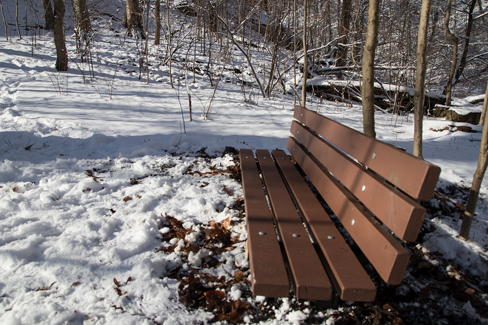

This bench, manufactured by the artist, was installed off of Tranquil Trail in Frick Park, Pittsburgh, PA, near the Homewood Cemetery.

It is oriented towards two, frequently overlooked structures in the park — a block of cement presumably left behind from the construction of the Forbes Ave. bridge and one of several lean-tos (maker unknown) that can be found around the park.

Simultaneously, it infiltrates the heavily used set of structures in Frick Park by passing as one of its public benches. As a look-alike to the official park benches while pointing towards this pair of unofficial structures, the bench is thus a physical mediation between these separate experiences of the park: one on the city-made trail and one near the anonymous structures built well away from it.

From my sketchbook:

