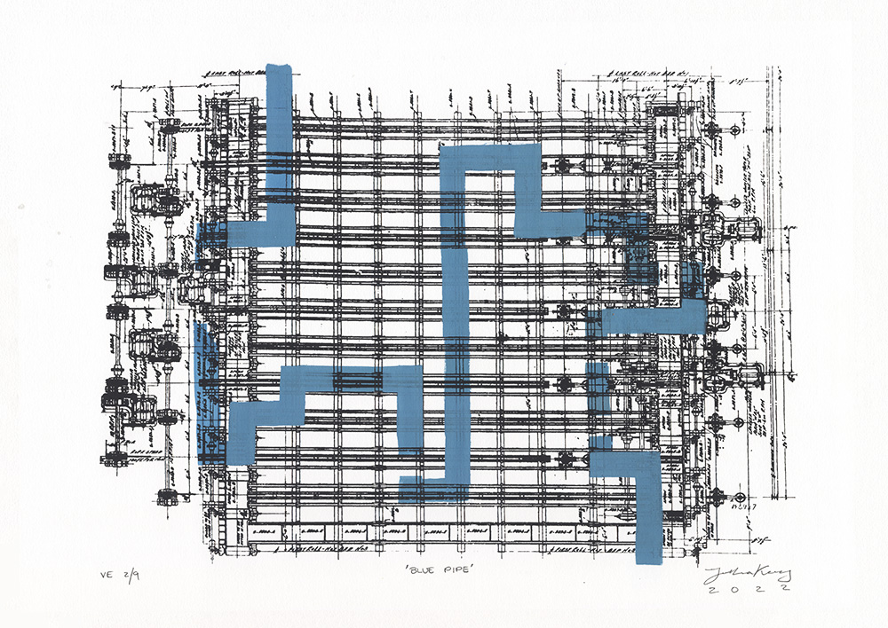
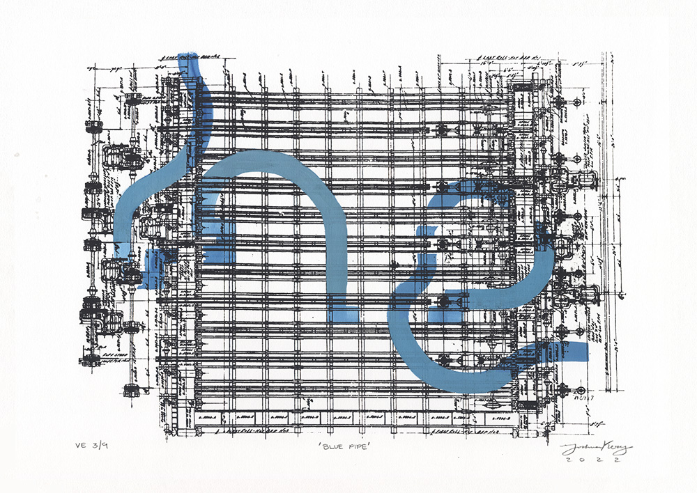
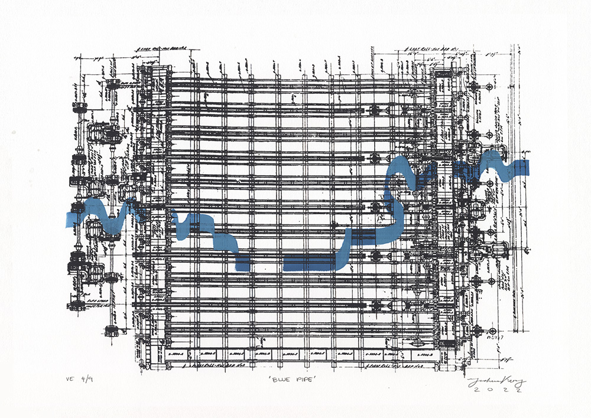
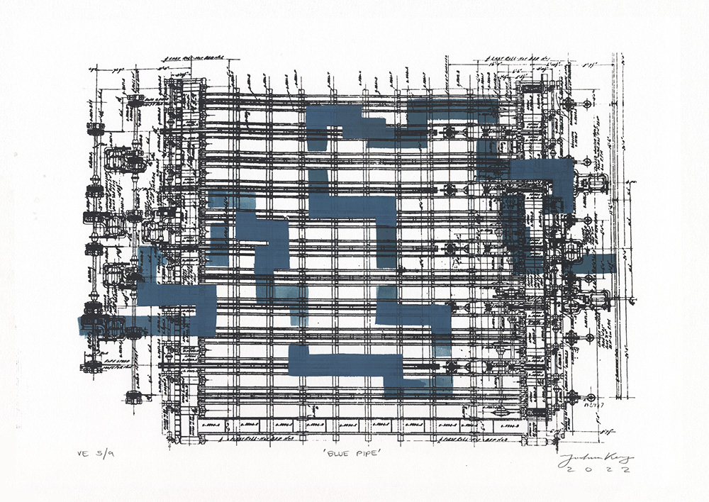
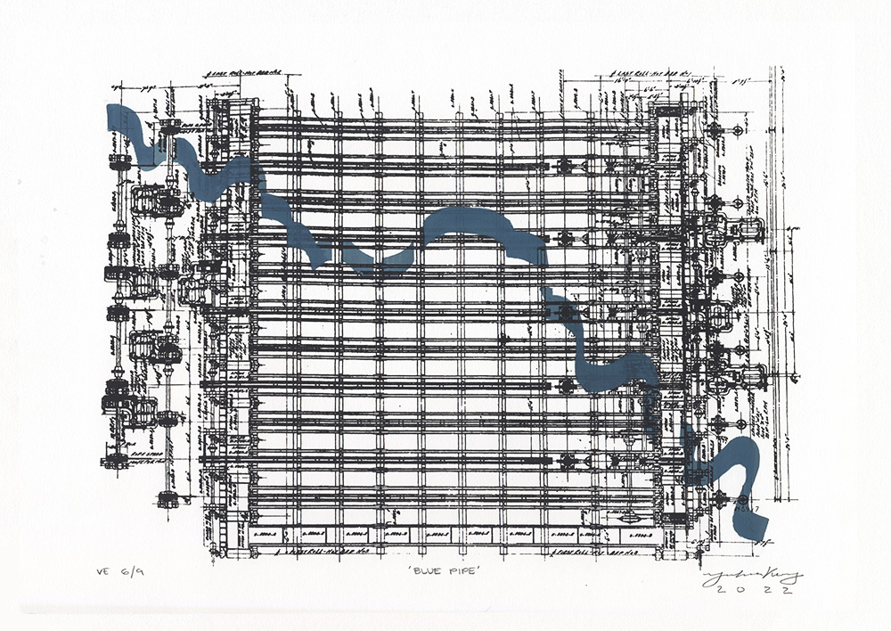
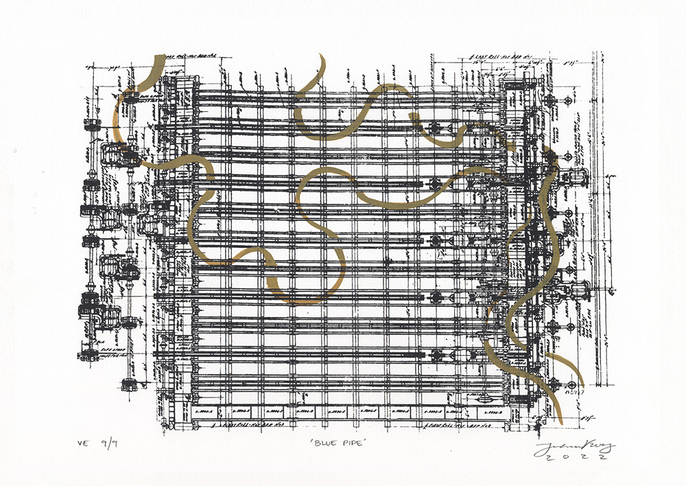

<group>
<c4>

</c4>
</group>

<group>

</group>

<group>
<c4>

</c4>
</group>

<group>
<c4>

</c4>
</group>

<group>

</group>

<group>

</group>

<group>
<c4>

</c4>
</group>

<group>
<c4>

</c4>
</group>

<group>
<c4>

</c4>
</group>