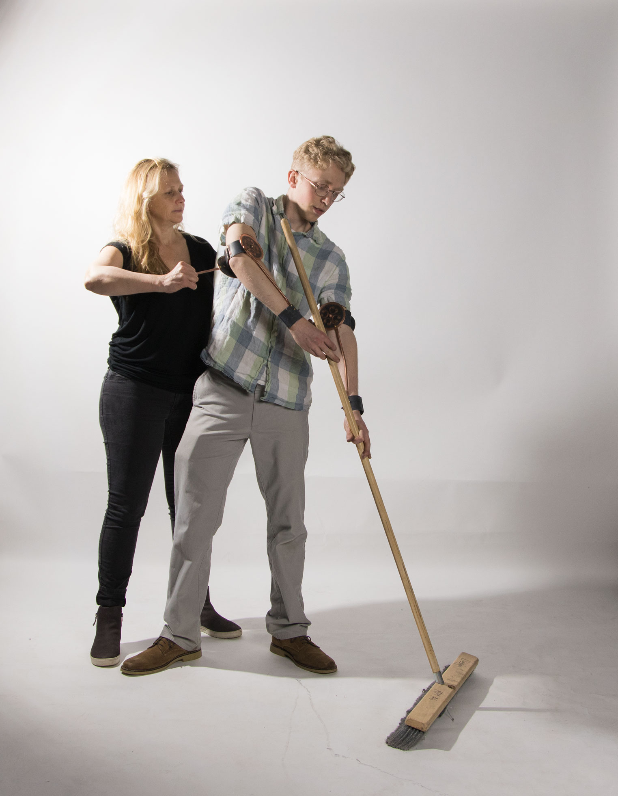
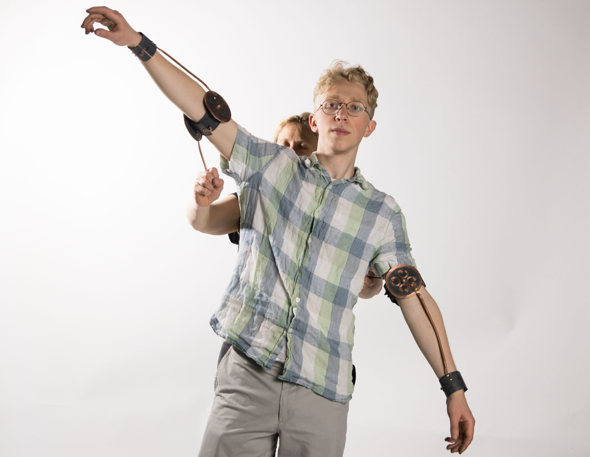
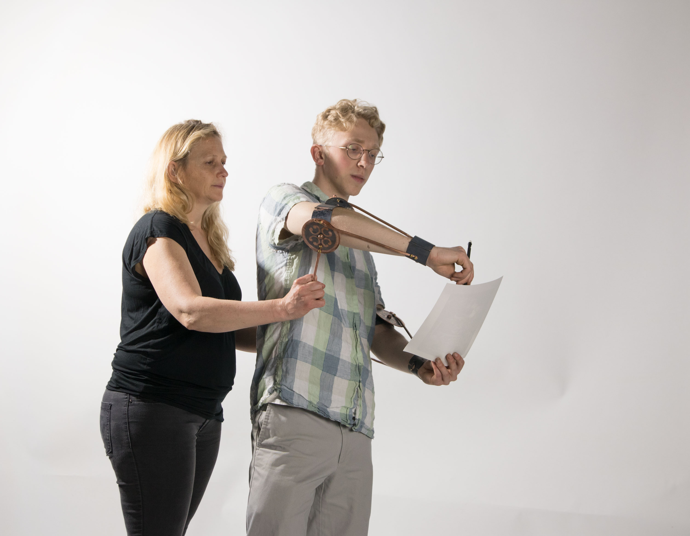
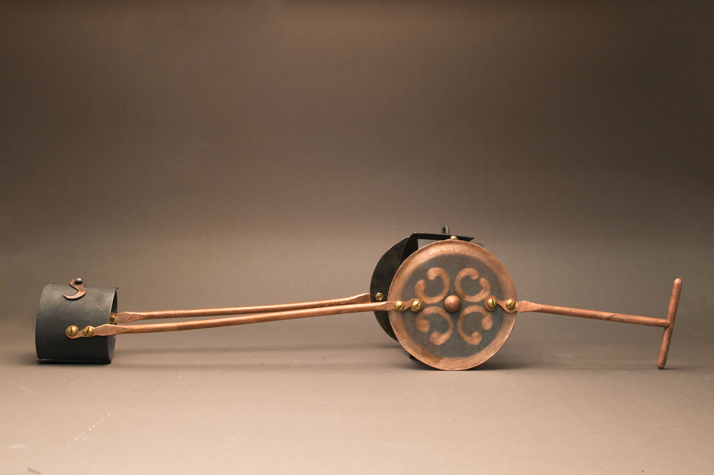
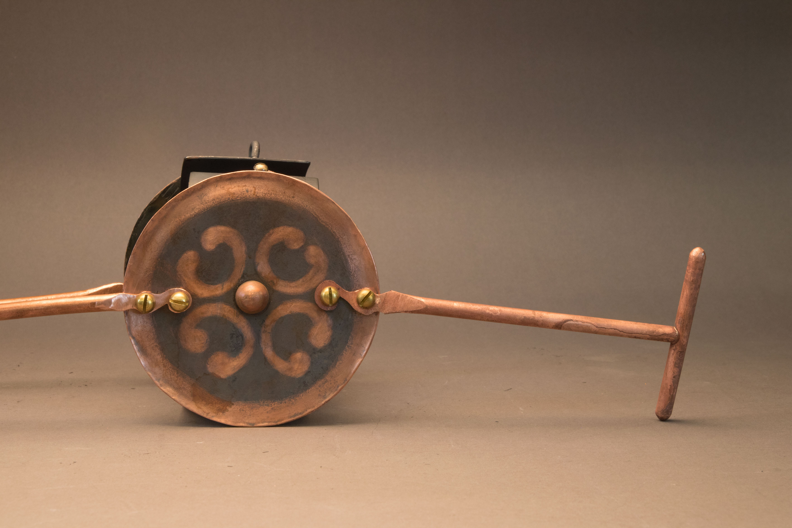
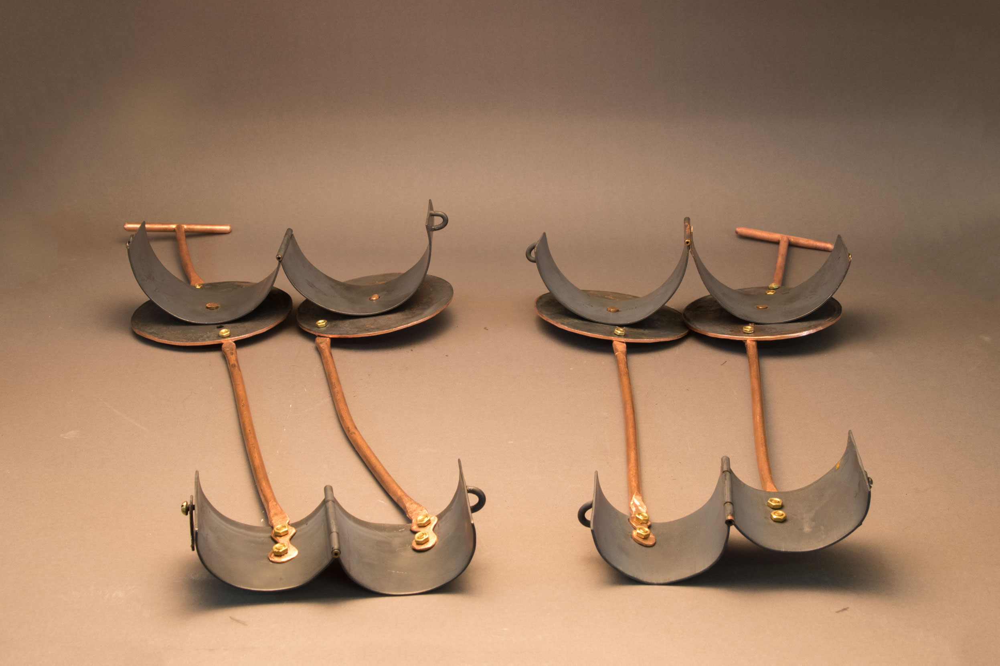
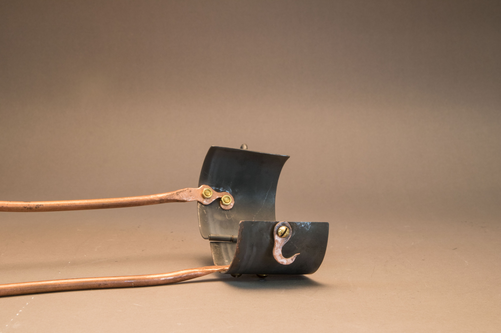
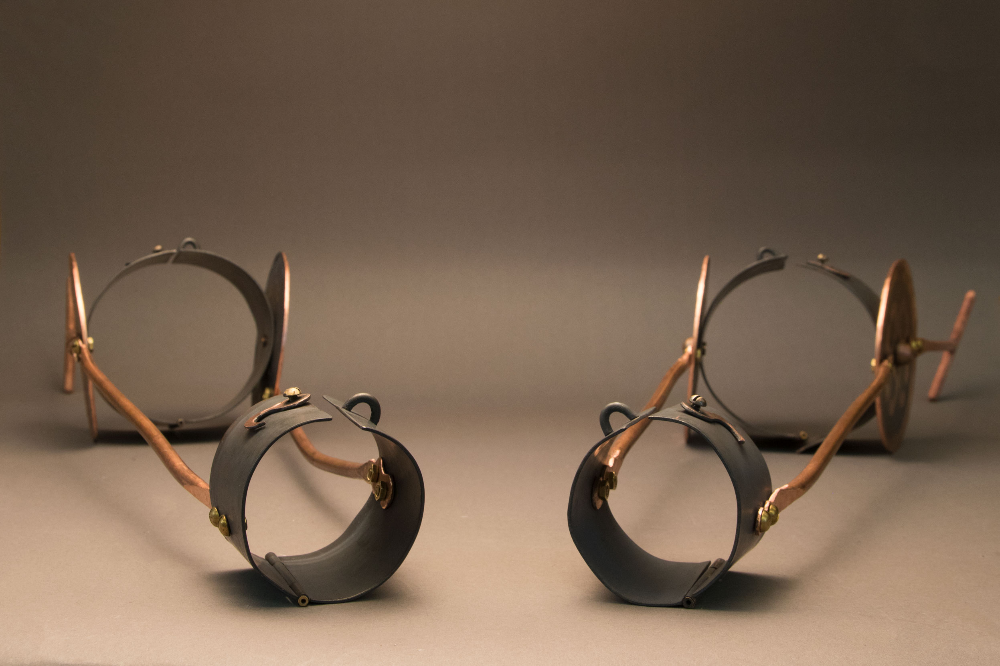

`youtube: https://www.youtube.com/watch?v=ubEUY7Nk0k8`

I often consider how I can trace my own behavior and artistic skill back to my parents.

I wore these 'machine' braces, with handles attached at the elbows, and asked my mother to use them to puppeteer me in the tasks of writing and sweeping.

If I were a machine, then my parents, both artists themselves, are my operators; they have programmed my daily actions and practice because they have taught me to work, to read and write, and to draw. This piece intends to shorten the distance of time and space by which I see my parents 'programming' my practice.

