<group>
<video-container>

`vimeo: https://vimeo.com/378954351`

</video-container>
</group>

<group>
<l3>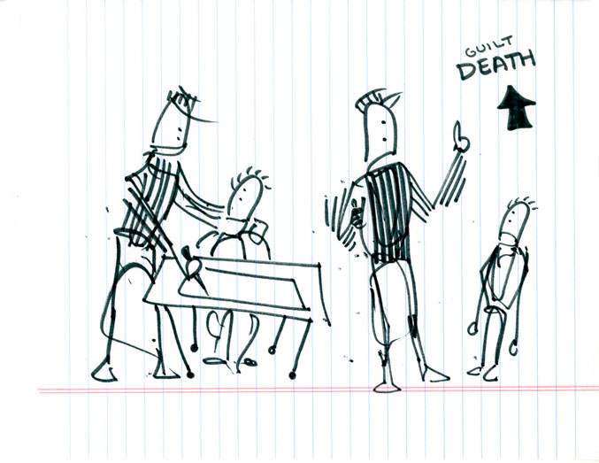</l3>

<l2>
<textbox>
"Brakeman" is an animation I developed in the Fall of 2019 out of a project of learning to draw technical drafts from my grandfather. Its story is a fictional account of an accident that happened to my grandfather's father, Frank "Tex" Kery, and his friend while they were working at Bethlehem Steel.
</textbox>
</l2>
</group>

<group>
<h5>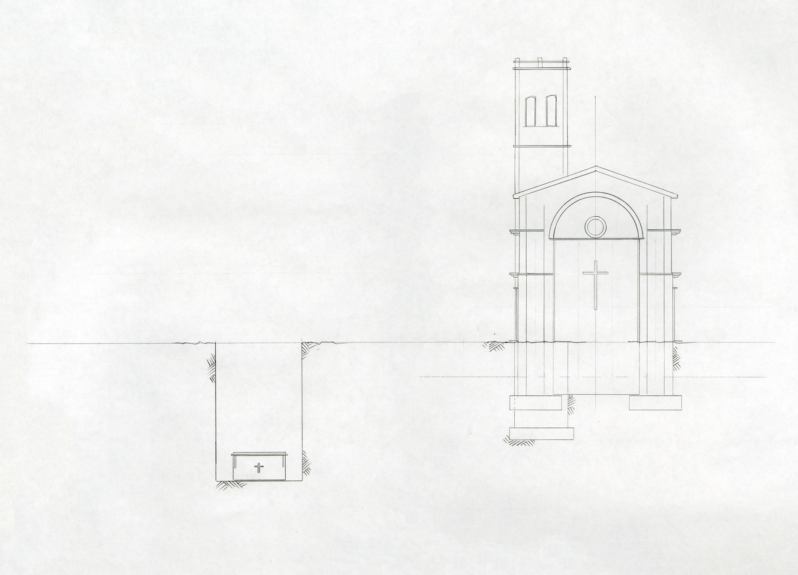</h5>
</group>

   

<group>
<r2>
<textbox>
The details of this story are my own invention, but my great-grandfather's friend really did lose his life working for the steel plant.
</textbox>
</r2>
</group>

<group>
<r3>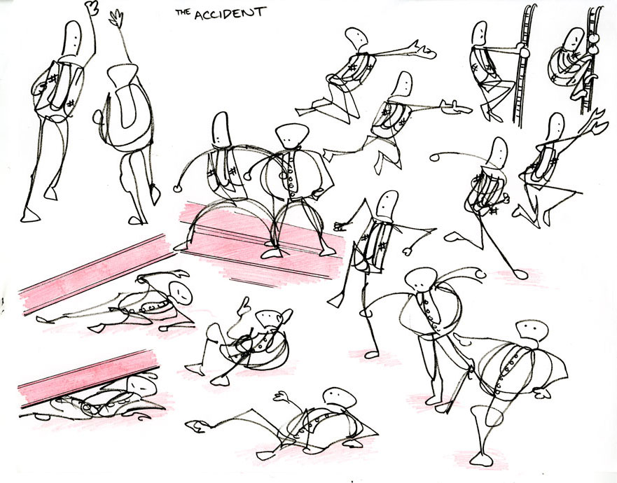</r3>
</group>

<group>
<h5>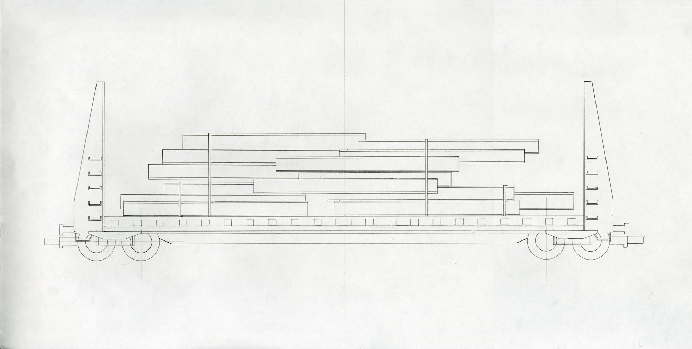</h5>
</group>

   

<group>
<c2>
<textbox>
The environments are hand-drawn, pencil on paper drafts inspired by the technical style of draftsmen-designers at Bethlehem Steel.
</textbox>
</c2>
</group>

<group>
<h5>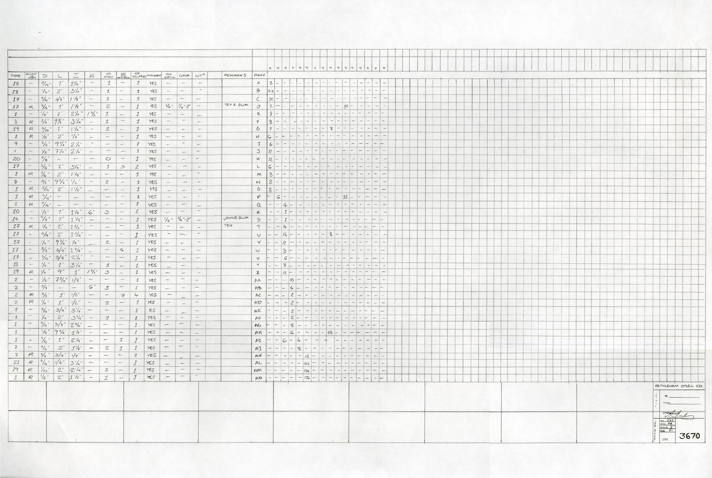</h5>
</group>

<group>
<h5>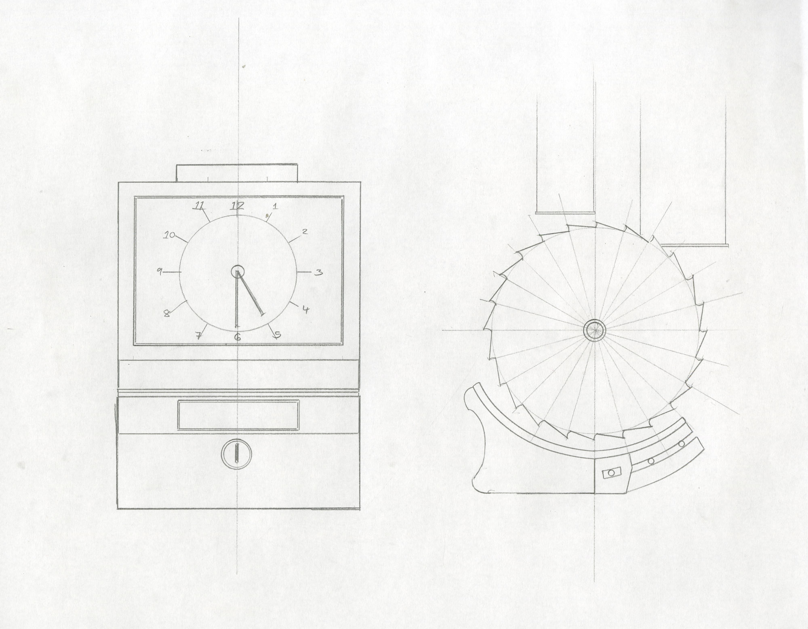</h5>
</group>

<group>
<h5>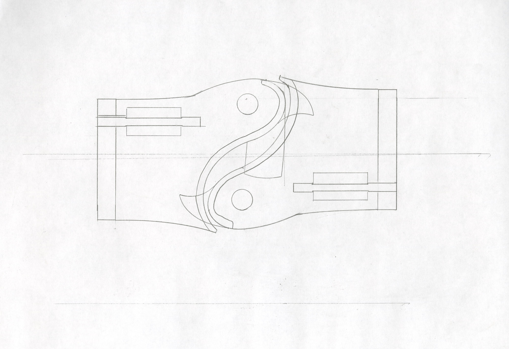</h5>
</group>

<group>
<h5>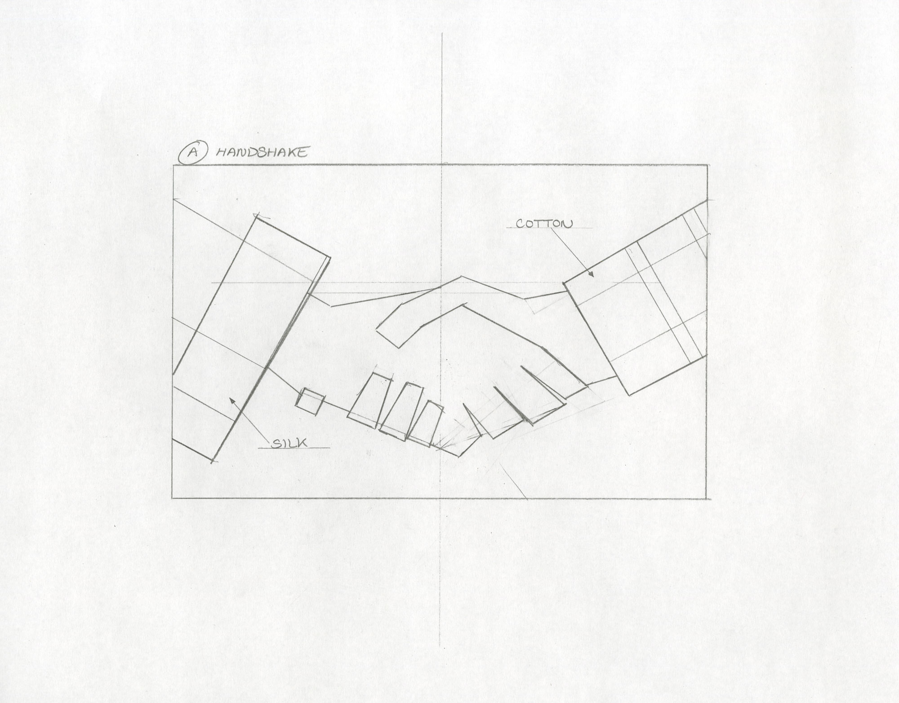</h5>
</group>

<group>
<h5>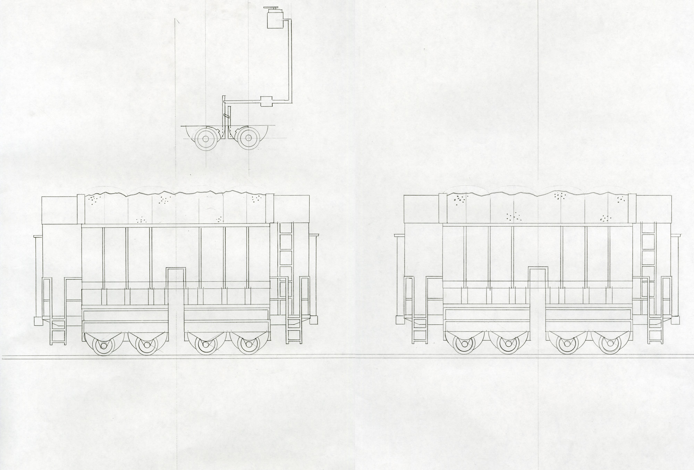</h5>
</group>

   

<group>
<l2>
<textbox>
The style of the characters was initially inspired by the gestural figure drawings in architectural drafts.
</textbox>
</l2>
</group>

<group>
<c4>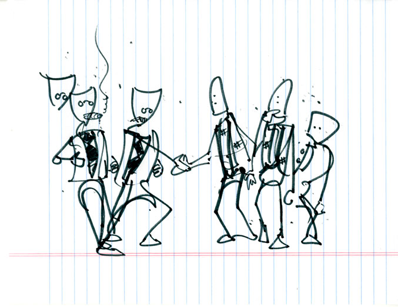</c4>
</group>

<group>
<l4>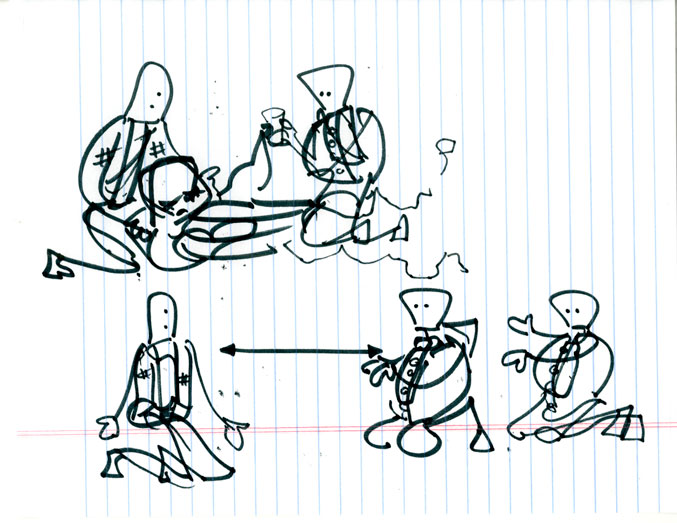</l4>

<c4>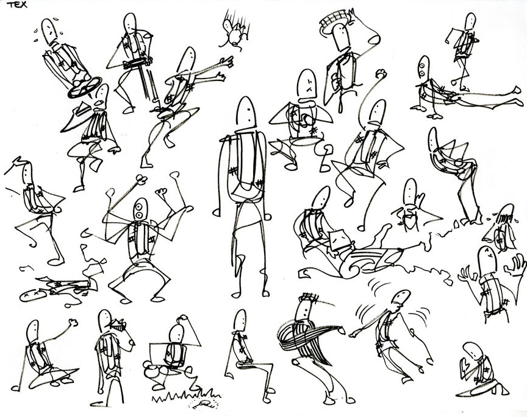</c4>
</group>

   

<group>
<l2>
<textbox>
Samples from the animatic:
</textbox>
</l2>
</group>

<group>
<h5>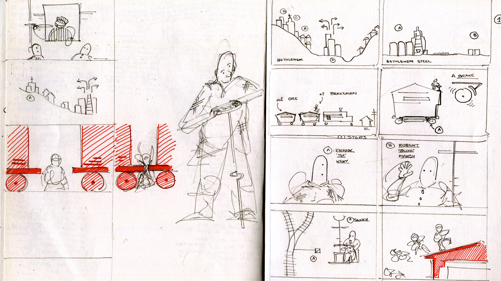</h5>
</group>

<group>
<l4>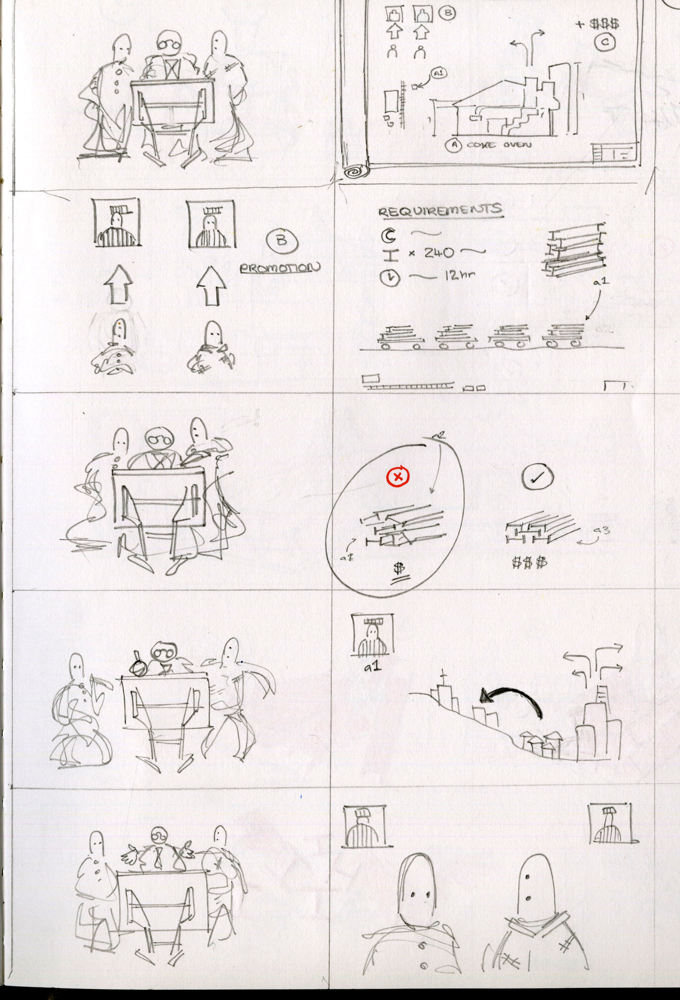</l4>

<h5>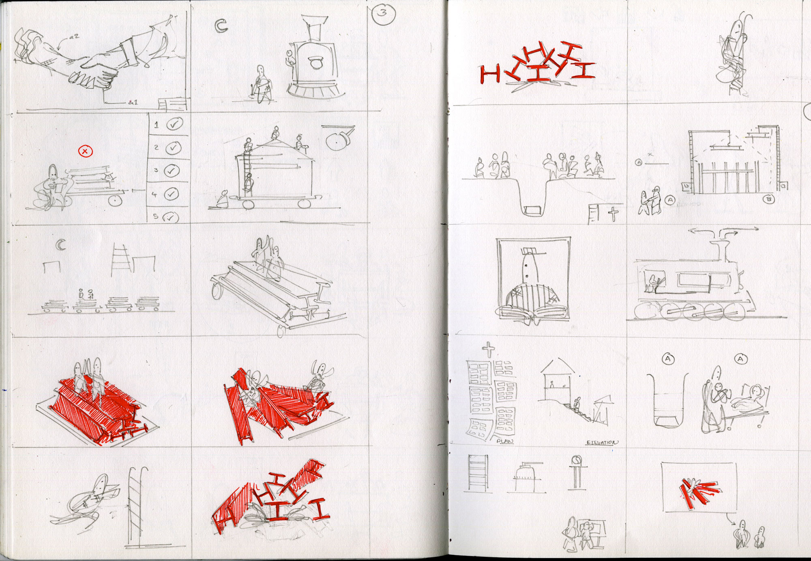</h5>
</group>

