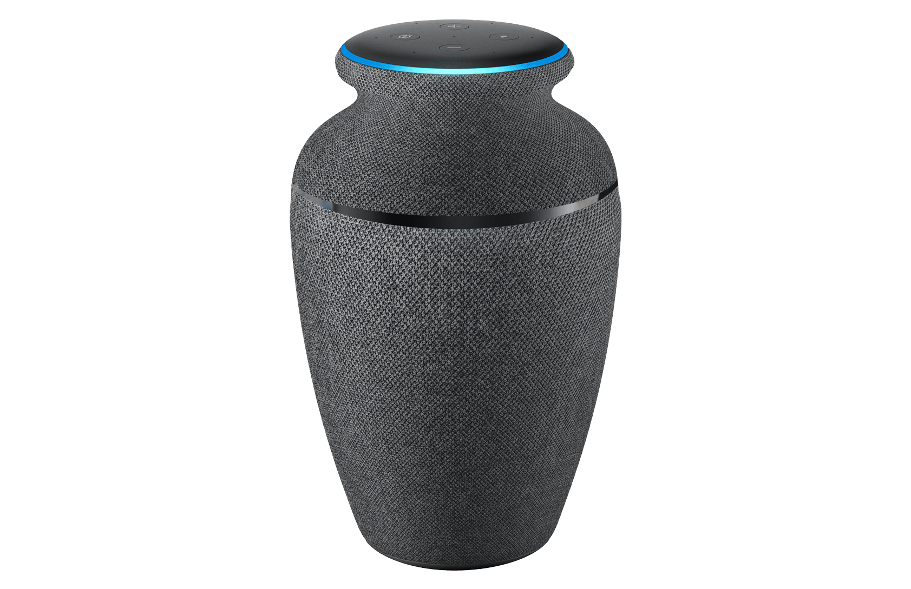
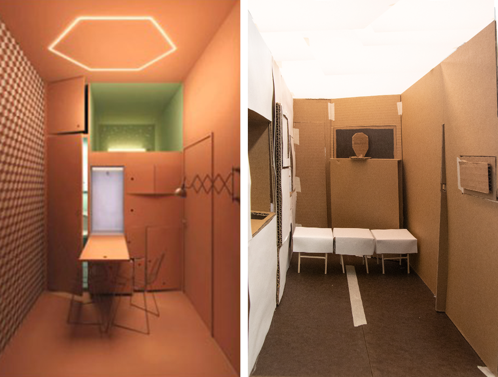
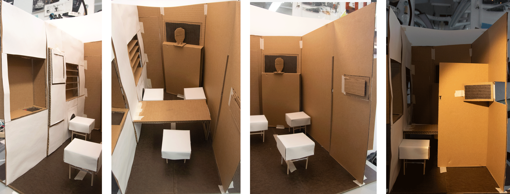
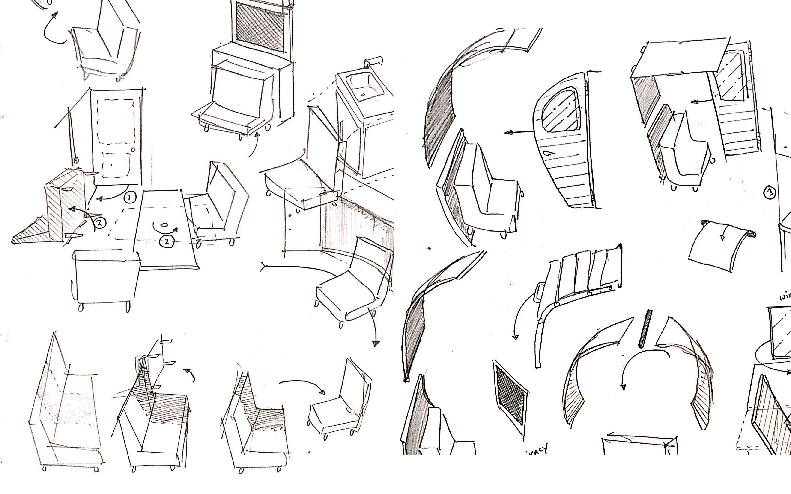
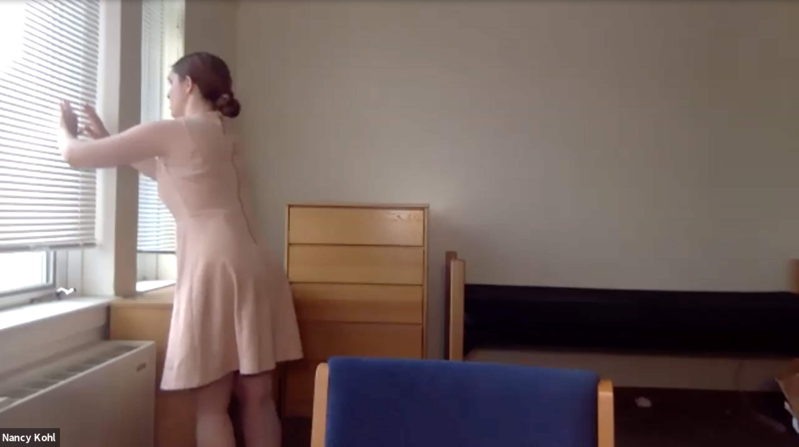

#Writing and Production

<cover-img>

</cover-img>

<design-meta>

###WHAT

Remote Performance

###WHEN

May, 2020

###MY ROLE

Writer\
Set & Costume Designer

###DESIGN COLLABORATORS

Lumi Barron\
Hannah Fitzgerald\
Shori Sims

</design-meta>

<grid-container>

##Recording

`vimeo: https://vimeo.com/414793308`

  

##Playbill

Produced by New Works Coffeehouse

Directed by Sabrina Zanello Jackson

Written by Josh Kery

Cast:
- Nancy: Jacqui Fashimpaur
- Emmett: Darien Weems
- Diana: Julianna Austin
- Max: Ayda Ozdoganlar
- Howard: Reece Grover

 

Stage Manager: Annika Evens

Tech: Brian D Yeskey (CMU Media Services)

Artistic Directors: Rebecca Enright & Bryanna Walker

Costume Designers: Hannah Fitzgerald & Josh Kery

Set Designers: Lumi Barron, Shori Sims & Josh Kery

This project was supported in part by funding from the Carnegie Mellon University
Frank-Ratchye Fund For Art @ the Frontier and the Residency in Your Room Fellowship.

  

  

##Synopsis

Now that human memories are completely converted to digital files, we can remember everything. Real-world limitations on resources and space, however, mean that our long-term memories come at immense financial cost.

So like all of us, the Kohl family faces a decision when they lose their father but not his memories. His life’s recordings are stored on an Amazon Urn ® that’s too expensive to keep. The mother of the family wants to donate the memories to The Museum of Family Records, which is more than happy to take them. But her children are still attached to what they have left of their Dad. It’s the day of the donation, and someone must decide what to do with their father.

  

##Original Set Design

The set was designed as a highly compact living space that would fit inside the living room of a residential home in Pittsburgh, the intended performance venue.

The set design captured the modularity and tidiness invoked by the media celebrity of Marie Kondo and our trending fascination with simplification and storage.

It featured a three-part modular couch, a pull-down table, and a sliding wall used to create a privacy booth in the home.

</grid-container>