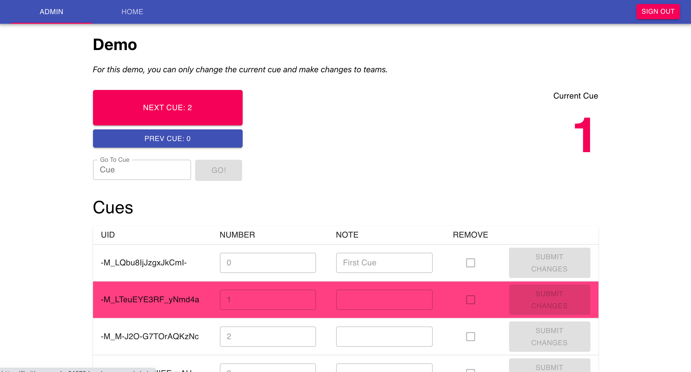

#Codebase for a browser-based cue system

<cover-img>

</cover-img>

<design-meta>

###WHAT

Queue-based cue system for triggering real-time changes to an audience-facing webpage

###USE

Interactive web performances

###WHEN

April - May 2021

###MY ROLE

Design\
Development

</design-meta>

<grid-container>

#OVERVIEW

##Sharing back the work I did for [Packing and Cracking](https://joshuakery.com/posts/packingandcracking/)

##I created this codebase to help others develop audience interactions for theatrical web performances

*Icon credit: https://thenounproject.com/bmijnlieff/*

#FINAL PRODUCT

<a target="_blank" href="https://github.com/joshuakery/interactive-cue-system"><h2>Github</h2></a>

##Demo

<iframe src="https://limitless-sands-24279.herokuapp.com/home" height="800"></iframe>

</grid-container>