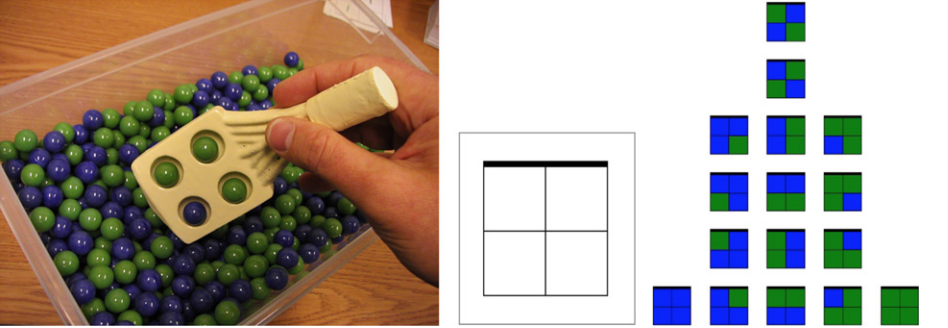

#Research on the Design-Based Research methodology

<cover-img>

*From Dor Abrahamson's ['Building educational activities for understanding,'](https://edrl.berkeley.edu/wp-content/uploads/2019/06/Abrahamson2014-IJCCI.pdf) an example of a design artifact.*

</cover-img>

<design-meta>

###WHAT

Research for a written piece about Design-Based Research

###WHEN

November 2020

###MY ROLE

Co-Author: Research & Writing

###CO-AUTHOR

Mimi Shalf

</design-meta>

<grid-container>

#ARTICLE LINK

##Coming Soon.

#OVERVIEW

##[Design-Based Research](http://www.designbasedresearch.org/reppubs/DBRC2003.pdf) offers a new lens for educators to see their design process.

##By considering how the designer contributes learning theories and design guidelines to the education community, it creates a new entry to well-worn approaches like Design Thinking, and highlights the power of participatory design like that taught by the [Cambridge D-Lab.](https://www.cpsd.us/office_of_curriculum_and_instruction/innovation_design_lab)

##This November, Mimi Shalf, the Education Programs Apprentice at [Design Museum](https://designmuseumfoundation.org/), and I conducted research for an article on Design-Based Research.

#RESEARCH

##The following people generously gave us their time to speak with us regarding their work and the questions raised by our research into Design-Based Research.

</img-pair>

[Angeline UyHam](https://www.linkedin.com/in/angeline-uyham-4151b2a3/)\
Co-Designer at Community Design Lab

 

</img-pair>

[Dor Abrahamson, Ph.D.](https://gse.berkeley.edu/dor-abrahamson)\
Professor of Cognition and Development in Berkeley's Graduate School of Education

 

</img-pair>

[Elizabeth Lin](https://www.linkedin.com/in/elizabethylin/)\
Founding Designer at Primer

 

</img-pair>

[Parth Shah](https://www.linkedin.com/in/parth-shah-4184b270/)\
Experiential Learning Manager at Lambda School

#RESOURCES

Our research list for this piece included:

1. Abrahamson, Dor. "Building educational activities for understanding: An elaboration on the embodied-design framework and its epistemic grounds." International Journal of Child-Computer Interaction, vol. 2, no. 1, pp. 1-16.

1. Austin, Bethany. "Design Thinking Vs Human-Centred Design: What’s the difference?" Medium, 2 Jan 2020.

1. Chen, Elizabeth, et al. "Enhancing Community Based Participatory Design." Health Promotion Practice, vol. 29, no. 1, 2019.

1. Cheng, Jiaming. How does a Gamification Design Influence Students’ Interaction in an Online Course? 2019. Syracuse University, PhD dissertation.

1. Chou, Yu-kai. "Points, Badges, and Leaderboards: The Gamification Fallacy." Yukai Chou: Gamification and Behavioral Design. 2014. Accessed 24 November 2020. https://yukaichou.com/gamification-study/points-badges-and-leaderboards-the-gamification-fallacy/

1. Christensen, Kimberly, and Richard E. West. "The Development of Design Based Research." Foundations of Learning and Instructional Design Technology, 1st ed., edited by Richard E. West, EdTech Books, 2018. 

1. Collins, Allan. "Toward a Design Science of Education. Technical Report No. 1." Center for Technology in Education, New York NY. 1990.

1. Deterding, Sebastian, et al. "From Game Design Elements to Gamefulness: Defining Gamification." Proceedings of the 15th International Academic MindTrek Conference: Envisioning Future Media Environments, MindTrek, 2011, vol. 11, pp. 9-15, 10.1145/2181037.2181040.

1. Edelson, D. C. (2002). Design Research: What we learn when we engage in design. Journal of the Learning Sciences, 11(1), 105-121.

1. Erickson, Alyssa, et al. "Gamification." Navigating Education Research, edited by Royce Kimmons, Simple Book Publishing.

1. Goldman, Shelley. Interview by Stanford Graduate School of Education. Interview with Tanner Vea. 

1. “How Does DBR Differ from Other Approaches?” Explanation - How Does DBR Differ from Other Approaches?, dbr.coe.uga.edu/explain02.htm.

1. Lauwers, Tom. Aligning Capabilities of Interactive Educational Tools to Learner Goals. 2010. The Robotics Institute, Carnegie Mellon University, thesis. 

1. Reimann, Peter. "Design-Based Research—Designing As Research." Handbook of Design in Educational Technology, edited by Luckin, Rosemary, et al. Routledge, 2013.

1. Rosenbaum, et al. "Shaping Perception: Designing for Participatory Facilitation of Collaborative Geometry." Digital Experiences in Mathematics Education, 15 May 2020.

1. Sailer, Michael, and Lisa Homner. "The Gamification of Learning: a Meta-analysis." Educational Psychology Review, vol. 32, pp. 77-112.

1. Sandoval, William & Bell, Philip. (2010). Design-Based Research Methods for Studying Learning in Context: Introduction. Educational Psychologist. 39. 199-201. 10.1207/s15326985ep3904_1. 

1. Smith, Kim. “Learning Beautiful: Building Computer Skills Without Computers.” Design Museum Everywhere, 20 May 2020, designmuseumfoundation.org/learning-beautiful/. 

1. “Some Examples of DBR” Explanation - How Does DBR Differ from Other Approaches?, http://dbr.coe.uga.edu/enact02.htm#references.

1. The Design-Based Research Collective. "Design-Based Research: An Emerging Paradigm for Educational Inquiry." Educational Researcher, vol. 32 no. 1 pp.5-8, 2003.

1. Tooke, Kate.  "Where Design Meets Play | A Research-Based Approach at Smale Riverfront Park." Design Museum Everywhere, 2018.  https://designmuseumfoundation.org/where-design-meets-play/

1. Udacity. "Design-Based Research." YouTube, 6 Jun 2016. https://www.youtube.com/watch?v=QoID5_JZHFk&ab_channel=Udacity

1. UyHam, Angie.  "Experimenting With Education: Cambridge Public Schools' Design Journey." Design Museum Everywhere, 2018. https://designmuseumfoundation.org/experimenting-with-education/.

1. Wexler, Natalie. "How classroom technology is holding students back." MIT Technology Review, 19 Dec 2019.

1. Zheng, Lanqin. "A systematic literature review of design-based research from 2004 to 2013." Journal of Computers in Education, vol. 1, pp. 399-420, 2015.

1. Zimmerman, John, et al. "Research Through Design as a Method for Interaction Design Research in HCI." CHI '07: Proceedings of the SIGCHI Conference on Human Factors in Computing Systems, pp. 493-502, Apr 2007.

</grid-container>