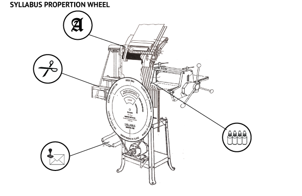

Digital Print.

This poster was designed after a series of conversations I had with my parents about their
graphic design practices.

This machine meets the specific need of my mother in her home office: to remove our family dog from the room automatically when he's bothering her.

My parents got their degrees in graphic design just before Apple and Adobe revolutionized the field in the 80s. At that time, a huge portion of the commercial printing and design process was outmoded — typesetting, lithographic printing, and crucially, designing with pens, knives, and paste.

This project was a meditation on what this shift meant for my parents. What they had been taught in school was quickly being phased out. And while they adapted to the computer — both do their design work digitally today with ease; my father teaches web design part-time — in my mind the PC revolution precipitated deeper changes to their practices that they have struggled to grapple with. The new way of working favors designers who can make a faster turnover between software tools, who can work for less, and much more quickly.

My parents have difficulties in their ways of working that I wanted to pair with the typesetting, chemical printmaking, and paste-up machines that were left behind by the design field. How could these machines be imaginatively repurposed to work again in my parents' favor? What will the print media that instructs in their maintenance and at the same time provides their livelihood look like?

