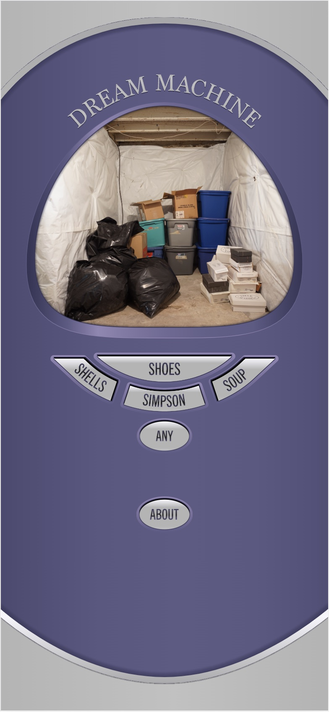
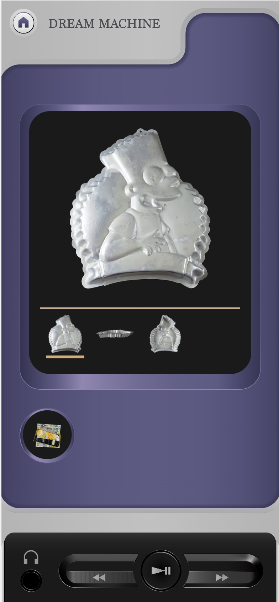
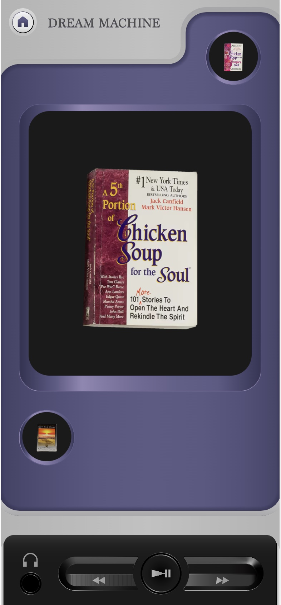
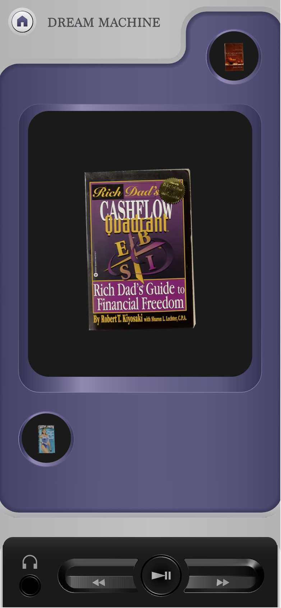

<group>
<button-link href="https://joshuakery.github.io/dream-machine/">OPEN DREAM MACHINE</button-link>
</group>

<group>
<multi-mobile-container title="Screen shot on iPhone from Dream Machine">
<mobile-container>

</mobile-container>
</multi-mobile-container>
</group>

<group>
<r3>
<textbox>

*Dream Machine* is a web-based archive of objects left behind from my cousins’ eviction from their house. The objects were too valuable to throw away but not precious enough for my family to keep with them when downsizing. They were instead stored in my mother’s basement for 10 years, where many were damaged by flooding.

</textbox>
</r3>
</group>

<group>
<multi-mobile-container title="Screen shot and recording at 4x speed on iPhone of Dream Machine">
<mobile-container>

</mobile-container>
<mobile-container title="">

</mobile-container>
</multi-mobile-container>
</group>

<group>
<l3>
<textbox>

This archive’s digital nature underscores this story of dispossession and decay. While I can preserve and share the memory of these objects through the technologies of digital photography and the Internet, the archive is also a reminder that my family’s physical home and possessions are lost.

</textbox>
</l3>
</group>

<multi-mobile-container title="Screenshots on iPhone from Dream Machine">
<mobile-container>

</mobile-container>
<mobile-container>

</mobile-container>
</multi-mobile-container>

<group>
<c3>
<textbox>

Conversely, the digital archive is also a creative tool. Through a process new to me, I built the web application containing photographs first and then used it to search the collection and pair images with clips from family interviews. This work sequencing my family’s stories reflects their own past sense-making and storytelling after losing their home

</textbox>
</c3>
</group>

<multi-mobile-container title="Screen recording at 4x speed on iPhone of Dream Machine">
<mobile-container title="">

</mobile-container>
</multi-mobile-container>

<group>
<button-link href="https://joshuakery.github.io/dream-machine/">OPEN DREAM MACHINE</button-link>
</group>

