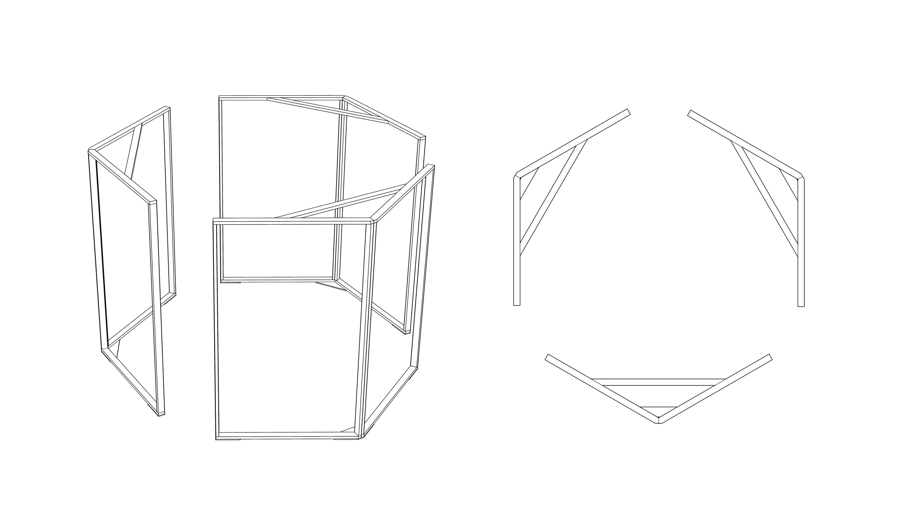
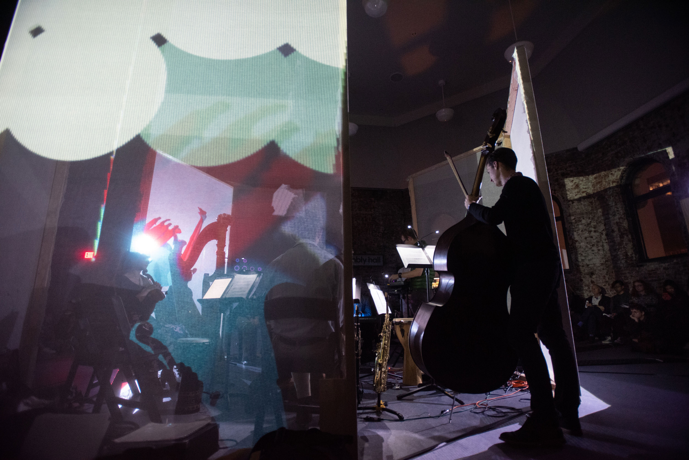
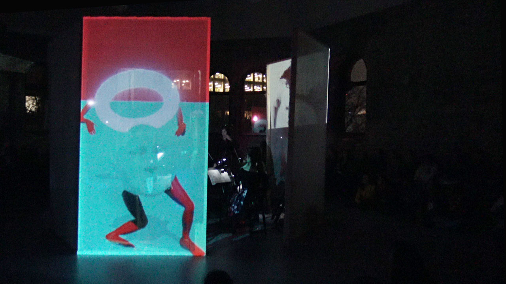

#Installation Design

<cover-img>

</cover-img>

<design-meta>

###EVENT

Live music, projected animation, and performance 

###WHEN

December, 2019

###WHERE

MuseumLab, Pittsburgh PA

###MY ROLE

Installation Design, Fabrication

###VISUAL DESIGN TEAM

Dave Choi\
Nick Diamant\
Selina Lee\
Katie Tender

###TOOLS

Rhino, woodshop

</design-meta>

<grid-container>

#OVERVIEW

##A site-specific music, art, engineering, and performance exhibition by graduate and undergraduate students from Carnegie Mellon University’s Integrative Design, Arts, and Technology (IDeATe) network.

##My team designed and developed the tower and projection mapping surrounding live musicians in the second half of the exhibition.

#

#DESIGN

##I designed and led the fabrication of the 10' tall frames surrounding the musicians.

Our team live mixed a collection of previously created animations with real-time 3D avatars, puppeteered behind-the-curtain by Nick Diamant:

Featured animations were created by the visual design team and our peers in *Animation Studio*.

#EVENT DETAILS

##Every Possible Utterance was produced through the collaboration of *Exploded Ensemble*, *Animation Studio*, and *Activating the Body: Physical Computing and Technology in Performance* (all Fall 2019).

The event's theme is based upon Jorge Louis Borges’ short story “The Library of Babel,” prompting a search for the possibility of meaning in randomness and the power of infinity.

The first half of the experience featured exploration and interaction, with sculptures, roving musicians, and performers from *Exploded Ensemble* and *Activating the Body*.

Audience members were invited to don 3D glasses in anticipation of the second half.

The second half presented projection art in concert with a live musical performance in MuseumLab's Assembly Hall.

*This exhibition was made possible by generous support from the Frank-Ratchye STUDIO for Creative Inquiry and CMU IDeATe at Carnegie Mellon University along with partners at MuseumLab.*

*Photographs courtesy of Sally Maxon and Christina Brown.*

</grid-container>