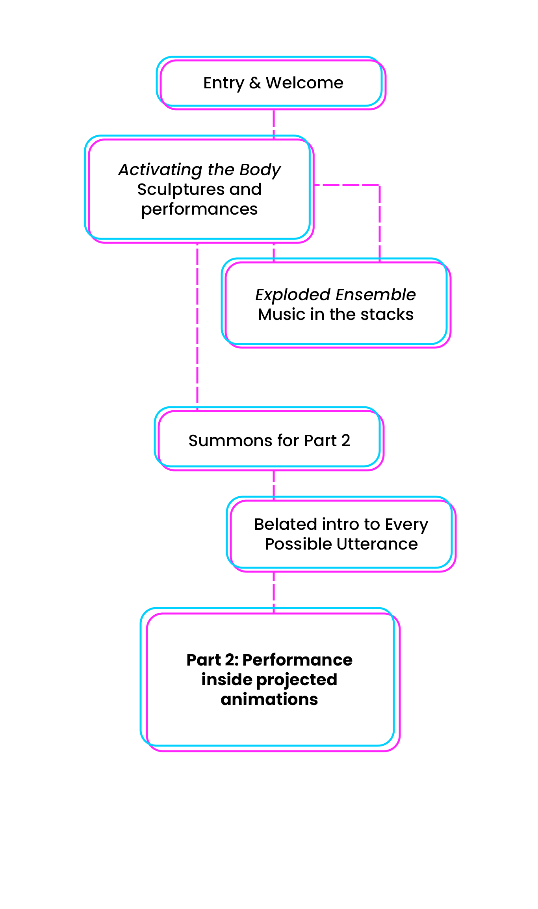
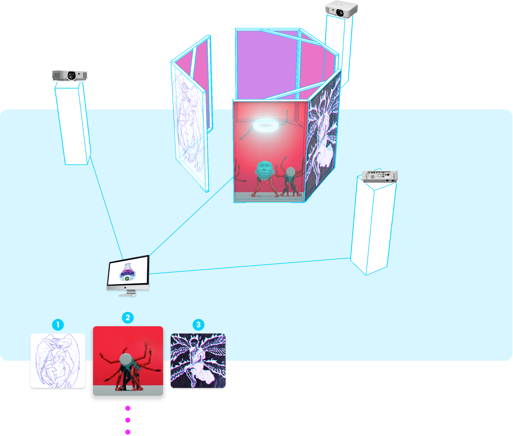
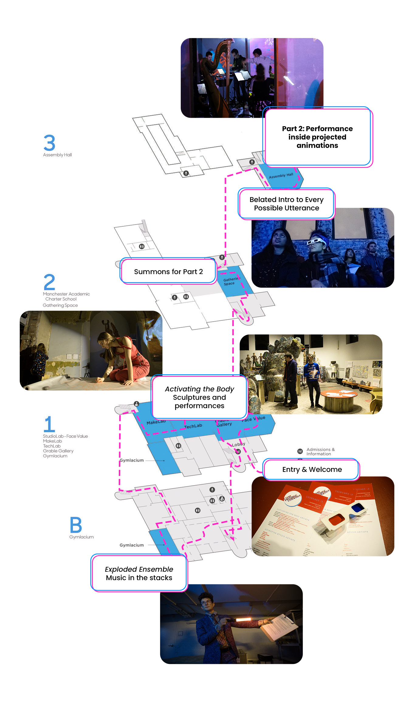

#Installation Design

<cover-img>

</cover-img>

<design-meta>

###EVENT

Live music, projected animation, and performance 

###WHEN

December, 2019

###WHERE

MuseumLab, Pittsburgh PA

###MY ROLE

Installation Design, Fabrication

###VISUAL DESIGN TEAM

Dave Choi\
Nick Diamant\
Selina Lee\
Katie Tender

###TOOLS

Rhino, woodshop

</design-meta>

<grid-container>

#CHALLENGE

##Combine the work of 20 animators, a body and performance course, and an experimental ensemble into a night of discovery and play.

##My team designed and built the tower and projection mapping surrounding live musicians in the second half of the exhibition.

#SOLUTION

<iframe title="vimeo-player" src="https://player.vimeo.com/video/588497528?h=4aa4a66aa2" width="640" height="360" frameborder="0" allowfullscreen></iframe>

 

##A free-standing frame of projected animations surrounds musicians from the Exploded Ensemble. The videos are remixed live in concert with the music.

 

#PROCESS

##I designed and led fabrication of the 10' tall frames surrounding the musicians.

Mockups of projection surface:

Our team live mixed with QLab a collection of previously created animations and a feed of real-time 3D avatars, designed and puppeteered behind-the-curtain by Nik Diamant.

<iframe title="vimeo-player" src="https://player.vimeo.com/video/588493208?h=7f2d47b5e9" width="640" height="360" frameborder="0" allowfullscreen></iframe>

  

<!-- 

 -->

Featured animations were created by the visual design team and our peers in *Animation Studio*.

#EVENT DETAILS

##Every Possible Utterance was produced through the collaboration of *Exploded Ensemble*, *Animation Studio*, and *Activating the Body: Physical Computing and Technology in Performance* (all Fall 2019).

The event's theme is based upon Jorge Louis Borges’ short story “The Library of Babel,” prompting a search for the possibility of meaning in randomness and the power of infinity.

The first half of the experience featured exploration and interaction, with sculptures, roving musicians, and performers from *Exploded Ensemble* and *Activating the Body*.

Audience members were invited to don 3D glasses in anticipation of the second half.

The second half presented projection art in concert with a live musical performance in MuseumLab's Assembly Hall.

*This exhibition was made possible by generous support from the Frank-Ratchye STUDIO for Creative Inquiry and CMU IDeATe at Carnegie Mellon University along with partners at MuseumLab.*

*Photographs courtesy of Sally Maxon and Christina Brown.*

</grid-container>