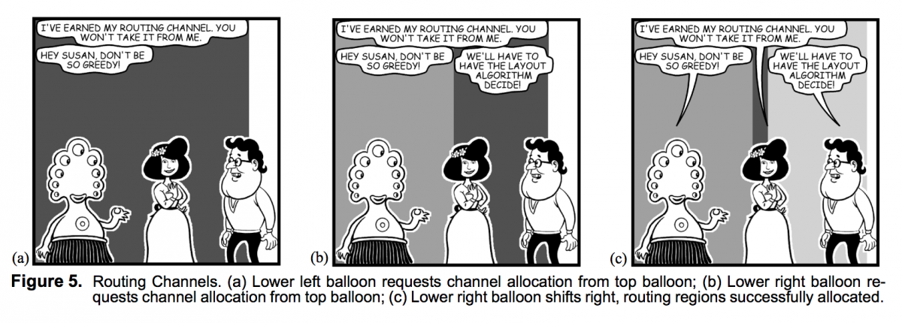

“Facetime Comics” transcribes spoken conversations over video chat in comic form.

"Facetime Comics" is based on Microsoft's Comic Chat from 1996. That software could be run on top of any compatible web chat, and it would take the text-based conversation and transcribe it as a comic. With my project, I wanted to revisit Comic Chat and apply to more ephemeral, spoken conversations. What excites me the most about it is the possibility of finding, among the character's generative reactions, accidental new meanings in the transcript of what's been said.

Microsoft published a paper on this project, which helped me implement my own, including the use of 'routing channels' to determine where characters are going to be placed:

My other inspiration for this work was Scott McCloud’s Understanding Comics, particularly his chapter on “Closure.”

We infer that the attacked happened in the space in between the panels.

McCloud considers the space in between panels, and how we read that space and infer what’s happening, as a unique quality of comics. He calls this “closure.” McCloud says that it’s present in video too, but at 24fps, the space in between “panels” is so little that the inferences we make between them are completely unconscious. Because of this, I think comics are a fitting transcription for video chat, as opposed to straight recording, because by limiting the frames shown, they open up the memory of the conversation to new interpretations.

