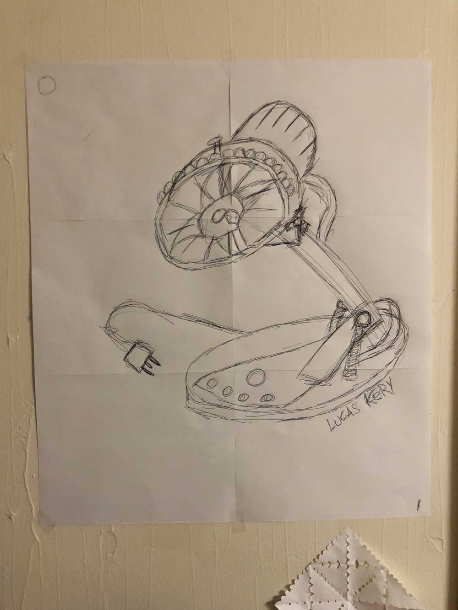
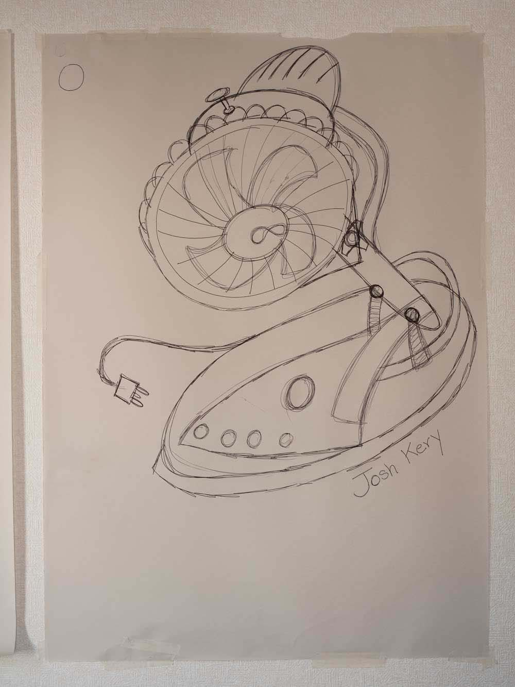
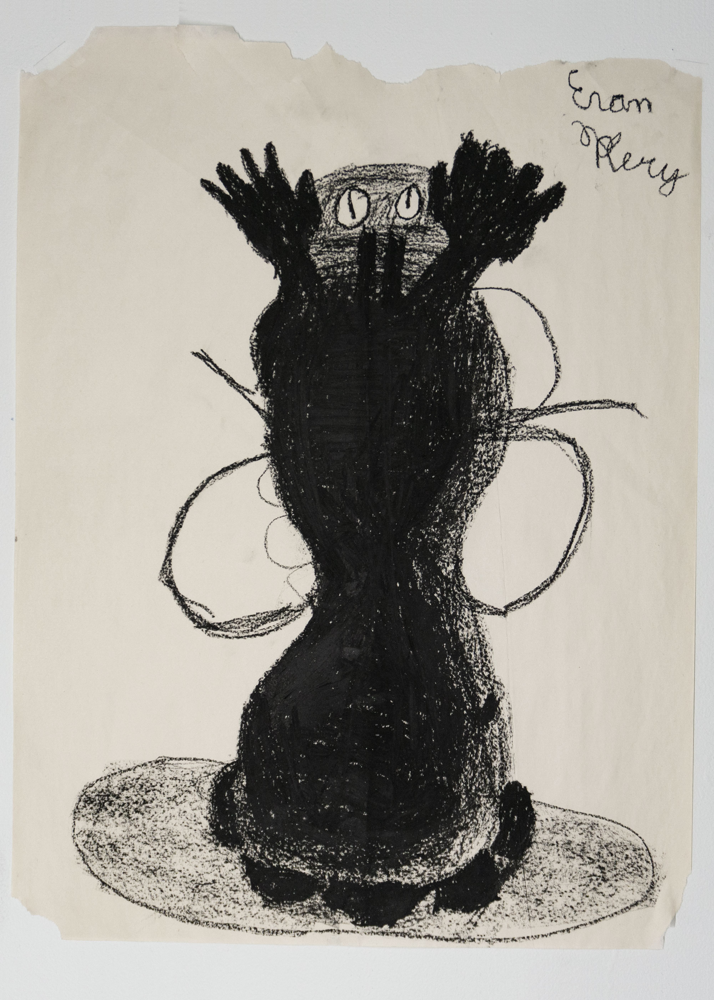
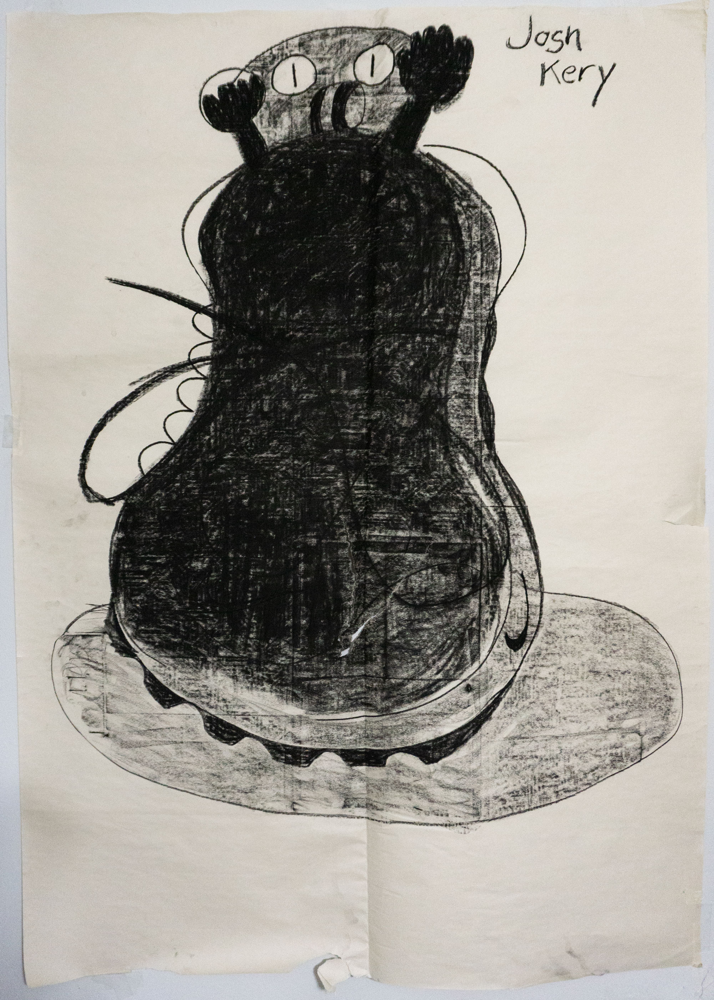
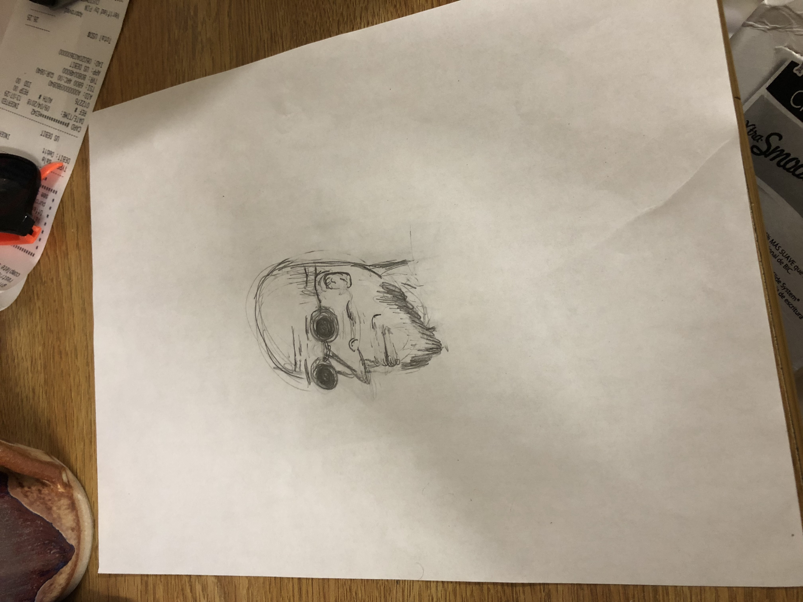
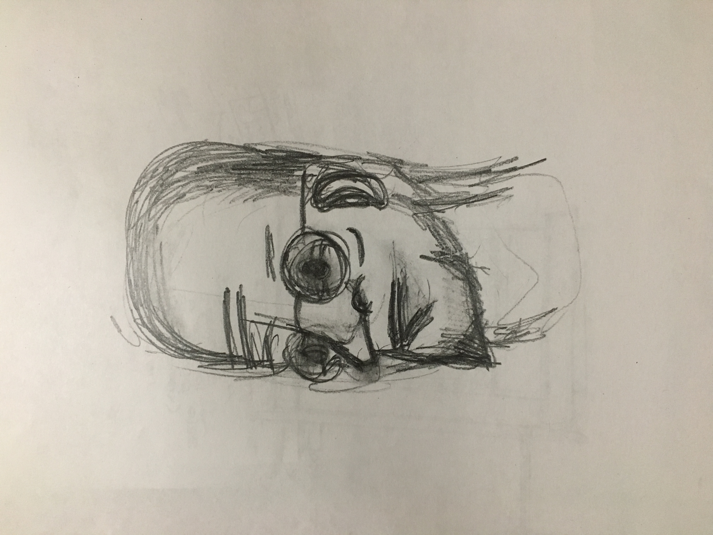
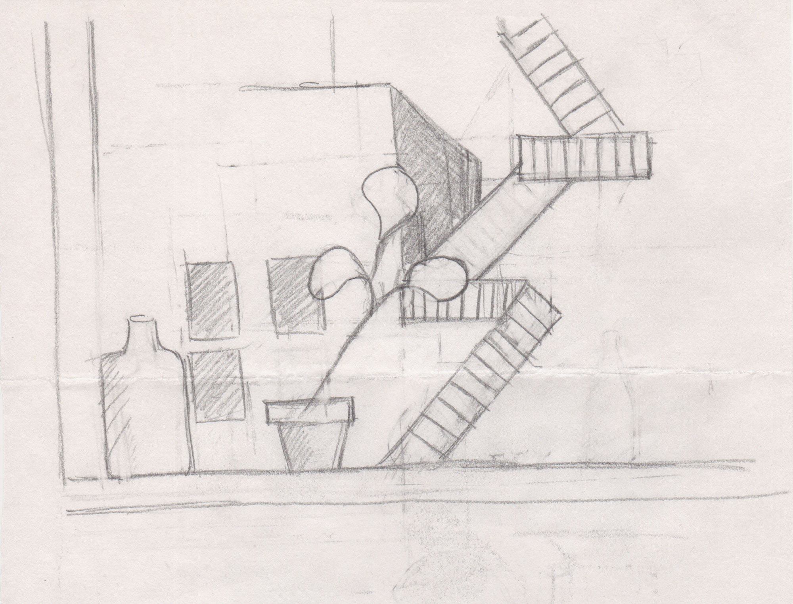
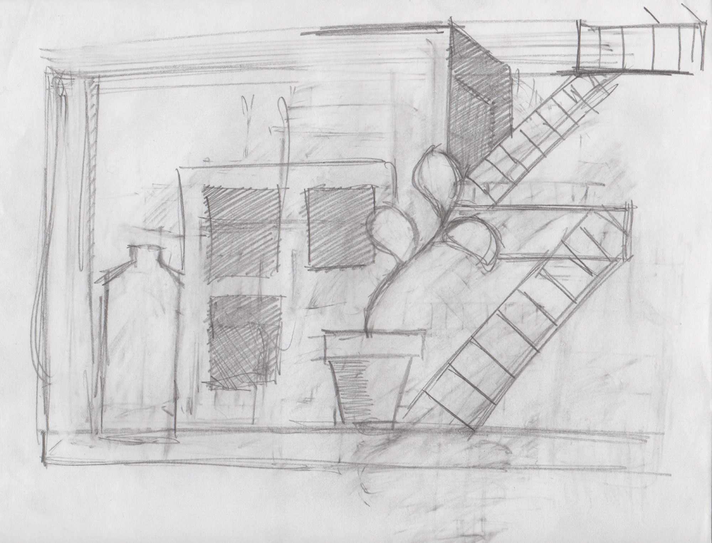
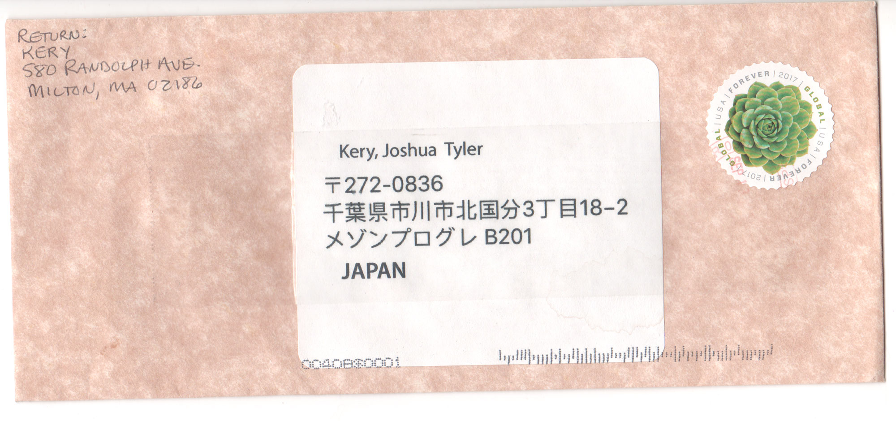
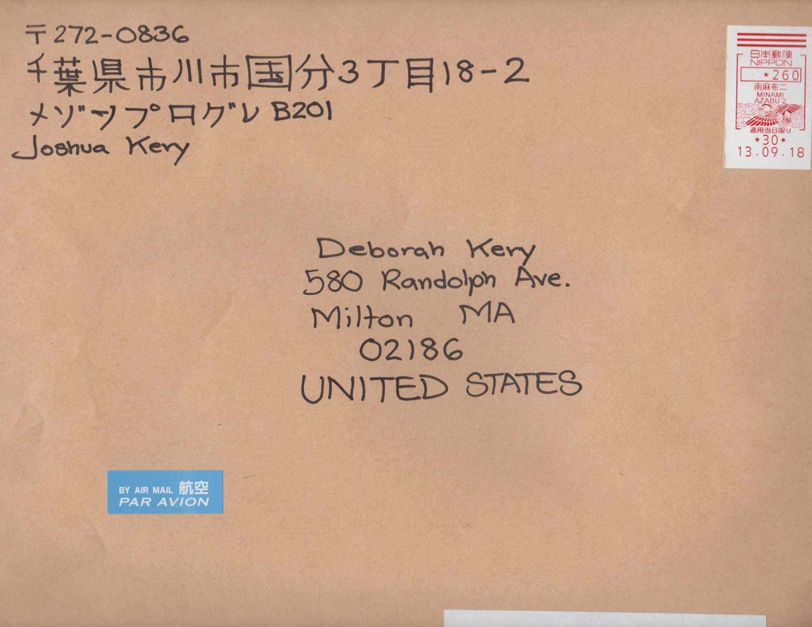

<group>
<c4>

`youtube: https://www.youtube.com/watch?v=9WR2Qbst-Ck`

</c4>
</group>

<group>
<c2>
While I was at school in Tokyo, and my brother was at school just north of Boston, we produced the same drawing in our separate locations using video chat.
</c2>
</group>

  

<group>
<l2></l2>
<l2></l2>
</group>

<group>
<l2>
The process for producing the drawing was as follows: (1) My brother and I both chose separate, nearby objects to draw and did not tell each other what our object were. (2) I began drawing my object by marking a single line (but it could have been any shape) on my paper; (3) My brother copied that line on his own paper, and then (4) added his own line to make the drawing appear more like his own object. (5) I then copied my brother’s last line, and then (6) added another line to my drawing to make it appear like my object. (7) My brother and I continued taking turns like this until the drawing felt complete.
</l2>
</group>

  

<group>
<l2>
My other brother and I went through nearly the same process before that:
</l2>
 
<l2></l2>
<l2></l2>

<l3>

`youtube: https://www.youtube.com/watch?v=o8xCXui2uvo`

</l3>
</group>

  

<group>
<l2>
This was an iterative project that I conducted with multiple members of my family as I figured out what the best way was to cross the distance between us.
</l2>
</group>

<group>
<l2>
In the earliest versions of this project, we drew without reference to an object in front of us at all. I asked my brother to draw the fireplace in our home living room from memory, and our father’s face.
</l2>

<l2></l2>

<l2></l2>
</group>

<group>

<r2>My Mom and I drew the view from our separate windows. In our drawings, they are combined into a new perspective, somewhere in between Tokyo and Boston.</r2>

<r2></r2>
<r2></r2>

</group>

<group>

<c2>
I asked her that we mail each other the drawings so that they swapped locations, just missing the chance to be together in the same place. A few months later, after her drawing returned to the U.S. in my suitcase, I have difficulty remembering which one is hers and which is mine.</c2>
 
<c2></c2>
<c2></c2>

</group>
