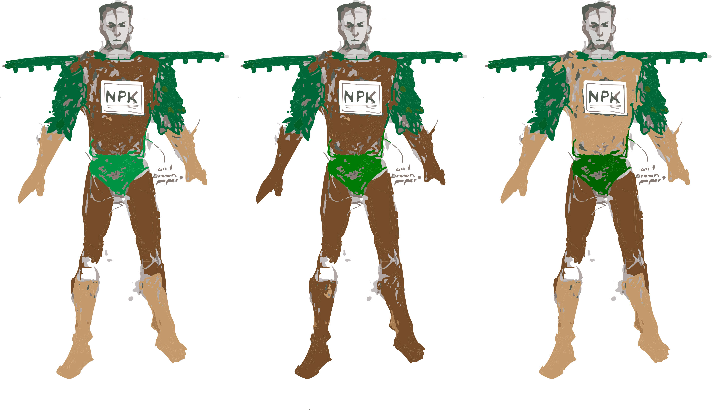

`youtube: https://youtu.be/R1VMhCBVkPE`

The champion of ten billion lives, ever-growing. This is Chemical Fertilizer Man, crusader of the agro-industrial complex, guardian of the GMO, hero of three incredible elements: Nitrogen, Phosphorous, and Potassium. He serves the world by dusting it with these nutrients. He proudly walks among the globe’s farms, distributing vital amounts of chemical fertilizer to all those in need. The omnipresent colossi of corn, soy, rice, and wheat bow to his benevolent presence. He holds up the advancement of the modern crop, the source of his agency; he enables it to grow to the limits that science has conceived for it, to feed those ten thousand, thousand, thousand mouths on this planet. Without the noble tactics of Chemical Fertilizer Man, they would all go hungry. Wherever he walks, the earth sickens with his life-sustaining power: Algal blooms blossom from his feet where he touches the sear; the air fills with noxious clouds of chemistry beneath his wings; in a single pass, he strips the soil of its original sustenance. (All the nutrients the soil will ever need will come from Chemical Fertilizer Man!)

Sketchwork:

