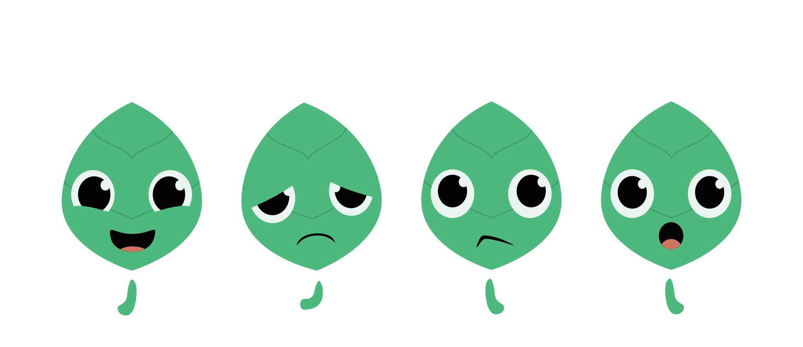
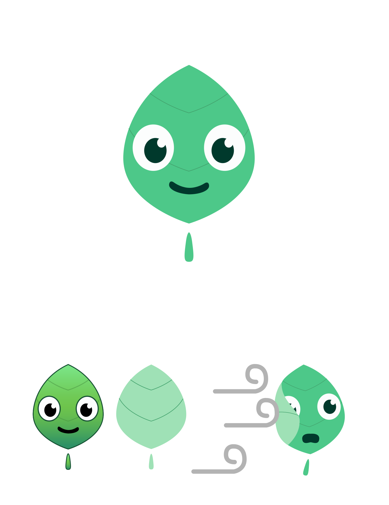
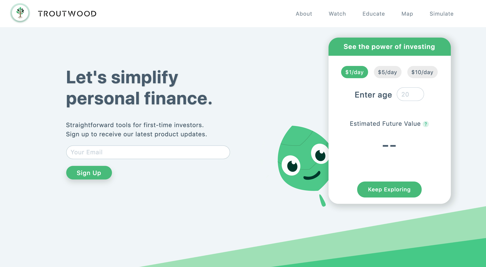
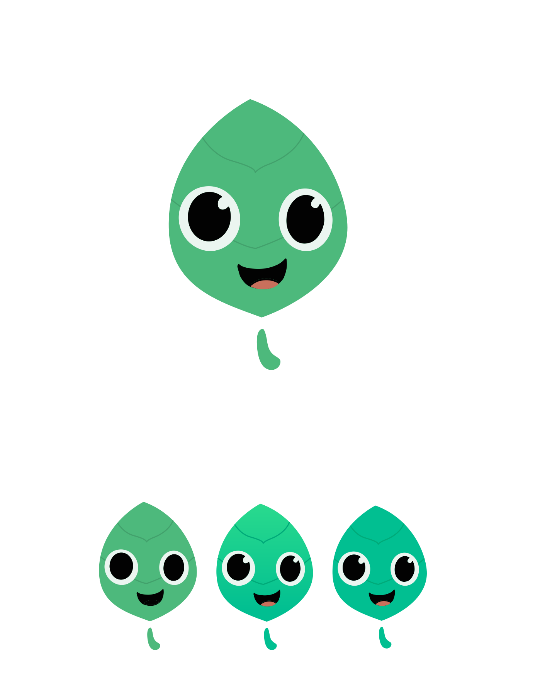
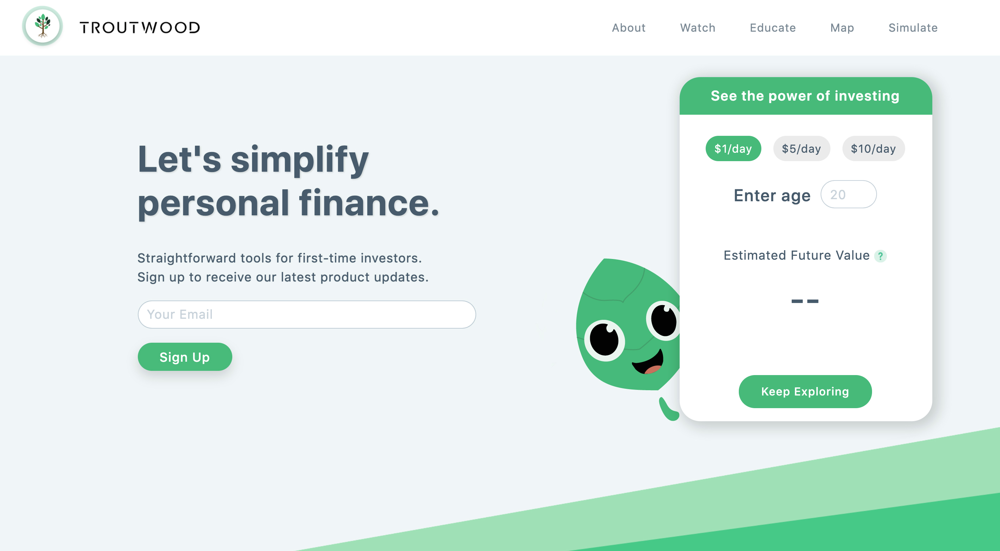
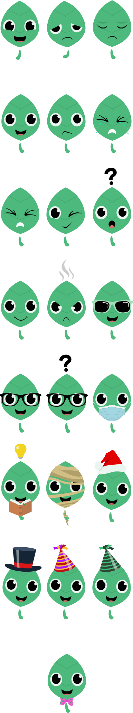

#Responsive Website for Educators

<cover-img>

</cover-img>

<design-meta>

###WHAT

Character Re-design

###WHEN

September 2020

###MY ROLE

Character Designer

</design-meta>

<grid-container>

#OVERVIEW

##Matching Character and UI Design

Troutwood asked me to update their mascot 'Finn' to match the latest design of their website.

I crafted a few options for them, with two shown below:

<browser-container isPrototype="true">

</browser-container>

<browser-container isPrototype="true">

</browser-container>

  

##Variations

I produced a set of 22 variations of Finn for Troutwood.

 

  

##Style Guide

Additionally, Troutwood asked me to produce a Duolingo-inspired style guide to help future illustrators.

</grid-container>

