<group>
<l2>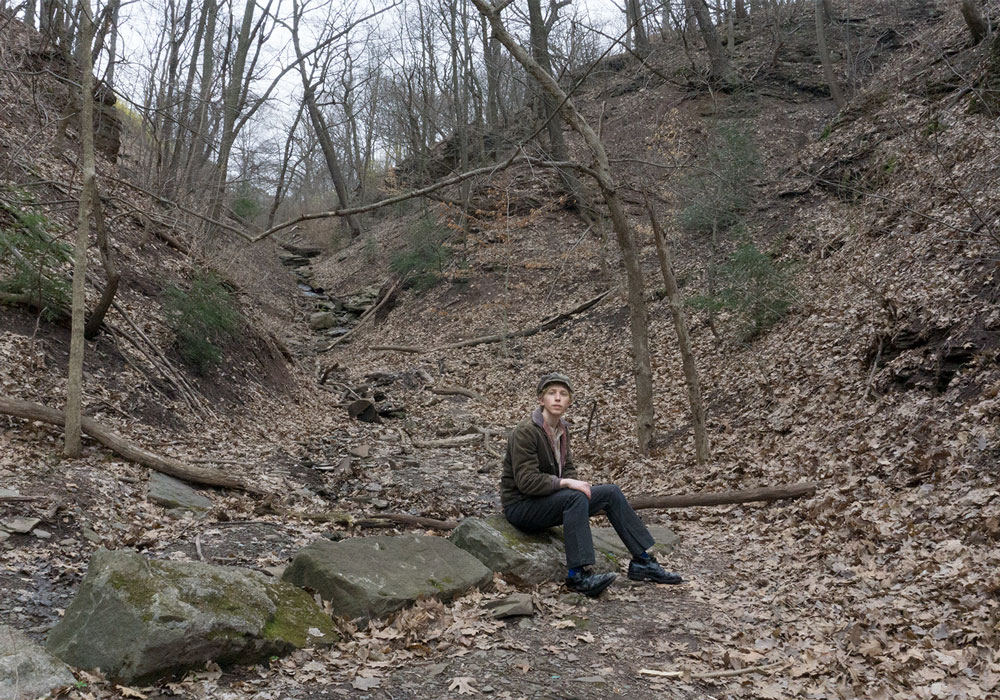</l2>
<l2>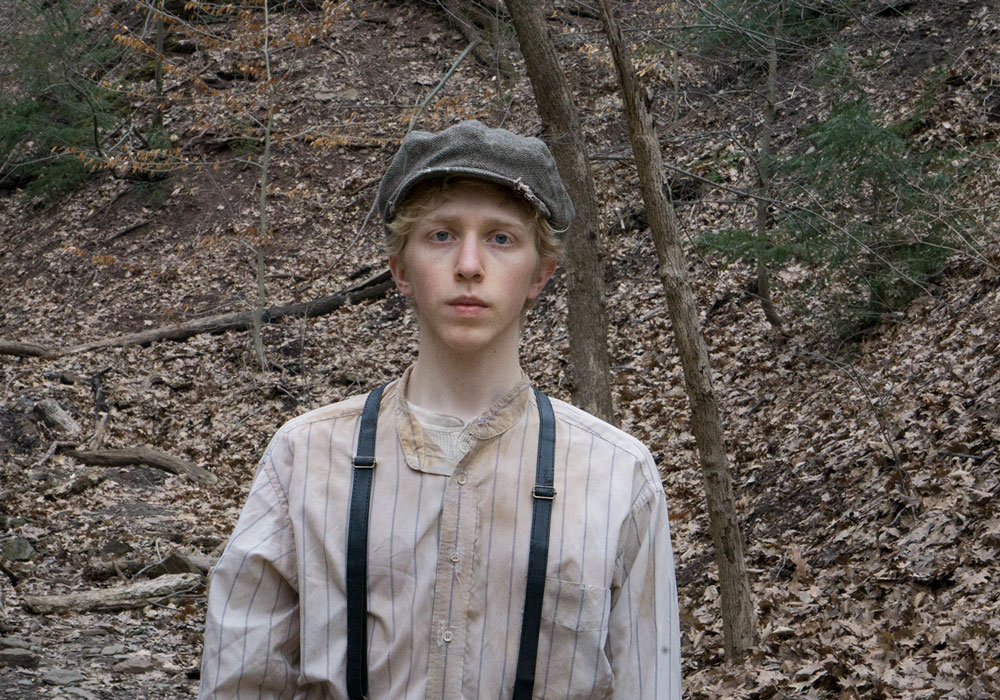</l2>
</group>

<group>
<r3>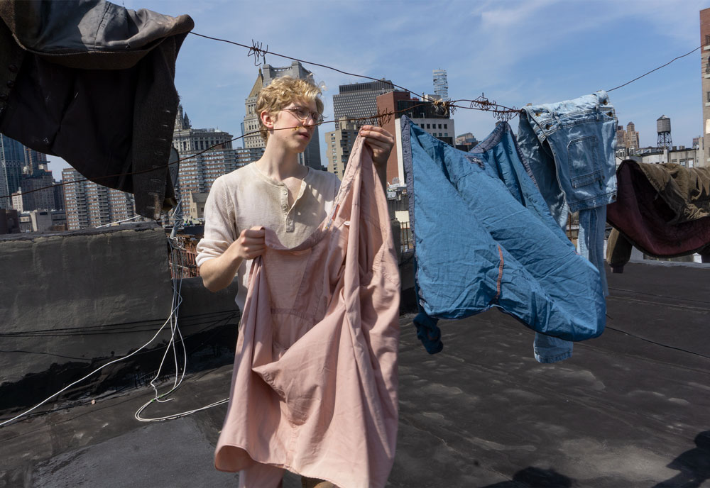</r3>
</group>

<group>
<l3>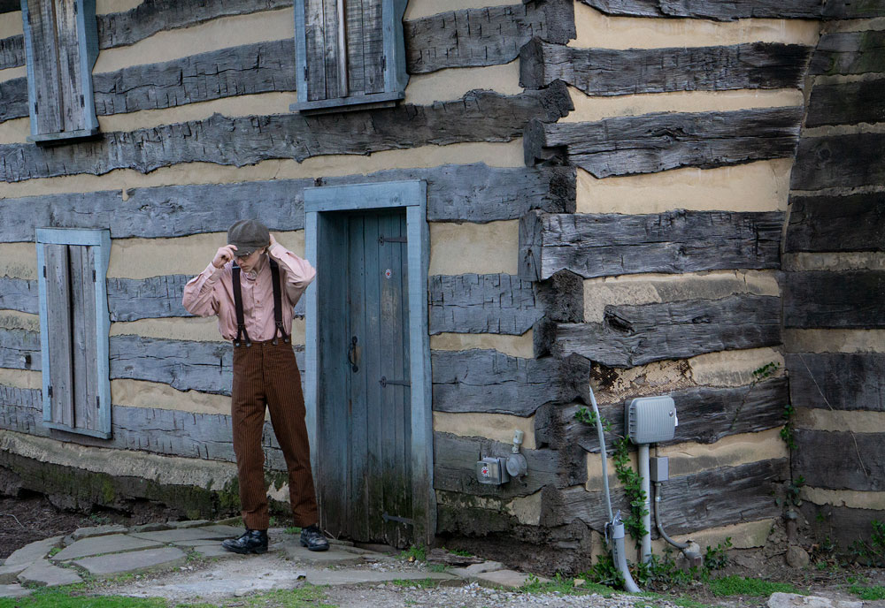<l3>
</group>

<group>
<c4>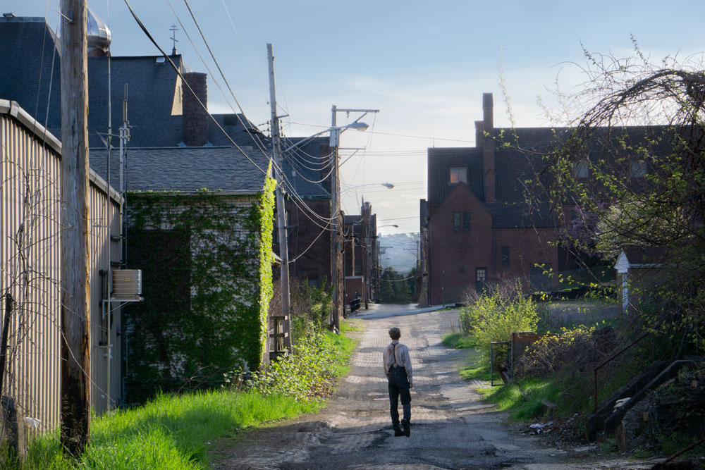<c4>
</group>

<r2>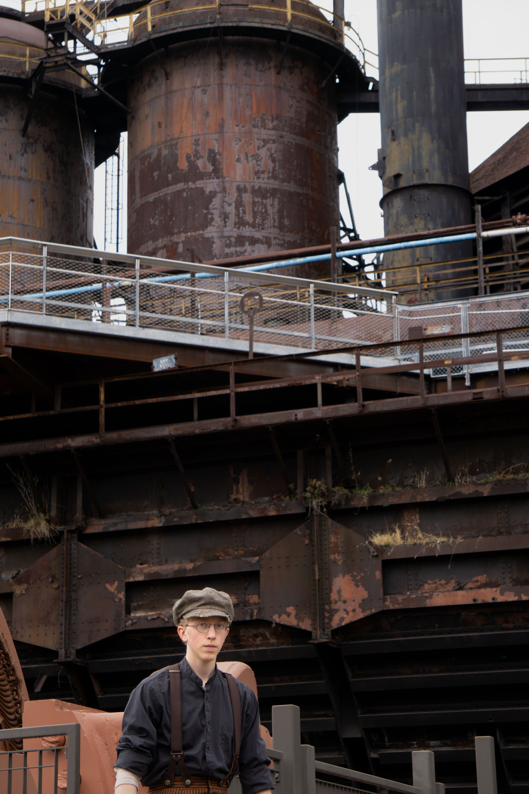</r2>
</group>

<group>
<l4>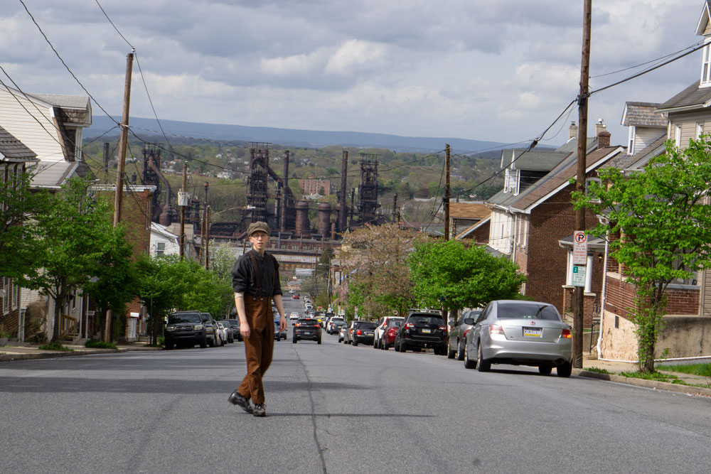<l4>
</group>

<group>
<r2>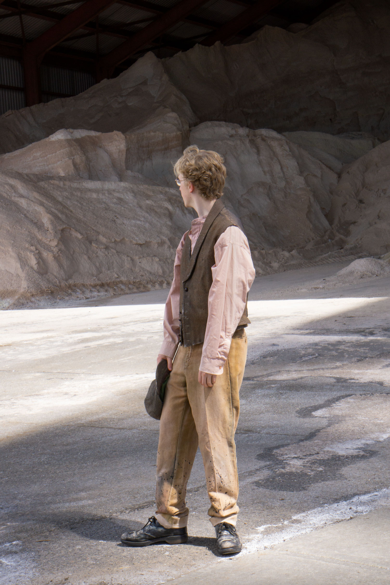</r2>
</group>

<group>
<c2>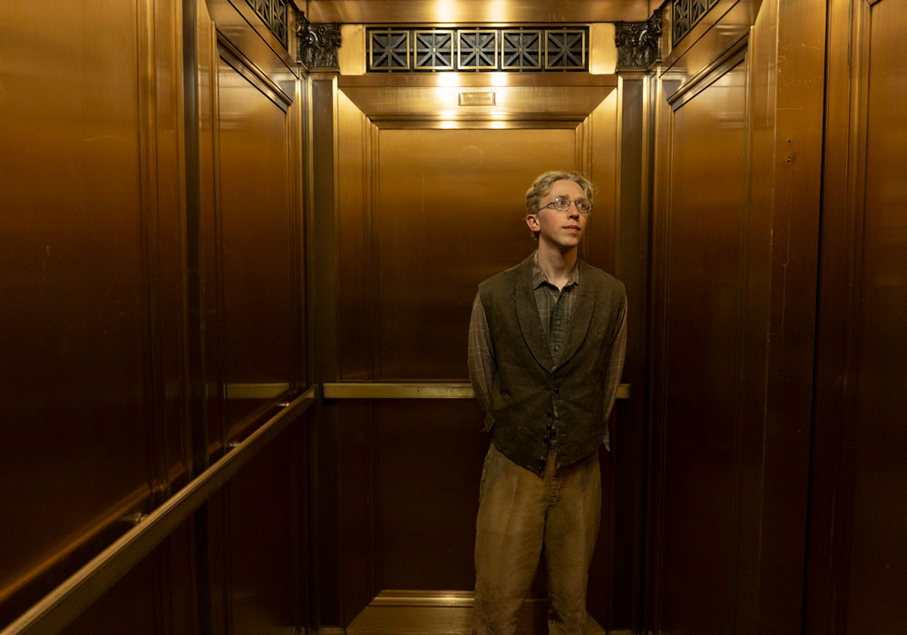</c2>
</group>

<group>
<r2>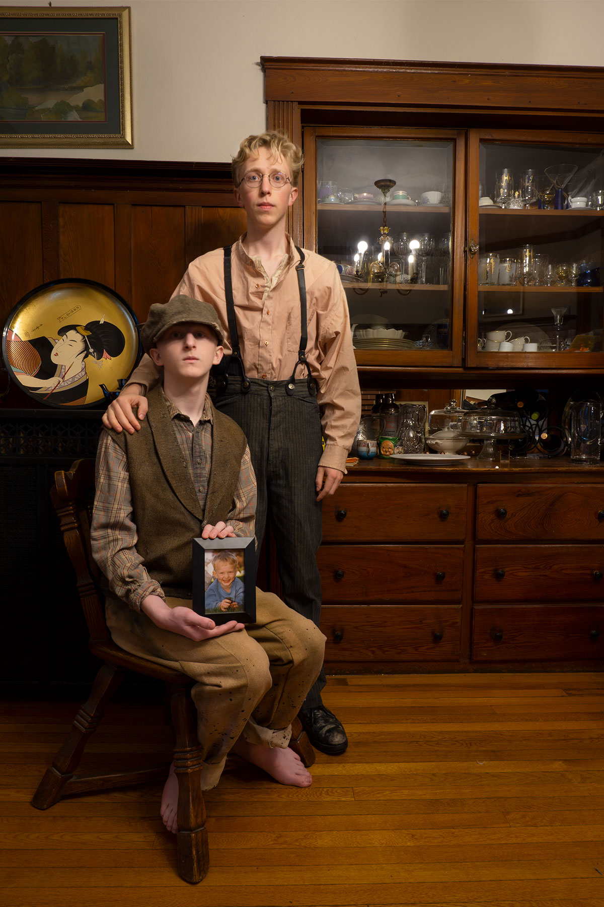</r2>
</group>

<group>
<c4>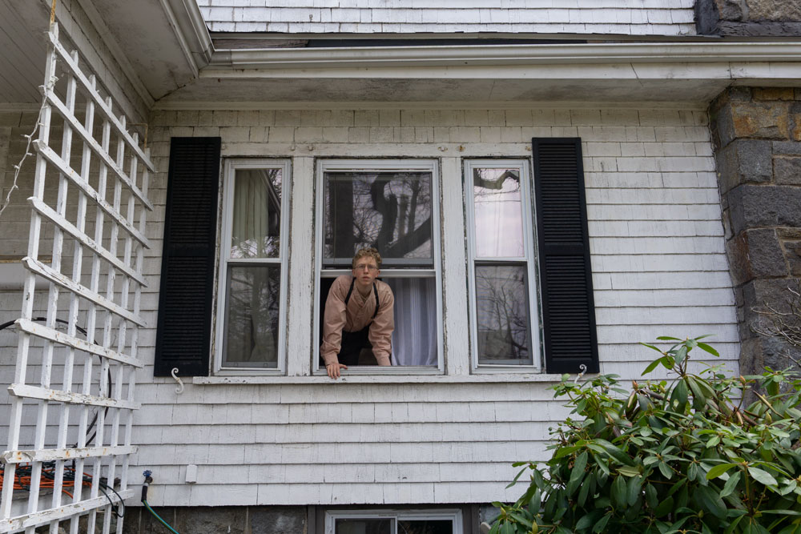</c4>
</group>

<group>
<l3>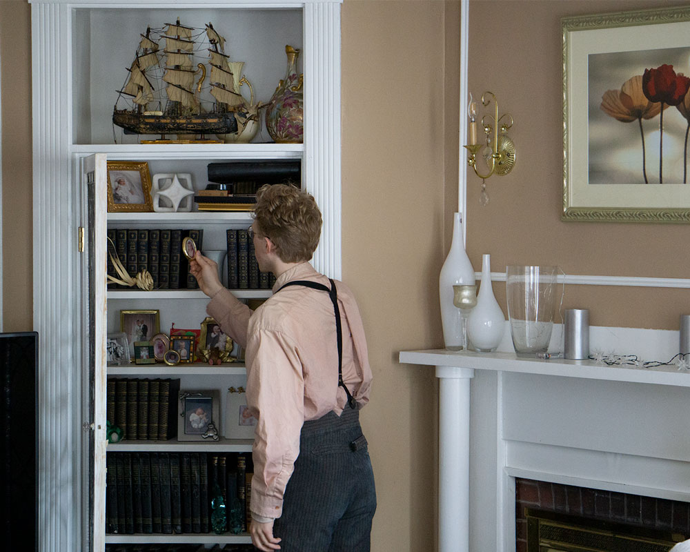</l3>
</group>

<group>
<r3>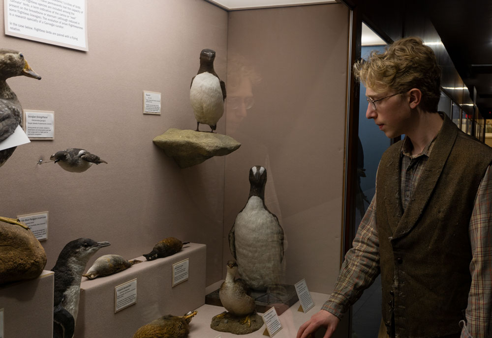</r3>
</group>

<group>
<c2>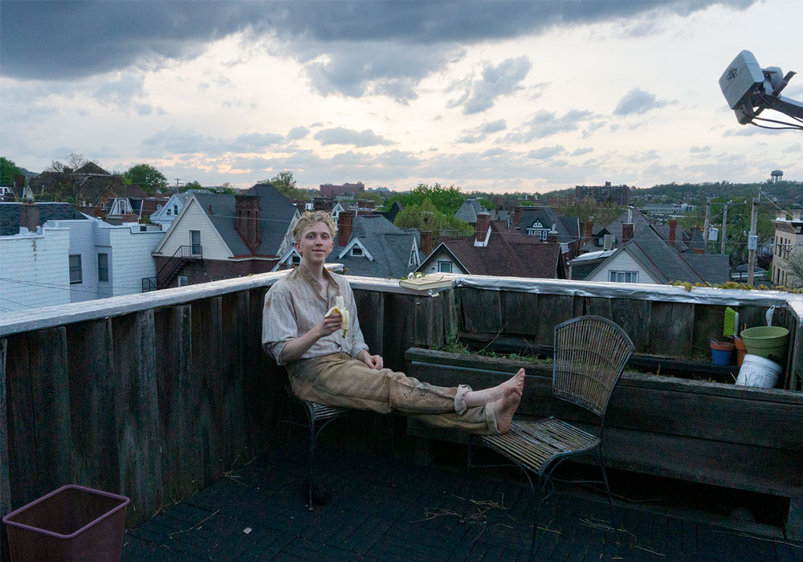</c2>
</group>

<group>
<l3>
<textbox>

In this work I took a series of photographs of myself dressed as if I were a relative of mine alive at the beginning of the 20th century. The memory of two of my great grandfathers inspired me. I never knew them well. Instead I am keenly aware that my memory of them is a construction, made up of their appearances in my parents’ stories and a few photographs, mixed with the behaviors and images of my family members alive today. I wanted to explore this use of the present-day experience to build the past by acting as both the remembered ancestor and the remembering descendant in this project.

To do so I strove to develop a persona for my ancestor that would help me tell a coherent history. I conceived of a young, immigrant steel worker who was based in Pittsburgh but at different times came through New York, worked in Bethlehem PA, and lived with wealth in Boston. Almost immediately, the character broke out of the traditional, still pose for portraits to have a more specific personality. I wanted his history to appear full. By these means, I want the contradiction between past and present in this work to occur between the entire historical narrative and the visual components that compose it. 

This series plays off the genres of family portraiture and social documentary to further affect a real account from my family history. I wanted my photos to act similarly to Walker Evans’s documentary-style photographs, with which he uses their appearance of objectivity to hide his specific point of view. Like Evans’s work, I assume the conventions of these genres to suggest that my images be mistaken as real documents, as if I am hiding their fabrication. That this is transparent to my audience lets me point back to my performance as the descendant. As that person, I am visibly constructing the memory of an ancestor. When I do so with my own body, I aim to show a radical example of how we assemble pieces of our present-day experience, including ourselves when we form the memory of someone no longer available to us today.
</textbox>
</l3>
</group>

