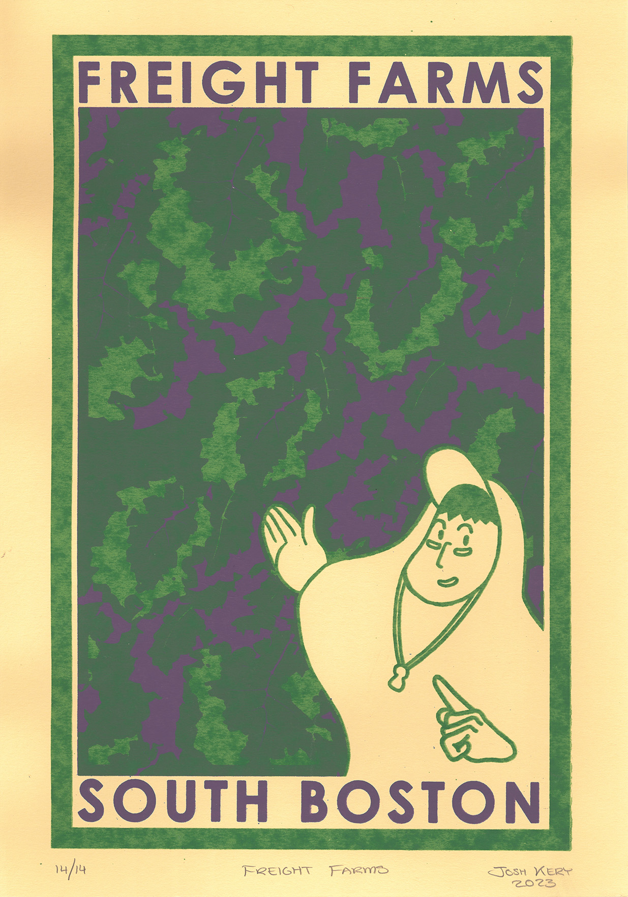
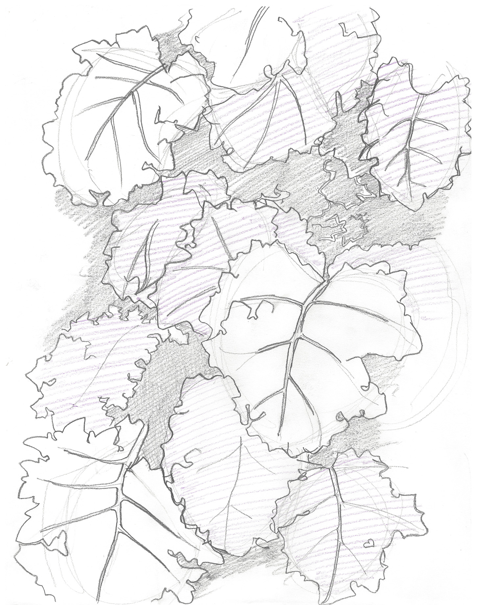
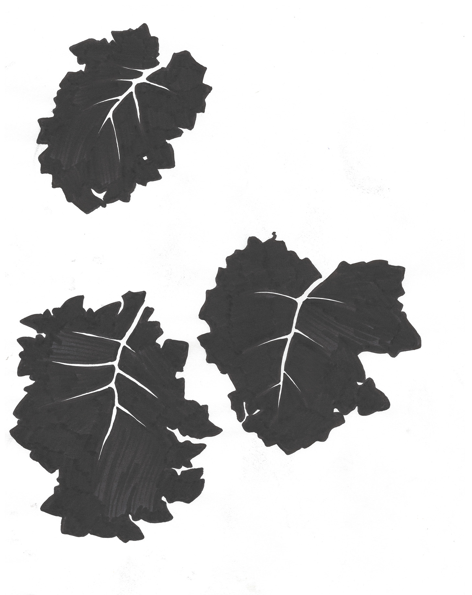
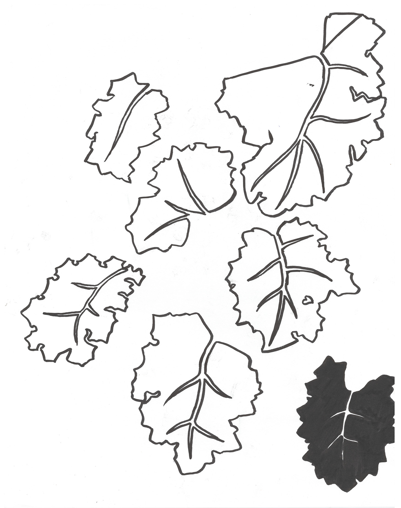

<group>
<c3>

</c3>
</group>

<group>
<c3>
<textbox>
Inspired by my friend Nathan, who always proudly shows me his work in the storage containers at Freight Farms.
</textbox>
</c3>
</group>

<group>
<l2>

</l2>
</group>

<group>
<c2>

</c2>
</group>

<group>
<r2>

</r2>
</group>