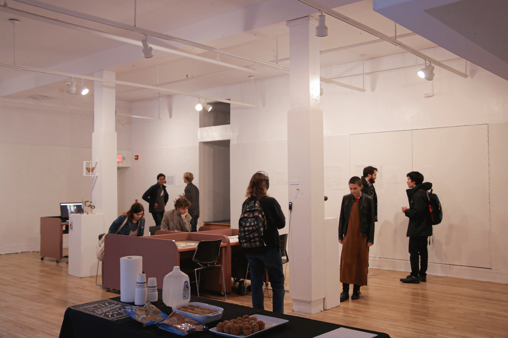
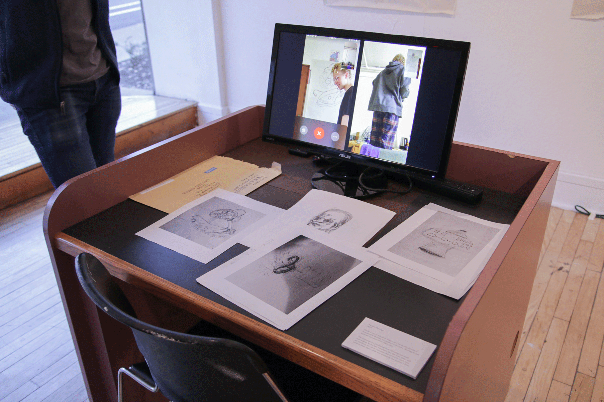
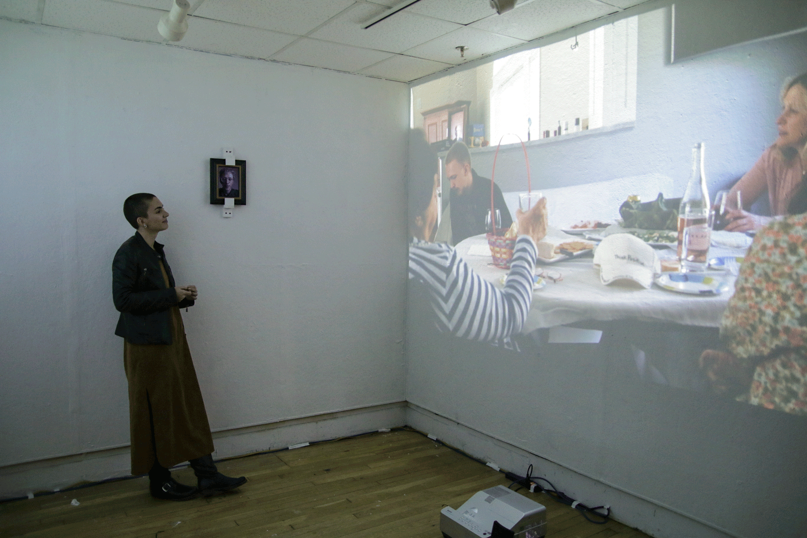
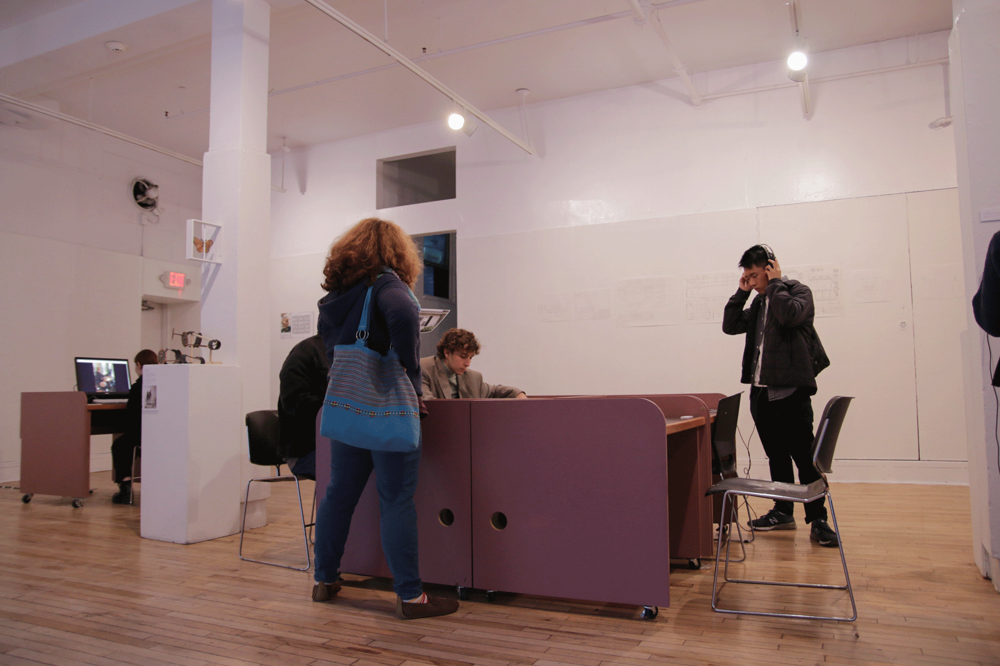
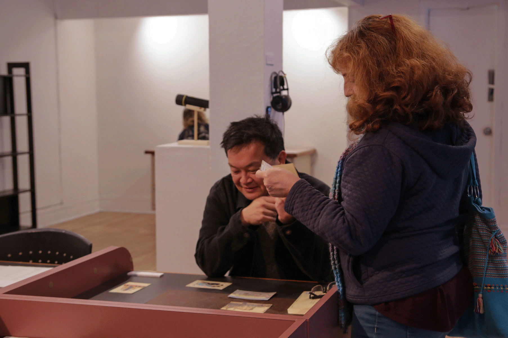
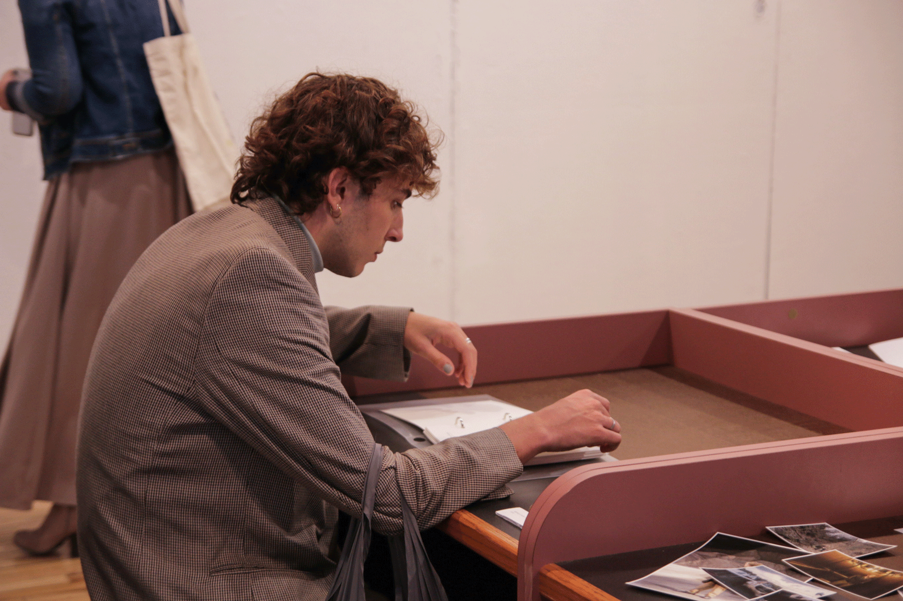
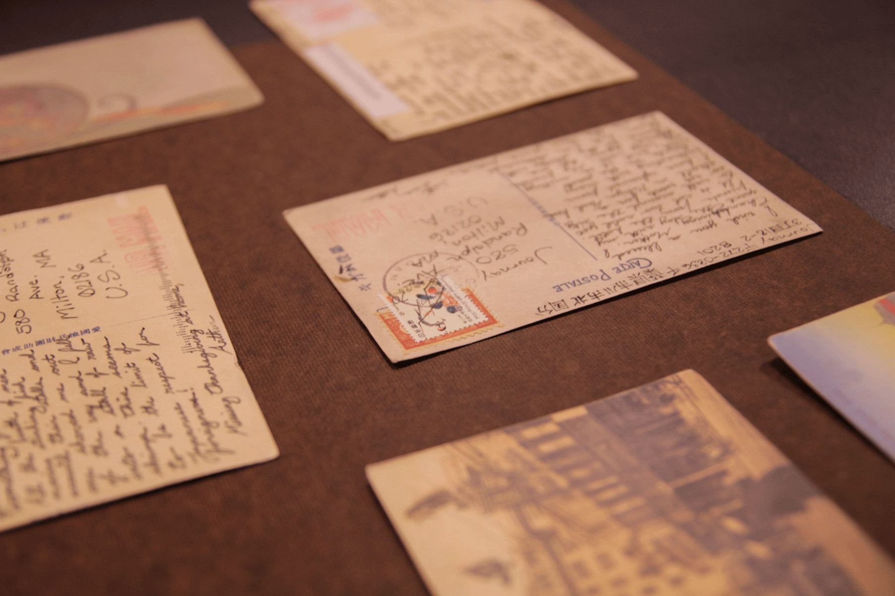
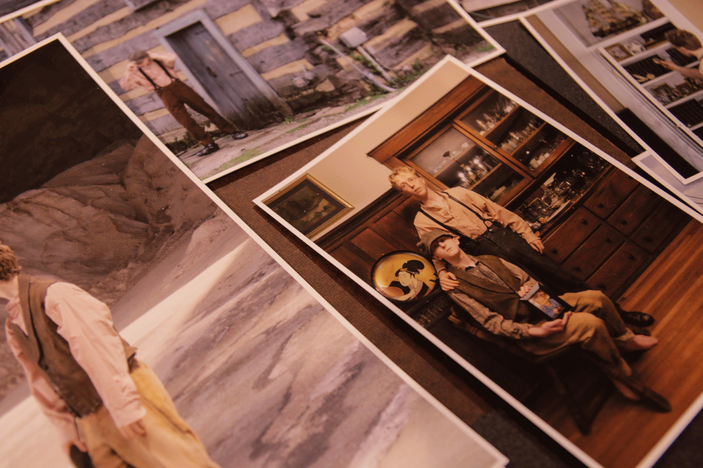
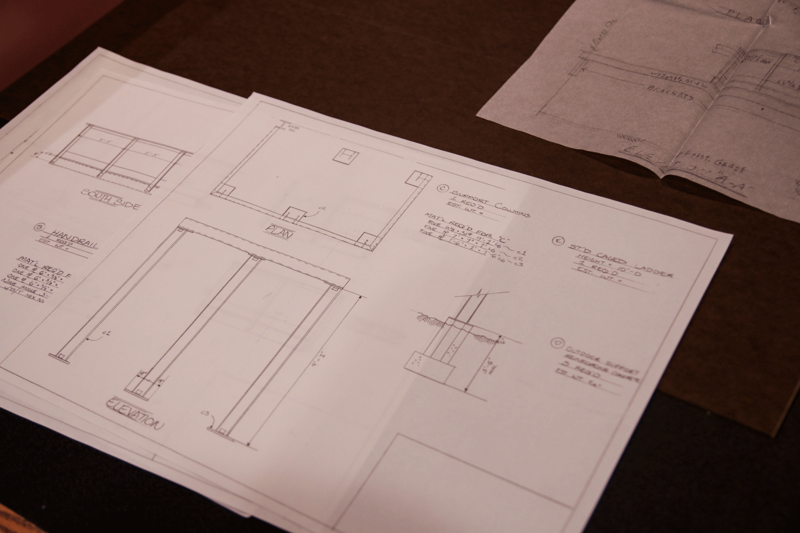
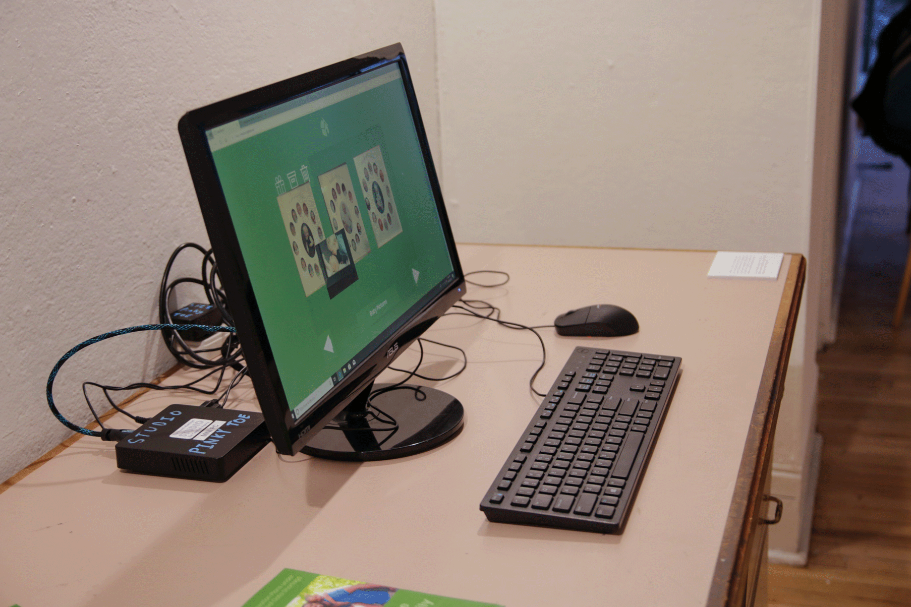

<group>
<c4></c4>
</group>

<group>
<c3>This solo show was held at the Frame Gallery at Carnegie Mellon University.</c3>
</group>

  

<group>
<l4></l4>
</group>

<group>
<l4></l4>
 
<l2><a href="/posts/facetime_drawings/">See the Work in Detail</a></l2>
</group>

  

<group>
<r4></r4>
</group>

  

<group>
<l4></l4>
</group>

<group>
<l4></l4>
</group>

<group>
<l4></l4>
</group>

<group>
<l4></l4>
</group>

<group>
<l4></l4>
 
<l2><a href="/posts/easter/">See the Work in Detail</a></l2>
</group>

  

<group>
<c4></c4>
</group>

<group>
<c4></c4>
</group>

<group>
<c4></c4>
</group>

  

<group>
<l4></l4>
 
<l2><a href="/posts/postcards/">See the Work in Detail</a></l2>
</group>

  

<group>
<r4></r4>
 
<r2><a href="/posts/frank_arthur/">See the Work in Detail</a></r2>
</group>

  

<group>
<c4></c4>
 
<c2><a href="/posts/steel_drawings/">See the Work in Detail</a></c2>
</group>

  

<group>
<r4></44>
</group>

<group>
<r4></44>
</group>
