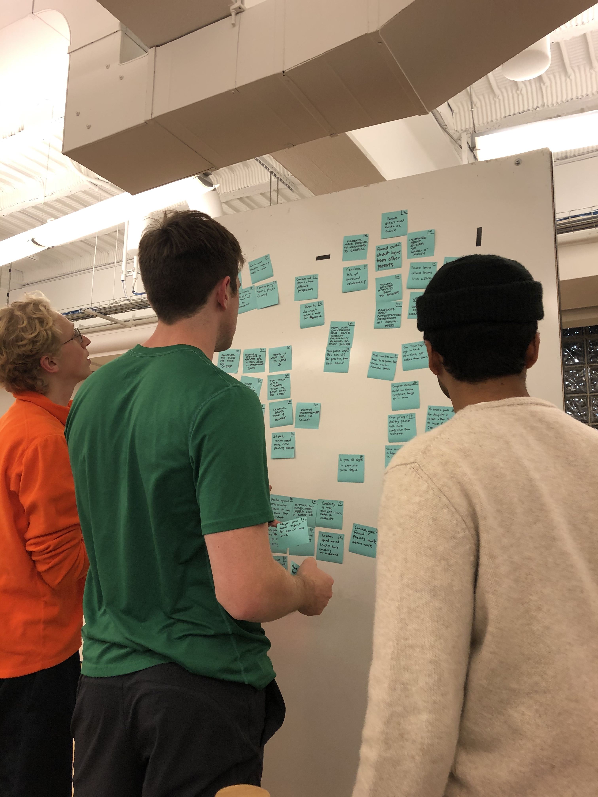

# Responsive Web Design Study

<cover-img>

</cover-img>

<design-meta>

### WHAT

Responsive Web App

### WHEN

December, 2019

### MY ROLE

Conducted User Research Interviews and Analysis\
Co-crafted User Experience Design and Information Architecture\
Contributed assets to Hi-Fidelity Prototype

### TEAM

Aaron Bishop\
Missy Chen\
Gautham Sajith

### GOAL

Reduce overhead for carpooling student athletes

### TOOLS

Figma

</design-meta>

<grid-container>

# OVERVIEW

We designed Kidspool, a web app for organizing youth athlete carpools, to free up more time for parents by improving the existing carpool structure — making it more flexible, accessible, and fair.

# UX SOLUTION

## A Streamlined Interface

### Requesting a Ride

<h4>

Users may tap a card to either offer a ride or request a ride.

**Need met:** Parents act as both drivers and ride-requesters, and our UI needs to serve both those needs.

</h4>

</img-pair>

### Viewing the Tokens Leaderboard

<text-pair>

<h4>

**Need met:** We encourage equal contribution to carpooling through an in-app currency.

Giving rides earns tokens, and requesting rides costs tokens. Tokens help parents avoid awkward conversations by providing automatic indirect feedback to under-contributing parents.

</h4>

</text-pair>

### Tracking a Driver On Their Way to Practice

<h4>

Tapping on an active event-details page shows the driver’s route status and a live tracking dot for the ride. There are also affordances to contact the driver.

**Need met:** Children’s safety is a primary concern with this platform, and the live tracking and driver contact give parents peace of mind.

</h4>

</img-pair>

### Picking up Athletes in the Carpool

<text-pair>

<h4>

**Need met:** Parent drivers don’t need to leave the application to navigate to their pickups. They can respond to incoming requests from within the app.

</h4>

</text-pair>

    

## Onboarding on Desktop

### We’re featuring the Kidspool onboarding flow on a desktop/tablet screen. The desktop view offers more real-estate for parents to fill out an input-heavy form.

<full-width-image>

</full-width-image>

Parents will be given a link by their coach to join their team’s Kidspool community. Parents create an account, fill in their contact information, and most importantly, fill in their driving availability (bottom-right in the image).

Presenting this in the onboarding also establishes a **precedent that parents are all expected to drive** in addition to requesting rides.

### We also created the desktop version of the ride-tracking interface. 

<full-width-image>

</full-width-image>

Since safety is a primary concern for parents, we take advantage of the bigger screen size to give parents a **more comprehensive map**. Yet the design is still consistent with the user interactions and elements of the mobile application to **ensure learnability**.

# UX RESEARCH

## Interviews with Three Stakeholder Groups

From *six* interviews we conducted, we developed personas for parents, coaches, and club & league administrators.

  

## Analysis via Affinity Diagraming

<text-pair>

<h4>

We generated several key insights from this analysis:

1. Parents and coaches are both **frustrated** with the time commitment of youth sports.
2. Some youth athletes miss chances to play on certain teams because their parents **lack the social connections** with other players' parents.
3. Athletes and parents rely on coaches for **organizational information and logistics**.

</h4>

</text-pair>

## Analysis via Journey Mapping

<full-width-image>

</full-width-image>

Some of the lowest points in parents' emotional journeys involve the **time commitment** of getting their kids to practices and games.

Conversely, *coaches* are most frustrated with **time spent on planning and logistics, communication with parents, and player absence.**

# UX PROCESS

## Rapid Prototyping

We crafted storyboards for potential solutions and **speed-dated** them with colleagues.

<full-width-image>

</full-width-image>

**Insight:** Parents and coaches need to spend less time getting kids to practice.

  

## Solution Identified: Improve the Existing Carpool Network

Carpooling already reduced parents' drive times and fostered community. Yet, from our research, we knew that even with carpools, parents still struggled with the time commitment of their children's sports.

  

## How might we improve the system so that they feel like it's working better for them?

We identified opportunities in three areas:

1. To efficiently accomodate **last minute requests**, so that the carpool is flexible right up to the last possible minute.
2. to **ease newcomers into the carpool**, to give them access with strong ties to the community, but also to grow that community.
3. To encourage **fair and equal contribution** to the team from all parents, so that the volunteer-nature of the carpool feels sustainable across seasons.

# UX PROCESS

## Converging and Diverging Design

With a **mobile-first** approach, we worked together to **converge** on what screens were key:

<h4>

- Home page with list of events
- Details screen for each event
- Map view with pickup route
- List of drivers to pick up from when requesting a ride

</h4>

</img-pair>

Next, we diverged, each of us creating low-fidelity prototypes:

We selected screens that best conveyed parents' **mental model** about carpooling.

We focused on an **event-based model**. Each upcoming practice, game, or other team event will be an “event card” on the home screen.

<!-- 

<h4>

This led us to three natural flows from each event card:

1. Tap a card for an event you’ve been matched with a driver for to see trip details and a live tracking of the ride
2. Tap a card for an event that you’re driving for to see your pickup details and driving instructions
3. Tap a card which is not either of the above to either:
4. Request a ride, or
5. Offer a ride

</h4>

</img-pair> -->

  

## High Fidelity Prototyping

### Submitted for critique:

We received feedback that the UI and colors felt **hectic and overloaded.** We also received feedback that the event name (“Soccer practice”) felt more emphasized than it needed to be, and that the actual useful information (i.e. event statuses) felt secondary. Next, we focused on **reducing the amount of data presented** and **emphasizing event statuses.**

# REFLECTION

### We encountered several challenges in this open-ended project:

1. Finding the right level of formality during guerilla research - we wanted to come across as professional researchers, but not intimidate people
2. We were given freedom to select which problem to solve, but this can lead to a tyranny of choices. It was difficult to arrive at an appropriately small problem to solve
3. Determining how to adapt our mobile-first design to take full advantage of larger displays (e.g., PC displays) was difficult

### Throughout the project, we learned a great deal. Several key lessons include:

1. Investing in quality research tools (e.g., personas) can inform current-state analysis and pinpointing the right problem to solve
2. Adding an emotional dimension to our pitch helps listeners to empathize and relate to our message
3. Removing design elements can clarify and improve our design

*This image shows our development across our hi-fi prototypes:*

We learned a great deal about youth sports and its positive impact on the Pittsburgh community. Based on the positive feedback our design received, we believe that it has real potential to improve carpooling and, by extension, youth sports in real world settings.

</grid-container>