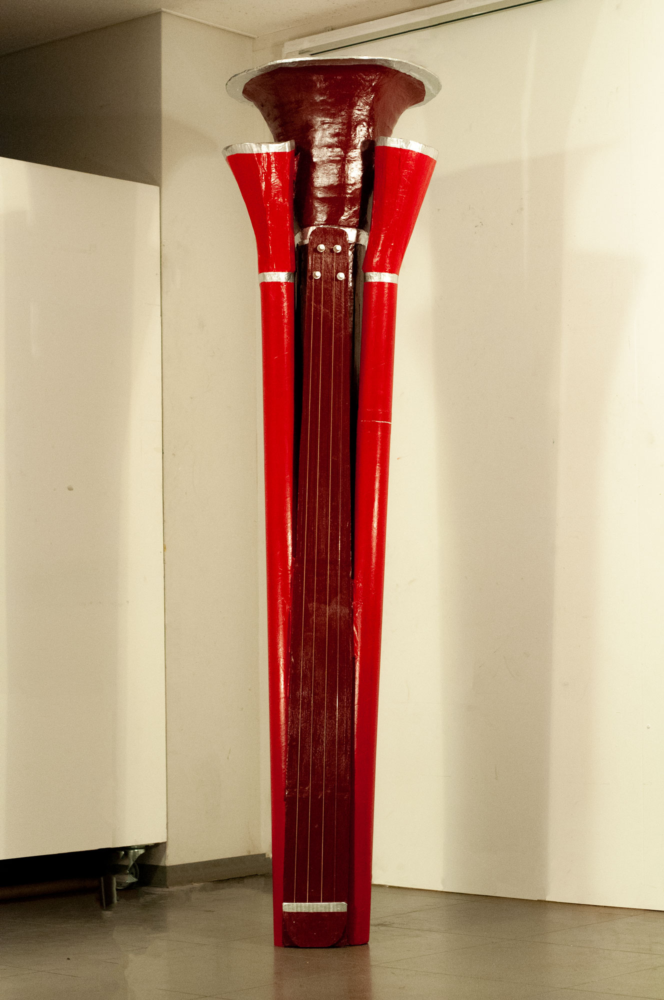
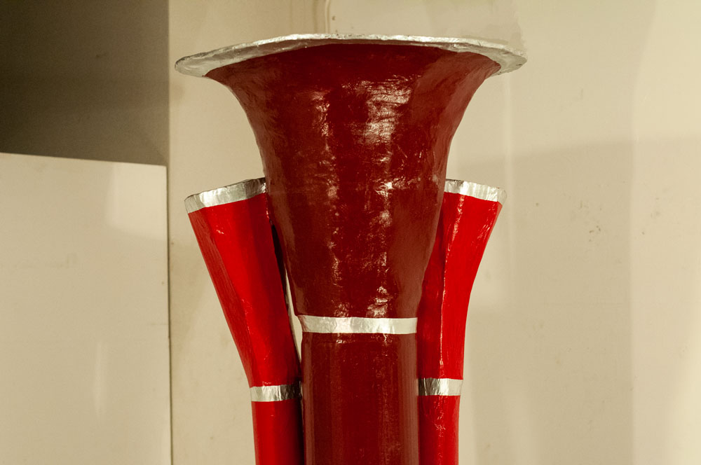
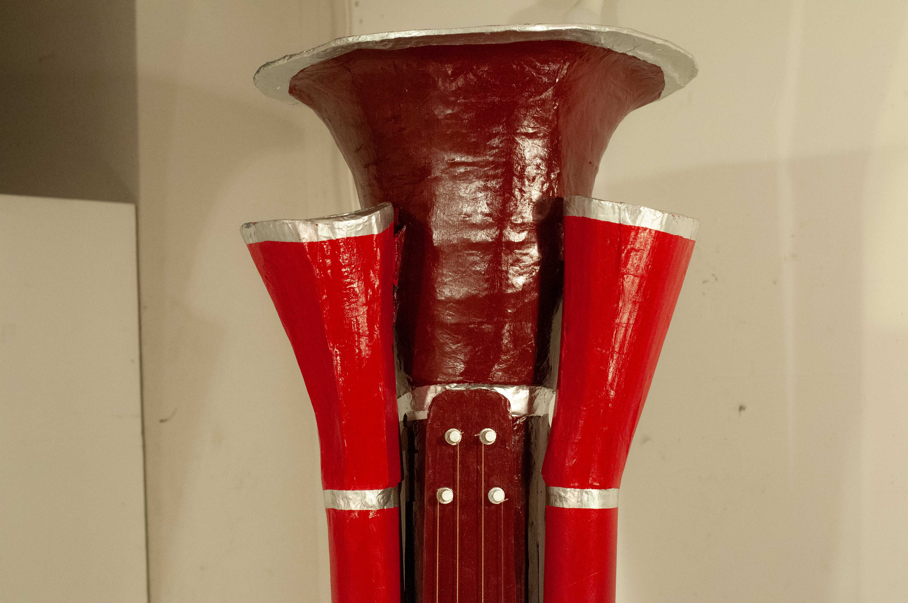

<group>
<h5>

`youtube: https://www.youtube.com/watch?v=Z_-FQssEO_U`

</h5>
</group>

<group>
<h5>

</h5>
</group>

<group>
<c4>

This is a speculative musical instrument, originally designed to produce basses that can only be made electronically. Performance by John Charmelo.

</c4>
</group>

<group>
<h5>

</h5>
</group>

<group>
<h5>

</h5>
</group>

  

<group>
<l2>

</l2>
</group>

<group>
<r3>

</r3>
<r3>

</r3>
</group>
