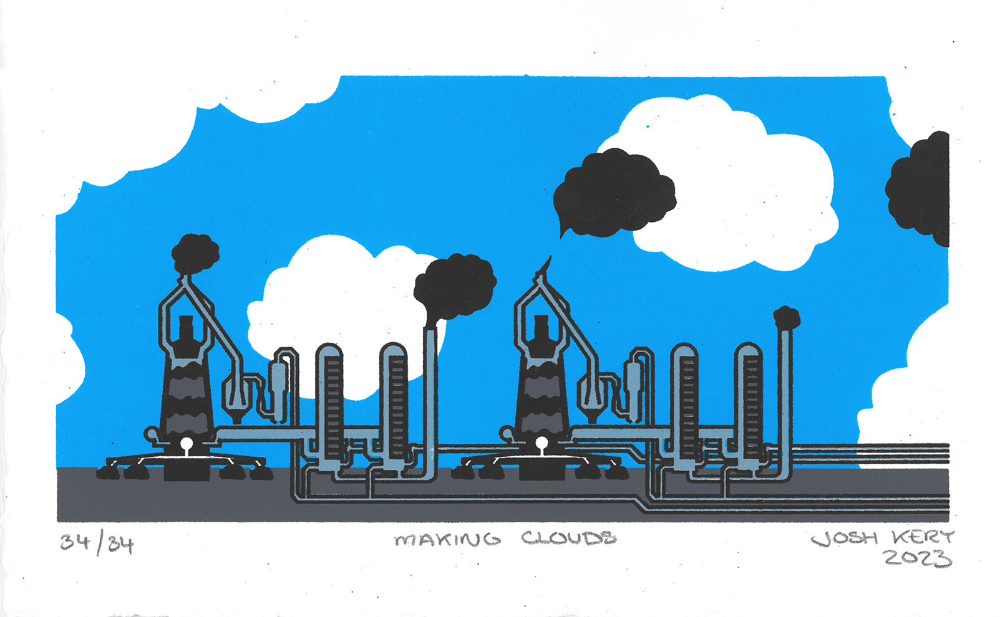
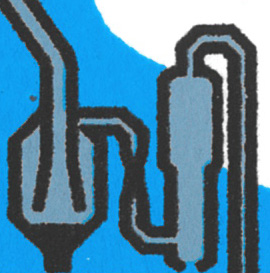
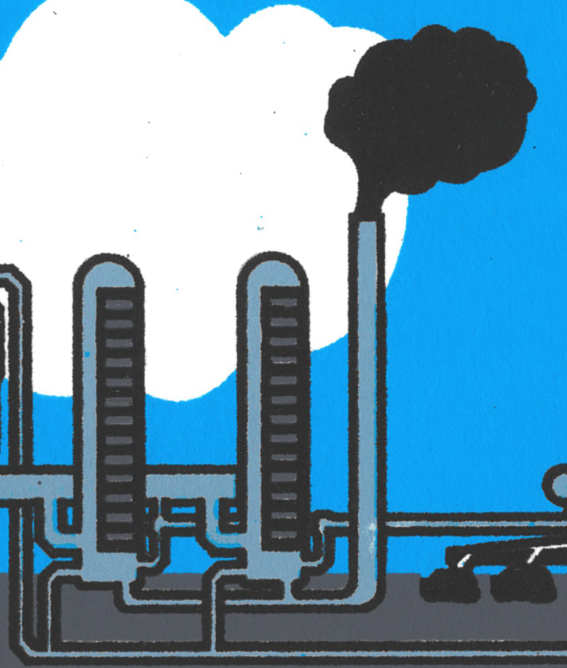
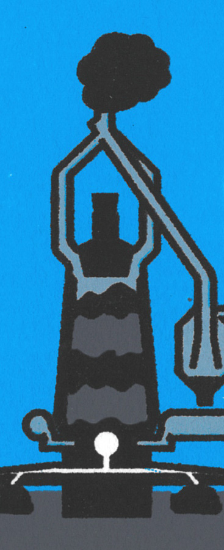

<group>

</group>

<group>
<c3>
<textbox>
My father, a designer, can recall his 1970s youth when his own father designed pipes for the Bethlehem Steel works. The pipes were a part of new environmental structures to limit air pollution. They would have been right in my grandfather's wheel house, since most of his work as a company draftsman-engineer was on pipes for the steel plant.
</textbox>
</c3>
</group>

<group>
<c2>

</c2>
</group>

<group>
<c3>
<textbox>
One structure that used these pipes, according to my grandfather and depicted in this drawing: the electrostatic precipitator. This structure "removes particles from a gas stream by using electrical energy to charge particles either positively or negatively" (US EPA Air Emissions Monitoring Knowledge Base) and sticks them to oppositely charged plates within its walls.
</textbox>
</c3>
</group>

<group>
<c2>

</c2>
</group>

<group>
<c3>
<textbox>
But a careful environmentalist would note that the use of an electrostatic precipitator (ESP) predates the air pollution uproar of the 70s. ESPs are useful not only because they (partially) keep hazardous particles out of the air, but also because they reclaim a small amount of valuable metal lost in whatever industrial process they're attached to ("History," Research Corporation for Science Advancement).
</textbox>
</c3>
</group>

<group>
<c2>

</c2>
</group>

<group>
<c3>
<textbox>
Bethlehem Steel had a sufficient interest in this purpose to install them at its plants well before the national air quality regulations of the 70s (Air Pollution Control in the Bethlehem Steel Company, Brandt, 1954).
</textbox>
</c3>
</group>