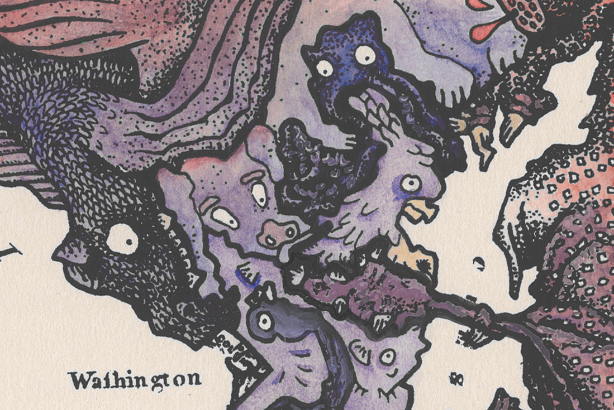
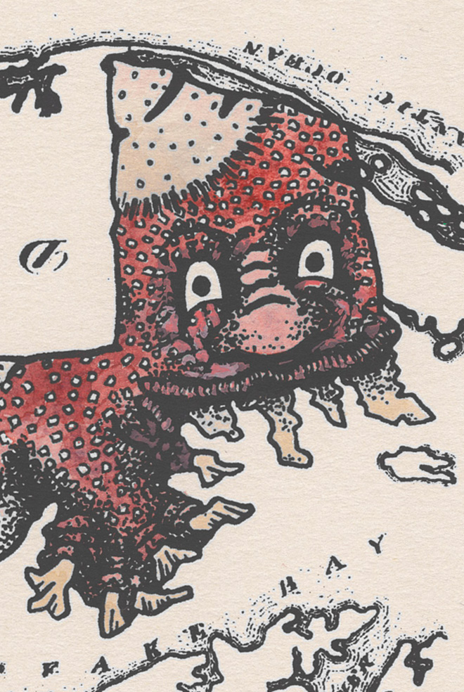
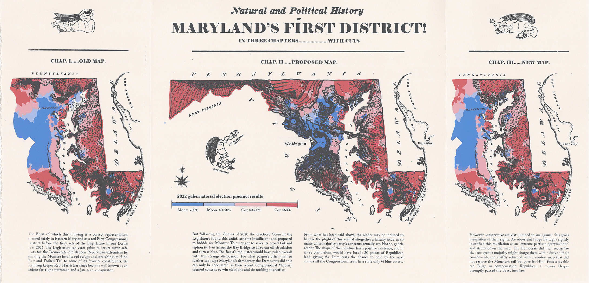
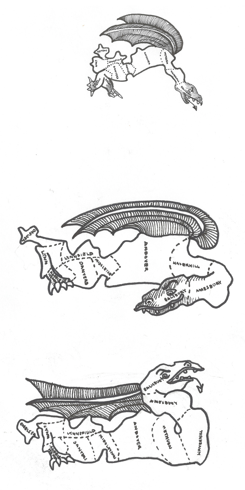
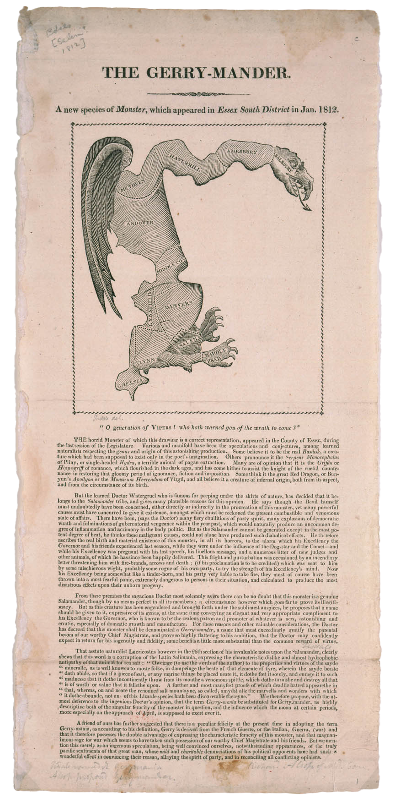
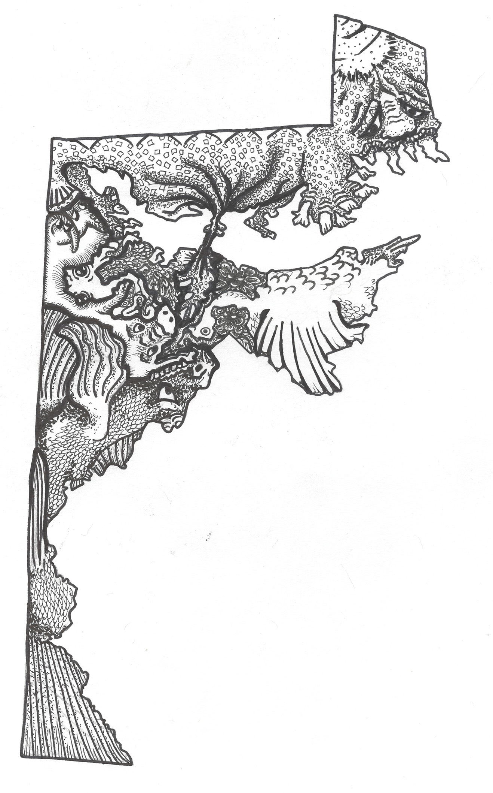
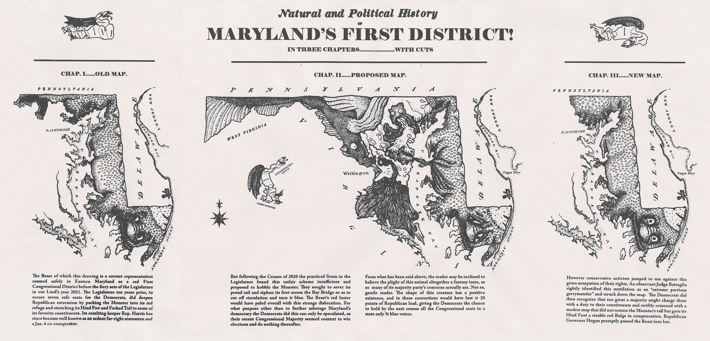

<group>

</group>

<group>
<l3>
<textbox>
This print satirizes gerrymandering in the U.S. State of Maryland’s federal congressional districts
in the style of the 1812 political cartoon about the Massachusetts ‘Essex South’ state district
from which gerrymandering gets its name.
</textbox>
</l3>
</group>

<group>
<r3>

</r3>
</group>

<group>
<c3>
<textbox>
Gerrymandering is the manipulation of voting district shapes to favor one party or class. After
every census, because populations change, the states redraw voting districts. In many states,
the representatives do the drawing, so those in the majority party often draw the shapes to
make it easier for their party to win in future elections. As a result, voters in the minority party (or
class or race!) lose the chance to elect good representatives for themselves.
</textbox>
</c3>
</group>

<group>
<l2>

</l2>
</group>

<group>
<button-link href="https://youtu.be/Mky11UJb9AY?si=vMcGO9sivEYR17LP">LEARN MORE ABOUT GERRYMANDERING</button-link>
</group>

 

<group>

</group>

 

<group>
<l2>

</l2>
</group>

<group>
<l2>

</l2>
</group>

<group>
<r3>

</r3>
</group>

<group>

</group>
