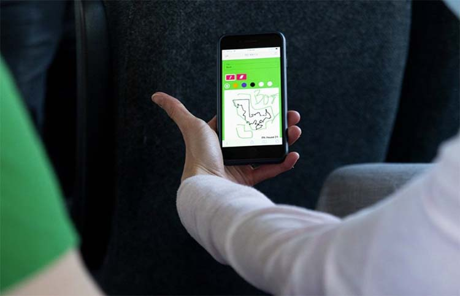
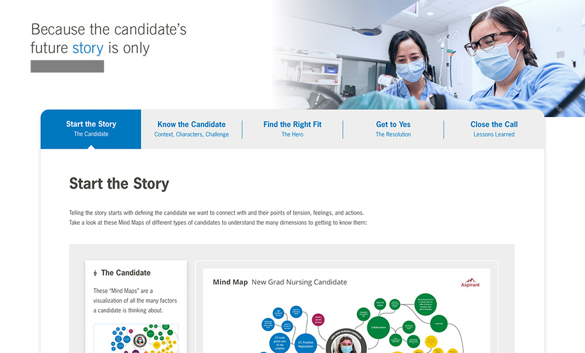
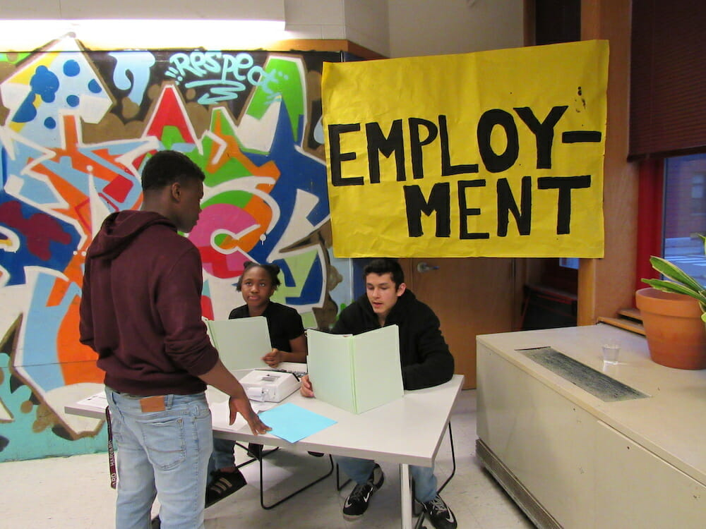

# For MIT Media Lab Application to PRG and CCC

<grid-container>

# ABOUT ME

I'm an artist, designer and developer with a passion for making informal learning experiences.

I'm pursuing grad school to develop my voice for advocating for research-backed projects in for-profit, educational media design.

*I currently program interactive media for museums with [RLMG](https://rlmg.com/).*

*In the past, I was a UX designer at [Aspirant](https://www.aspirant.com/) and taught and wrote curricula for Design Museum Everywhere (now [CoDesign Collaborative](https://codesigncollaborative.org/))*

# PROJECTS

Below I call out projects relevant to my application to the Personal Robotics Group and the Center for Constructive Communication.

Complete project posts are on <a href="/portfolio">my main site.</a>

# PROJECTS 1

## Packing and Cracking

A participatory performance about gerrymandering. We took our audience *by bus* to the site of a community split by voting district lines.

### What I Did

- Organized site research trip to decide where to take our audience
    - Visiting a site was a physical, emotional data-visualization experience with implications for exhibition design like in CCC's [Collective Echoes](https://www.media.mit.edu/projects/collective-echos/overview/)

 

- Collaborated in game design session to reformat Packing and Cracking from its virtual version to its in-person, bus version.
    - We centered pedagogy on play and creative input to support learning, relevant to PRG's [AI-literacy curricula](https://www.media.mit.edu/publications/ijaied-ai-ethics-for-middle-school/) or CCC's work applying learning pedagogy to [communicating difficult concepts to non-experts](https://aclanthology.org/2024.acl-long.388/)

 

- Designed and developed an audience-facing, mobile web game page
    - We built quiz-format games that gathered audience data, relevant to designing automatic assessment practices in research products like [LevelUp](https://www.media.mit.edu/publications/level-up-2022/) with PRG 

 

<button-link href="/posts/packingandcracking_onabus" target="_blank">READ FULL POST ON PACKING AND CRACKING</button-link>

  

# PROJECTS 2

## Storytelling Pitchbook

A web tool to guide recruiters' pitch of a major hospital to nurse candidates.

 

### What I Did

 

- Conducted semi-structured interviews with over 40 nurses, recruiters, and hiring managers; performed data analysis via affinity diagramming
    - Qualitative research methods like these are practiced by PRG and CCC, for example semi-structured interviews in PRG's study of DAILy's [Make-a-Thon](https://www.media.mit.edu/publications/make-a-thon-for-middle-school-ai-educators/)

 

- Facilitated collaborative design-thinking workshop with users and other stakeholders
    - Co-design like this is a key research practice for PRG with [older adults](https://www.media.mit.edu/projects/generative-ai-for-healthy-aging/overview/) and [teachers](https://www.media.mit.edu/publications/preparing-pre-service-teachers-to-integrate-technology-in-k-12-classrooms-standards-and-best-practices/) and for CCC's Dimitra Dimitrakopoulou's work on the [Generative Dialogue Framework](https://www.tandfonline.com/doi/full/10.1080/21670811.2022.2075415)

 

- Designed iterative prototypes in Miro and Figma; validated with users via think-aloud protocol
    - Iterative prototyping especially applicable to playtesting nethods like in Cassandra Lee's [thesis project](https://www.media.mit.edu/projects/crossroads-game/overview/) or Ivan Sysoev's [work supporting early literacy](https://drive.google.com/file/d/1GYtxRzIqqGuQjhyT11fEM_psG1AWEh3Y/view)

 

<button-link href="/posts/storytelling_pitchbook" target="_blank">READ FULL POST ON STORYTELLING PITCHBOOK</button-link>

  

# PROJECTS 3

## RLMG Software Development

I have built over a dozen visitor-ready software experiences for RLMG, for clients including [SCOTUS](https://www.supremecourt.gov/visiting/exhibition.aspx), the [Science Center of Iowa](https://www.sciowa.org/), and [Moonshot Museum](https://moonshotmuseum.org/).

 

### What I Did

<touch-container title="Spaces Debates at the Moonshot Museum">

</touch-container>

- Developed visitor-ready apps in Unity and for the web
- Coordinated with museum staff to install projects on site
    - applicable to building projects like PRG's [interactive storybooks](https://www.media.mit.edu/projects/ai-storybook/overview/) or data visualization exhibitions like [Collective Echos](https://www.media.mit.edu/projects/collective-echos/overview/) with CCC

 
<touch-container title="York Your Story Audio Booth at the York County Historical Society">

</touch-container>

- Connected software to existing database APIs
- Built bespoke APIs for client software
    - translatable to work like PRG's use of generative image APIs in its [Creative AI](https://www.media.mit.edu/publications/exploring-generative-models-with-middle-school-students-2/) curriculum, extending Scratch for Teachable Machine and Arduino in [How to Train Your Robot](https://www.media.mit.edu/publications/how-to-train-your-robot-a-middle-school-ai-and-ethics-curriculum/), and CCC's use of ChaptGPT to synthesize data like in its [Bridging Dictionary](https://www.ccc.mit.edu/project/bridging-dictionary/)

 

<button-link href="/posts/york_audio_booth" target="_blank">READ FULL POST ON AN EXAMPLE PROJECT</button-link>

  

# PROJECTS 4

## DME Curricula Writing

At Design Museum Everywhere, I researched and wrote curricula and facilitated a design workshop for youth

### What I Did

- Researched, wrote and designed curricular activities for [Diversity in Action](https://codesigncollaborative.org/event/diversity-in-action/), a training for cultural responsiveness to address historical inequities in design fields.
    - relevant to sociotechnical perspectives in [Impact.AI](https://www.media.mit.edu/publications/impact-ai-thesis/) in PRG
    - applicable to work with educators in PRG and CCC's projects, like CCC's [study on technology-assisted coaching](https://dspace.mit.edu/handle/1721.1/130837)

 

- Facilitated sessions and mentored youth in Neighborhood Design Project, a 14-week design-thinking workshop for underserved youth in Cambridge, MA
- Prepared and taught materials from the We Design card deck, specifically around career pathways, for the workshop
    - applicable to the PRG DAILy curriculum focus on [exposing students to future careers](https://dl.acm.org/doi/10.1145/3408877.3432513)
    - applicable to PRG and CCC's participatory research methods centered on design-thinking (see Storytelling Pitchbook above)

  

# PROJECTS 5

## Undergraduate Research Assistantship with OH!Lab

[D3](https://d3js.org/) visualizations for [ClassInSight](https://ohlabcmu.wordpress.com/portfolio/classinsight/), a study on software helping teachers improve their classtime behavior by reviewing motion-tracking and speech-tracking data.

### What I Did

- Prototyped data visualizations for teachers' body position, integrated into [Django](https://www.djangoproject.com/) LMS
    - applicable to data visualization in CCC's work
- Shadowed semi-structured interviews and consent-form gathering with adult student and teacher study participants
    - generally applicable to PRG and CCC's research methods with research subjects in formal learning spaces

    

<button-link href="/portfolio" target="_blank">SEE ALL MY OTHER PROJECTS</button-link>

</grid-container>