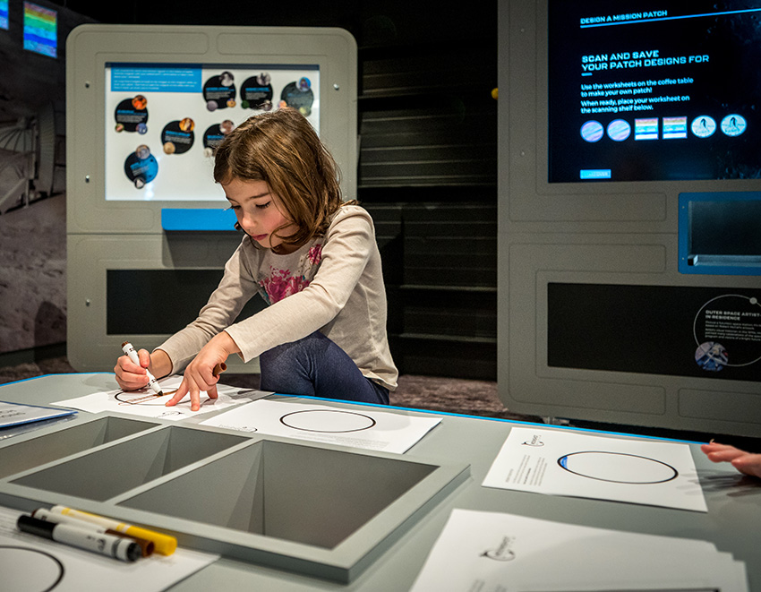
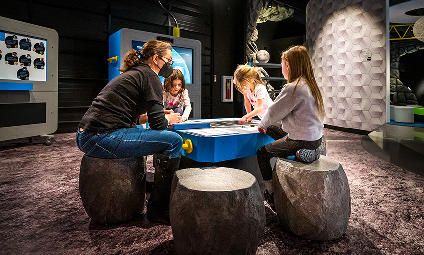
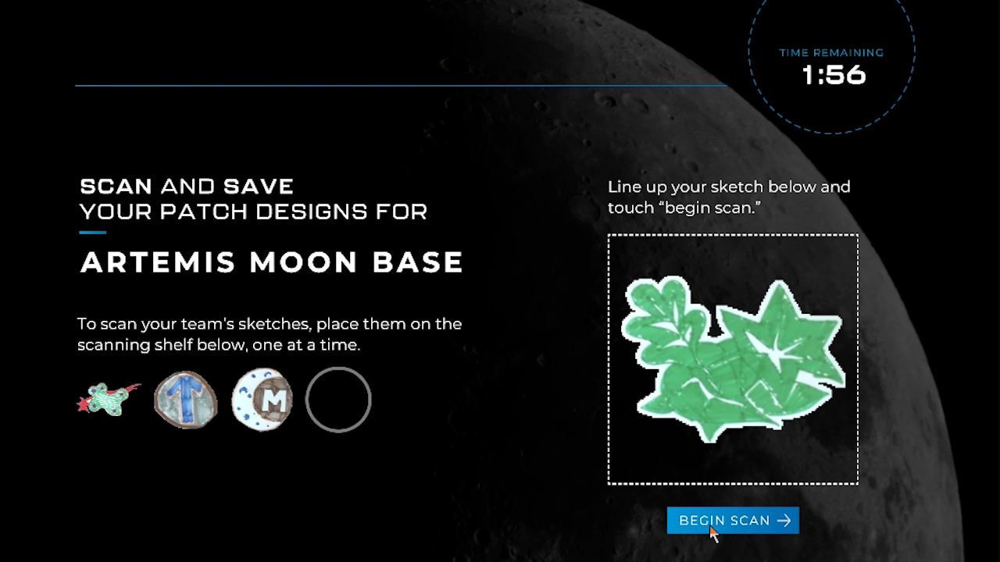
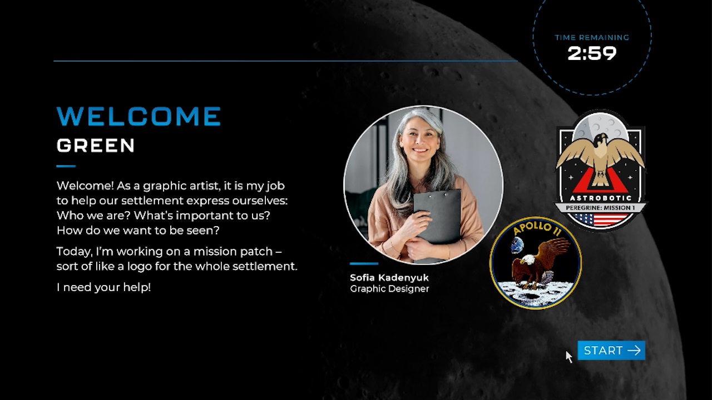
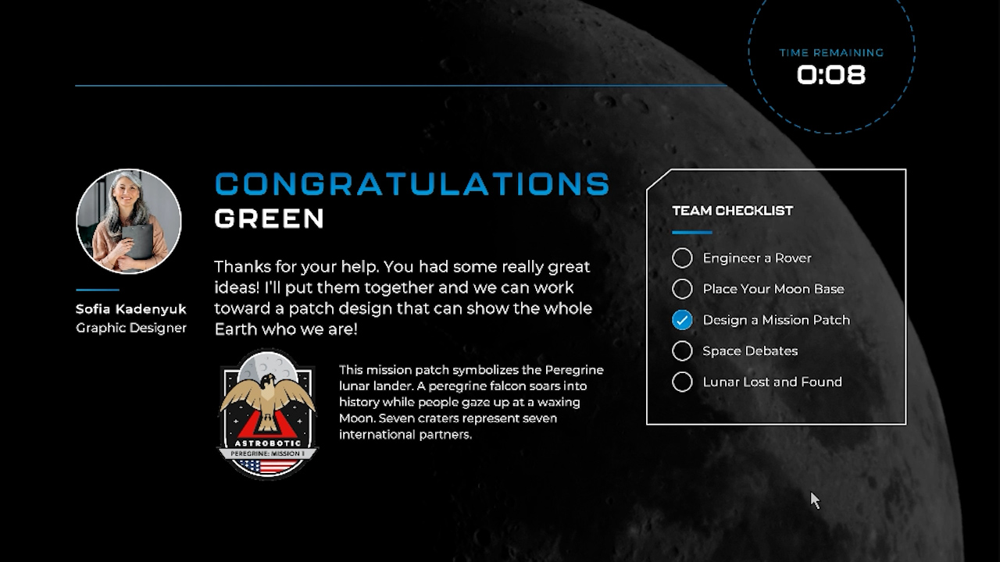
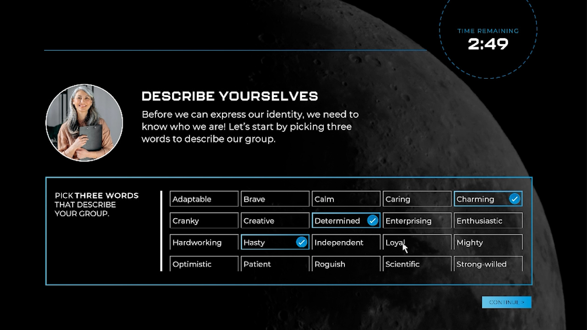
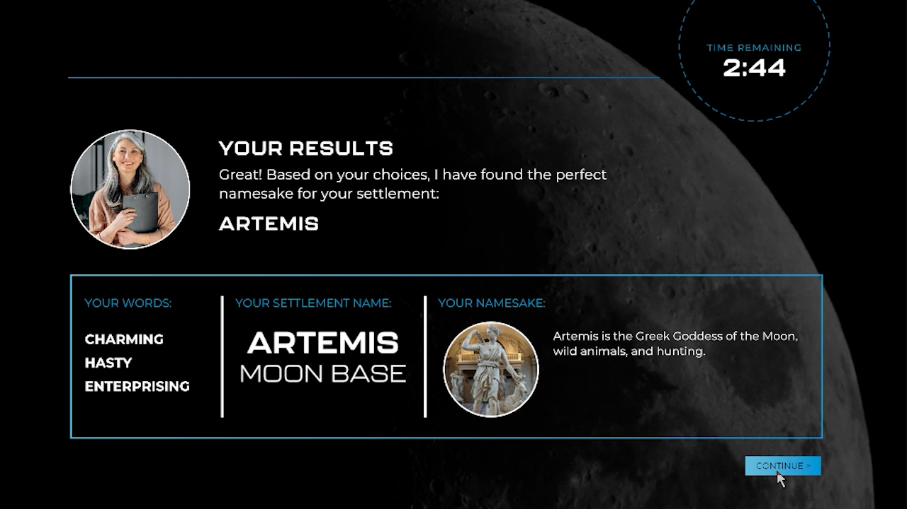
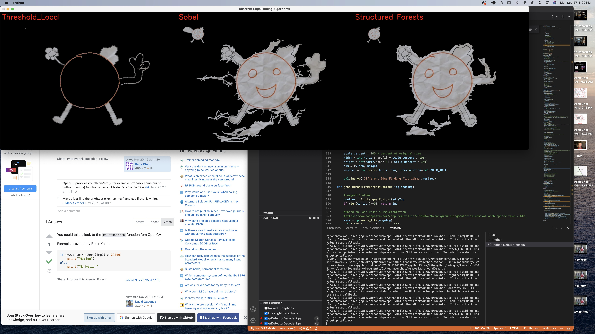
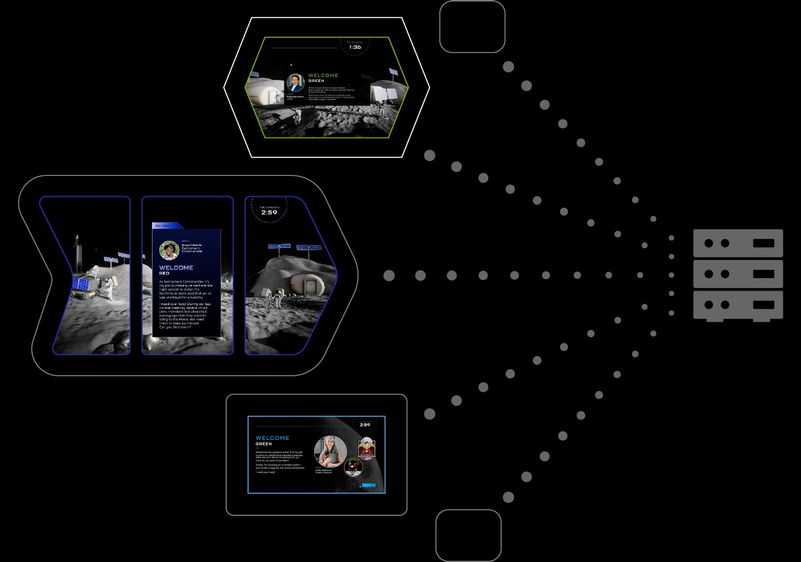

# Dynamic Background Removal Interactive

<cover-img>

</cover-img>

<design-meta>

### WHAT

Museum Interactive

### WHEN

October 2022

### MY ROLE

Prototyped Background Removal\
Developed Visitor-Ready Software

### TOOLS

Python\
Unity\
OpenCV

</design-meta>

<grid-container>

# OVERVIEW

## Sharing Hand-Drawn Designs

Visitors create the visual identity for their moon mission by drawing their own mission patch, "scanning" it into the software, and previewing it on a mural of a colonized lunar landscape.

<!-- video here -->
<video-container title="Experience Mockup">

`vimeo: https://vimeo.com/1010622662`

</video-container>

# VISITOR EXPERIENCE

All visitors draw at a moveable table before inputting their images into the software.

<bespoke-container title="Scanning Screen">

<!-- blue border -->

<!-- gray border -->

<!-- blue border -->

<!-- gray border -->
</bespoke-container>

  

Like the other Moonshot Museum interactives, this one features two visitor modes:

<ol>
<li>Mission   - designed for school groups to break out into small teams, and</li>
<li>Space Now - an ambient experience for the museum's daily visitor flow.</li>
</ol>

 

<table style="width: 100%">
<tr>

<td style="width: 40%; padding-right: 10px">

<bespoke-container title="This welcome screen introduces the interactive to small teams in 'Mission' mode.">

<!-- blue border -->

<!-- gray border -->

<!-- blue border -->

<!-- gray border -->
</bespoke-container>

</td>

<td style="width: 40%; padding-right: 10px">

<bespoke-container title="This conclusion screen points teams to the next interactive in the Moonshot experience.">

<!-- blue border -->

<!-- gray border -->

<!-- blue border -->

<!-- gray border -->
</bespoke-container>

</td>

</tr>
</table>

  

In addition to sharing badge drawings, "Mission" teams also choose a legendary historical or mythological figure as the namesake for their moon base via a selection of brand key words.

<bespoke-container title="Word Picker Screen">

<!-- blue border -->

<!-- gray border -->

<!-- blue border -->

<!-- gray border -->
</bespoke-container>

<bespoke-container title="Name Result Screen">

<!-- blue border -->

<!-- gray border -->

<!-- blue border -->

<!-- gray border -->
</bespoke-container>

# TECHNICAL HIGHLIGHTS

## Background removal prototype and calibration

I developed in Python an initial prototype as a proof of concept for the automatic background removal this experience.

<bespoke-container title="Background removal algorithm comparison">

<!-- blue border -->

<!-- gray border -->

<!-- blue border -->

<!-- gray border -->
</bespoke-container>

<bespoke-container title="Background removal prototype demo">

<!-- blue border -->

<!-- gray border -->
<video-container title="Background removal prototype demo.">

`vimeo: https://vimeo.com/1017204262`

</video-container>

<!-- blue border -->

<!-- gray border -->
</bespoke-container>

  

The interactive features a debug menu used for calibrating the image scanning after changes in lighting.

<bespoke-container title="Background removal prototype demo">

<!-- blue border -->

<!-- gray border -->
<video-container title="Debug Menu for calibrating the interactive's image scanning.">

`vimeo: https://vimeo.com/1017200255`

</video-container>

<!-- blue border -->

<!-- gray border -->
</bespoke-container>

  

## Networked experience across five interactives

This interactive is networked to the other four Moonshot activities in order to sync the activity timers and pass teams' results back to the experience's server.

<figcaption>

Moonshot network illustration calling out the three interactives I developed: Space Debates (top), Lunar Lost and Found (center), and Design a Mission Patch (bottom). Server by Chunk Icons from <a href="https://thenounproject.com/browse/icons/term/server/" target="_blank" title="Server Icons">Noun Project</a> (CC BY 3.0)

<figcaption>

I developed [Space Debates](/posts/moonshot_charter), [Design a Mission Patch](/posts/moonshot_art), and Lunar Lost and Found as clients for this server.

</grid-container>