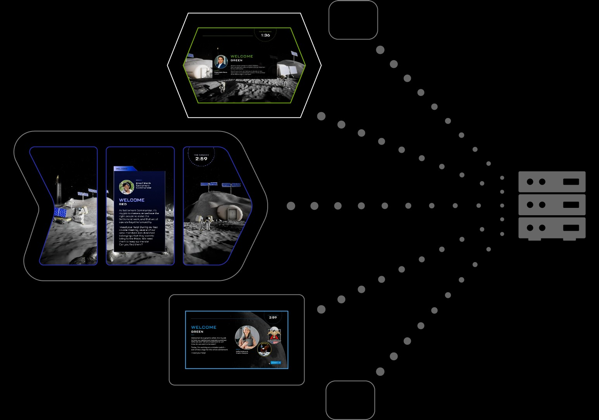

# Networked Moon Law Interactive

<cover-img>

</cover-img>

<design-meta>

### WHAT

Museum Interactive

### WHEN

October 2022

### MY ROLE

Developed Visitor-Ready Software

### TOOLS

Unity\
After Effects

</design-meta>

<grid-container>

# OVERVIEW

## Digital ballots and tallying facilitate debate

Visitors debate different stances on lunar law in their future moon colony over multiple rounds.

<!-- video here -->
<video-container title="Experience screen recordings in mockup">

`vimeo: https://vimeo.com/1017669536`

</video-container>

 

# VISITOR EXPERIENCE

## Multi-touch table for concurrent voting

Up to 6 visitors gather around a table of digital ballots, debate their positions on the questions presented, vote and see the results displayed on the screen above them.

<video-container title="Detail of voting at multi-touch table">

`vimeo: https://vimeo.com/1017673416`

</video-container>

  

On a secondary display, visitors can observe the results of their voting in a HUD over a window onto the lunar landscape outside their colony.

<video-container title="Detail of secondary, wall-mounted display">

`vimeo: https://vimeo.com/1017675964`

</video-container>

  

## One mode for school trips; another, for casual visitors

In 'Mission' mode, school groups break out into small teams and debate a series of lunar laws in two-minute intervals.

In 'Space Now' mode, regular visitors to the museum consider questions of lunar law at their own pace:

<bespoke-container title="Question and ballot in Space Now mode.">

<!-- blue border -->

<!-- gray border -->

<!-- blue border -->

<!-- gray border -->
</bespoke-container>

 

<table style="width: 100%">
<tr>

<td style="width: 40%; padding-right: 10px">

<bespoke-container title="In 'Space Now' mode, visitors choose from four policy areas to vote on lunar policy.">

<!-- white border -->

<!-- green border -->

<!-- green border -->

<!-- white border -->
</bespoke-container>

</td>

<td style="width: 40%; padding-right: 10px">

<bespoke-container title="Visitors are shown what percentage of past visitors voted the same way as them.">

<!-- white border -->

<!-- green border -->

<!-- green border -->

<!-- white border -->
</bespoke-container>

</td>

</tr>
</table>

# MOTION DESIGN

I both designed and implemented the motion graphics for this experience.

<bespoke-container title="Detail of moon crash zoom">

<video-container title="Detail of secondary, wall-mounted display">

`vimeo: https://vimeo.com/1017692118`

</video-container>

<!-- green border -->

<!-- white border -->
</bespoke-container>

# TECHNICAL HIGHLIGHTS

## Networked experience across five interactives

In 'Mission' mode, interactives share data about each teams' progress at the five stations in the experience, as well as the images teams produce and the current time in the round, all via a server on the local network.

<figcaption>

Moonshot network illustration calling out the three interactives I developed: Space Debates (top), Lunar Lost and Found (center), and Design a Mission Patch (bottom). Server by Chunk Icons from <a href="https://thenounproject.com/browse/icons/term/server/" target="_blank" title="Server Icons">Noun Project</a> (CC BY 3.0)

<figcaption>

<video-container title="Mockup with real screen recordings of networked timer across multiple Moonshot interactives. Pictured left to right: Timer from Space Debates, screen recording of Lunar Lost and Found, screen recording of Design a Mission Patch.">

`vimeo: https://vimeo.com/1017695272`

</video-container>

 

I developed [Space Debates](/posts/moonshot_charter), [Design a Mission Patch](/posts/moonshot_art), and Lunar Lost and Found as clients for this server.

</grid-container>