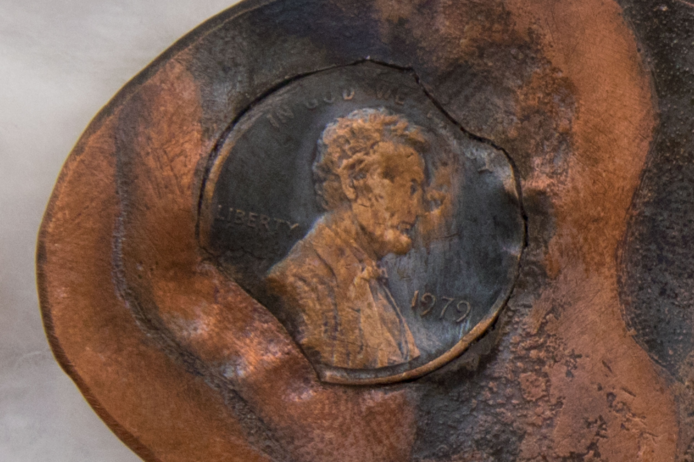

<!-- <iframe width="560" height="315" src="https://youtu.be/EOtwzR_Y01g" frameborder="0" allowfullscreen></iframe> -->

From the wall text at the Pittsburgh Athenaeum:

"Lincoln Moth
Callosamia Promethea Lincolna
Found 1979, Maryland

Only two examples of C. Promethea Lincolna have ever been found, both in the DMV tri-state area. The other specimen of C. Promethea Lincolna is currently housed at the Smithsonian National Museum of Natural History.

Environmentalists have speculated over what climatic factors could have caused the Lincoln mutation in such a narrow range of habitat: Many have suggested that the moths’ distinct patterning developed in response to the increased scarcity of copper in the late 1970’s.

Upon its discovery, C. Promethea Lincolna was immediately hailed as an American marvel by entomologists and coin collectors alike.

Donated by Joshua Kery."

