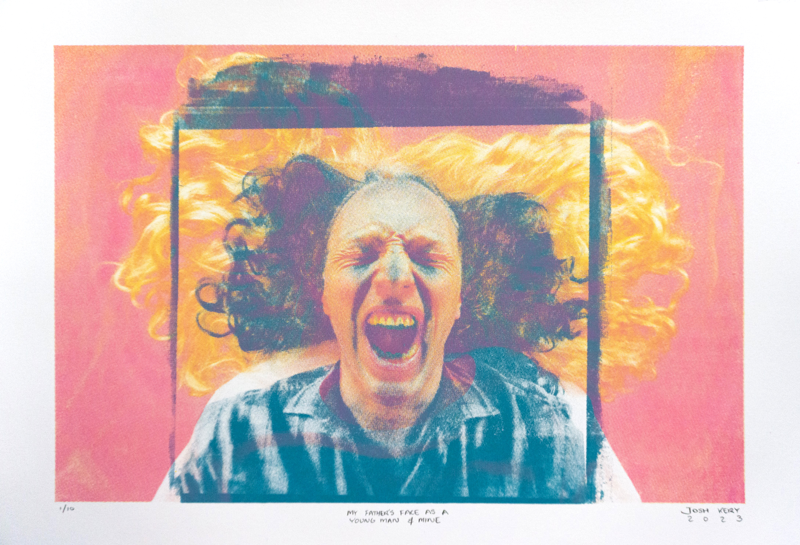
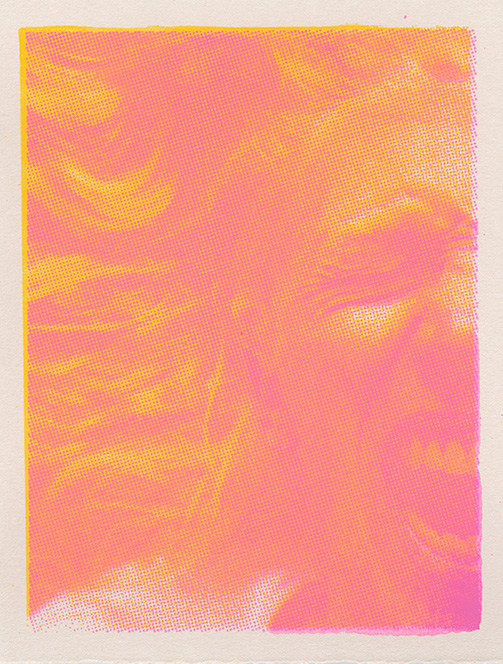
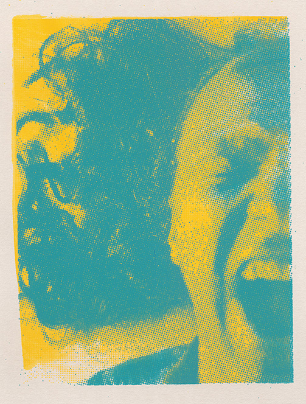
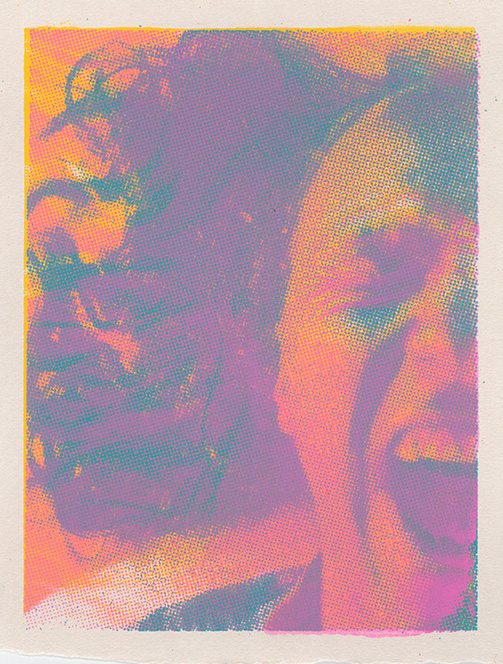
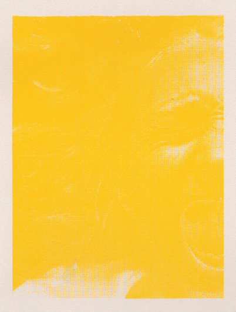
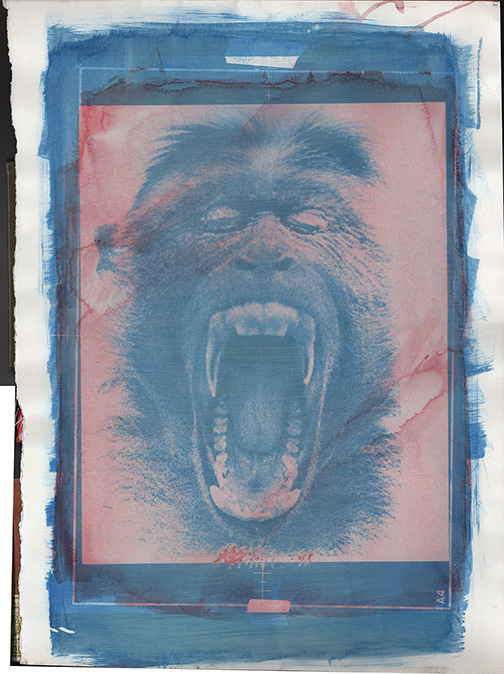
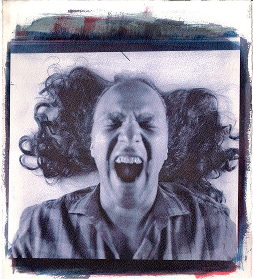

<group>

</group>

<group>
<r3>
<textbox>
For some time after art school my father kept up his chemical photography practice, shooting himself, store fronts, Philadelphia Zoo animals, desiccated bodies in the Mütter Museum, and whatever caught his eye as a subject to overlay with another.
</textbox>
</r3>
</group>

<group>
<table>
<tr>
<td>

</td>
<td>

</td>
<td>

</td>
<td>

</td>
</tr>
</table>
</group>

<group>
<l3>
<textbox>
This print features a reproduction of a photograph my father made of himself at this time. The other face is my own, captured digitally, with my own long hair and agonized roar.
</textbox>
</l3>
</group>

<group>
<l3>

<figcaption>Proofs I created prior to printing show more clearly the two images featured in the final print, including a final black layer I chose to omit in the end.</figcaption>
</l3>
</group>

<group>
<c3>
<textbox>
Among my dad's works from this period is also an image of a zoo monkey, also with jaw wide open, eyes squinted shut. Probably yawning. And I assume my dad took the picture of himself so that he could try exposing a double negative, himself and the monkey together.
</textbox>
</c3>
</group>

<group>
<table>
<tr>
<td>

</td>
<td>

</td>
</tr>
</table>
</group>

