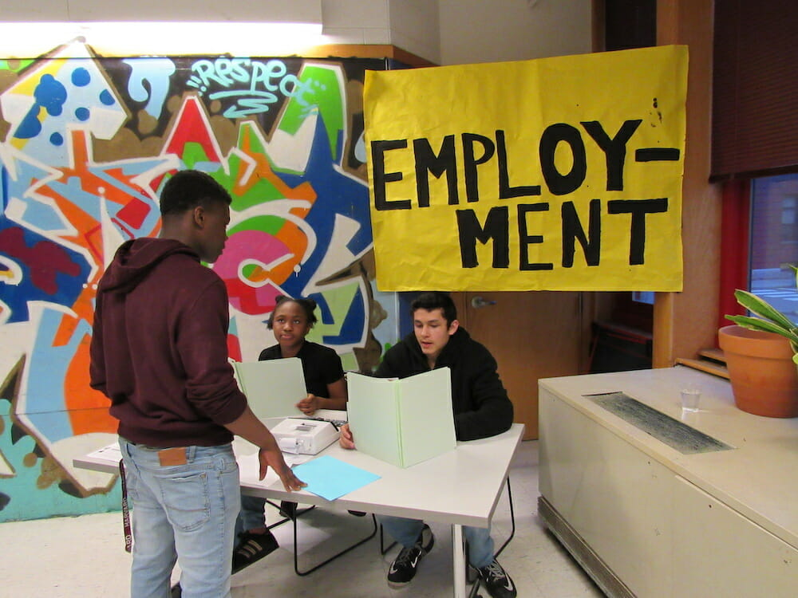
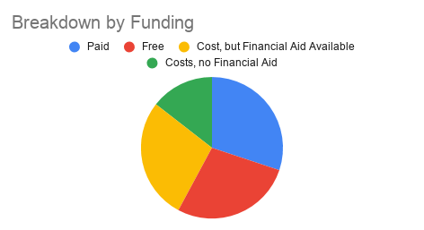
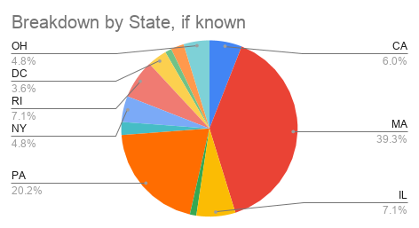
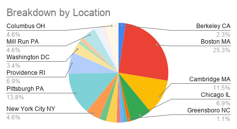
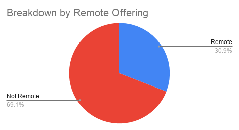
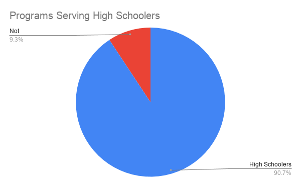
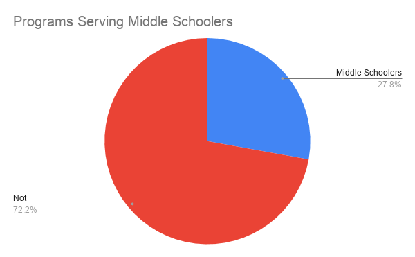

#Resource Creation

<cover-img>

</cover-img>

<design-meta>

###WHAT

Resource List for teens interested in design

###WHEN

September 2020

###MY ROLE

Research

</design-meta>

<grid-container>

#OVERVIEW

##List of 90+ teen programs in design fields

##For teens interested in design across the United States

##Prepared with a focus on teen participants in the [Neighborhood Design Project with Design Museum](https://designmuseumfoundation.org/program/neighborhood-design-project/)

#RESULTS

##In addition to being a resource for teens looking to pursue work in design, this programming list serves as a benchmarking tool for Design Museum to evaluate its education programs, like Neighborhood Design Project and [Summer Design Project.](https://designmuseumfoundation.org/program/summer-design-project/)

##Teen participants were financially compensated for their time in Neighorhood Design Project—a model that sets Neighborhood Design Project and its peer programs apart from the majority of youth education programs centered on design.

##Neighborhood Design Project was offered in Cambridge at the beginning of 2020.

##Unlike many design programs this year, Summer Design Project was offered remotely in 2020.

##Both programs aimed at educating students ages 14-18.

</grid-container>