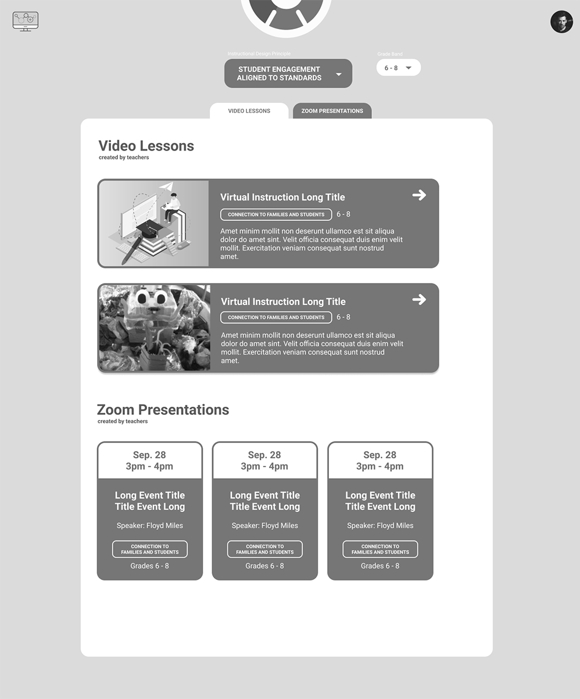

#Responsive Website for Educators

<cover-img>

</cover-img>

<design-meta>

###MEDIUM

Responsive Website

###WHEN

August - December 2020

###MY ROLE

Design,\
Full-Stack Development

###CO-DESIGNER

Amelia (Xi) Li

###GOALS

Support schoolteachers adapting to remote learning.

###TOOLS

Figma\
Adobe Illustrator\
Wordpress

</design-meta>

<grid-container>

#OVERVIEW

##The switch to remote and hybrid learning has been a challenge for schoolteachers across the country.

##Their fellow teachers, who are continuously innovating in the face of this challenge, may be their greatest resource in meeting this challenge.

##As such, the [Allegheny Intermediate Unit](https://www.aiu3.net/) sought a website to connect regional schoolteachers with the ideas of passionate educators sharing their solutions in remote and hybrid learning.

#FINAL PRODUCT

##[Visit the final website here.](https://www.onrampremotelearning.net)

##Desktop

Landing

  

Main Site

  

##Mobile

<text-pair>

<h4>

Landing

</h4>

</text-pair>

<h4>

Main Site

</h4>

</img-pair>

#BACKGROUND

##AIU3 wanted to center its learning content around the six [Instructional Design Principles for Remote Teaching and Learning](https://onrampremotelearning.net/the-framework-2/) it had developed in collaboration with the [Friday Institute for Educational Innovation](https://www.fi.ncsu.edu/) at NC State.

Many educators have approached the adaptation to remote and hybrid learning as a problem of technology, eagerly trying to learn new or unfamiliar tools like Google Classroom.

AIU3, however, wanted teachers to approach the switch with pedagogy at the forefront.

<quote>

We often had educators asking us, 'Well, how do I give out this worksheet on the computer?' ...

We don't want educators to bring ineffective teaching practices with them online. We want to use this transition as an opportunity to focus on effective teaching skills. Pedagogy first, technology second.

</quote>

The Instructional Design Principles ask teachers to focus on the following when running class remotely:

1. Social and Emotional Learning
1. Connection to Families and Students
1. Student Engagement Aligned to Standards
1. Flexibility and Choice for Diverse Needs
1. Feedback on Student Work
1. Collaboration Among Students

#DESIGN PROCESS

##Ideation

##Lo-fi Wireframes

##Mid-fi Wireframes

##Final Layouts

<full-width-image>

</full-width-image>

#DEVELOPMENT

##For ease of use, AIU3 asked us to integrate its synchronous and asynchronous content into one, navigable system.

To that end, as the solo developer I created a custom Wordpress plugin that combined the content of the [LearnDash LMS](https://www.learndash.com) and [Events Manager](https://wp-events-plugin.com/) plugins.

This plugin allows users to search and filter for AIU3's real-time professional development events and asynchronous video lessons all in one place.

Furthermore, I developed in javascript a custom breadcrumbs system on the landing page to introduce site visitors to the Instructional Design Principles.

Finally, I customized the site's Events RSS feed to display our content in bi-weekly email newsletters with robust styling that stands up to most email clients.

a test email in MailChimp

</grid-container>