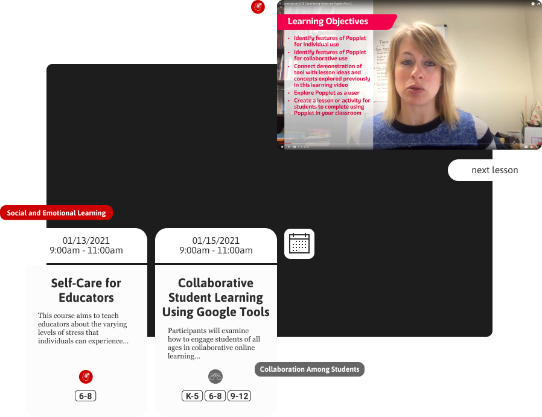
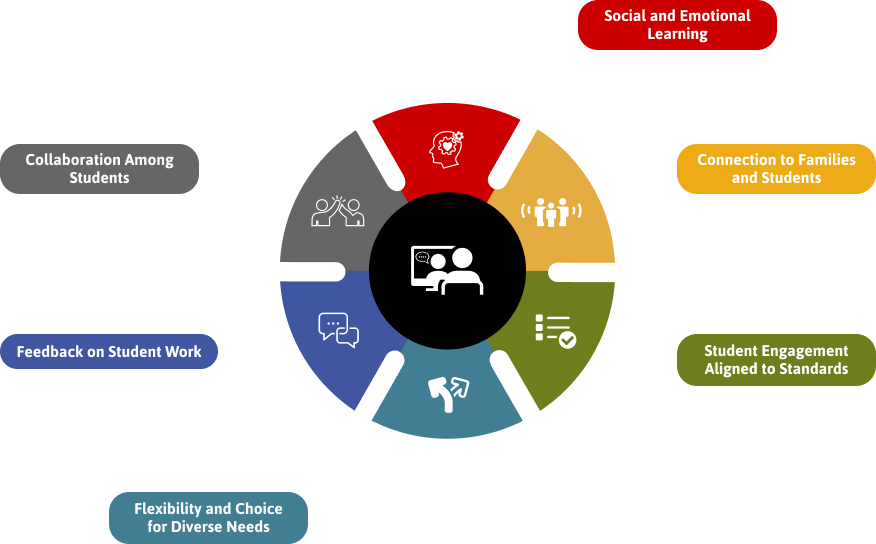
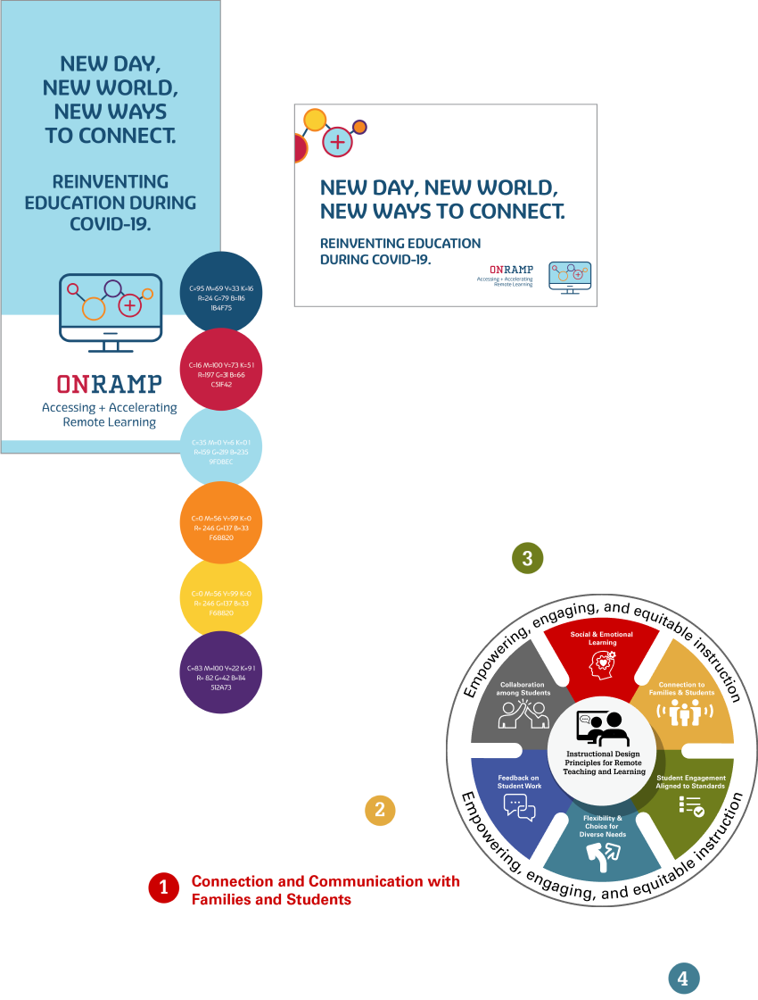

# A Learning Management System for Hybrid Educators

<cover-img>

</cover-img>

<design-meta>

### WHAT

Responsive Website

### WHEN

August - December 2020

### MY ROLE

Co-designed concept and early user experience \
Designed final experience and visuals \
Developed custom Wordpress plugin and theme

<!-- ### CO-DESIGNER

Amelia (Xi) Li

### GOALS

Support schoolteachers adapting to remote learning.

### TOOLS

Figma\
Adobe Illustrator\
Wordpress -->

</design-meta>

<grid-container>

# OVERVIEW

The [Allegheny Intermediate Unit](https://www.aiu3.net/) needed a platform to connect regional schoolteachers with remote and hybrid teaching guidance produced by passionate fellow educators.

<button-link href="https://www.onrampremotelearning.net">VISIT LIVE ONRAMP WEBSITE</button-link>

# UX CHALLENGE

## Navigating a Multi-Modal Resource

With two modes of content delivery — pre-recorded video lessons and live workshops — AIU sought a web resource where teachers could easily access both.

 

# UX CHALLENGE

## An Instructional Design Lens

AIU wanted to show teachers how each video lesson and workshop matched one of 6 Instructional Design Principles from the Friday Institute.

 

  

Many educators have approached the adaptation to remote and hybrid learning as a problem of technology, eagerly trying to learn new or unfamiliar tools like Google Classroom.

AIU3, however, wanted teachers to approach the switch with pedagogy at the forefront.

  

<quote>

We often had educators asking us, 'Well, how do I give out this *worksheet* on the computer?' ...

Research has shown that worksheets are a less effective teaching practice...

We don't want educators to bring ineffective teaching practices with them online. We want to use this transition as an opportunity to focus on effective teaching skills. *Pedagogy first, technology second.*

</quote>

  

# UX CHALLENGE

## Merging Two Brand Identities

AIU needed to merge two brands in this site: the Instructional Design Principles, and a set of logo standards developed by their graphics team.

 

  

# UX SOLUTION

## OnRamp to Remote Learning: Responsive Web App

<browser-container>

</browser-container>

<browser-container>
<figure>

<figcaption>Landing Page</figcaption>
</figure>
</browser-container>

  

<browser-container>
<figure>

<figcaption>All Content Page</figcaption>
</figure>
</browser-container>

<browser-container>
<figure>

<figcaption>All Content Page</figcaption>
</figure>
</browser-container>

  

<multi-mobile-container title="Mobile Landing and All Content Page">
<mobile-container>

</mobile-container>
<mobile-container>

</mobile-container>
</multi-mobile-container>

<!-- <text-pair>

<h4>

Landing

</h4>

</text-pair>

<h4>

Main Site

</h4>

</img-pair> -->

  

# UX PROCESS

## Defining the User Flow

  

## Crafting the Information Architecture

My co-designer and I created this architecture for the site, following our flow map above.

  

<!-- ## Ideation

## Lo-fi Wireframes

 -->

<!-- ## Mid-fi Wireframes -->

<!--  -->

<!-- 

 -->

## Mid-fi & Hi-fi Mockups

For the second phase of this project, I developed these higher fidelity mockups of the site in preparation of executing it in code.

<browser-container isPrototype="true">

</browser-container>

<browser-container isPrototype="true">

</browser-container>

<browser-container isPrototype="true">

</browser-container>

<browser-container isPrototype="true">

</browser-container>

<!-- # DEVELOPMENT

## For ease of use, AIU3 asked us to integrate its synchronous and asynchronous content into one, navigable system.

To that end, as the solo developer I created a custom Wordpress plugin that combined the content of the [LearnDash LMS](https://www.learndash.com) and [Events Manager](https://wp-events-plugin.com/) plugins.

This plugin allows users to search and filter for AIU3's real-time professional development events and asynchronous video lessons all in one place.

Furthermore, I developed in javascript a custom breadcrumbs system on the landing page to introduce site visitors to the Instructional Design Principles.

Finally, I customized the site's Events RSS feed to display our content in bi-weekly email newsletters with robust styling that stands up to most email clients.

a test email in MailChimp -->

  

<button-link href="https://www.onrampremotelearning.net">VISIT LIVE ONRAMP WEBSITE</button-link>

  

</grid-container>
