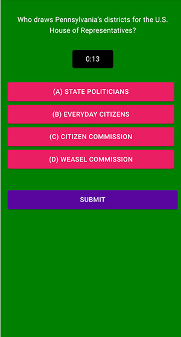

# A Mobile & Mobile Performance Party About Gerrymandering

<cover-img>

</cover-img>

<design-meta>

### WHAT

Responsive Web App for Live Performance

### WHEN

October 2021

### MY ROLE

Game & Experience Design\
Technical Design for Hardware\
Developed Audience-Ready Software

### TOOLS

React\
Firebase\
p5\
Web Sockets

</design-meta>

<grid-container>

# OVERVIEW

## Packing and Cracking?

<quote>

Do we choose our politicians, or do our politicians choose us?

Packing and Cracking is a mapmaking party about gerrymandering: the pervasive practice of politicians choosing their voters rather than the other way around.

Through drawing and map-drawing games, Packing and Cracking uses critical cartography, gerrymandering history, and interviews with politicians and reformers today to show how easy and disenfranchising gerrymandering can be and ask what we should do about it.

</quote>

- from [packingandcracking.com](https://www.packingandcracking.com/)

 

For Packing and Cracking's 2021 run, I revamped its [digital experience](/posts/packingandcracking) with a new mobile app for a newly mobile audience.

We were bringing the audience to real sites of gerrymandering, by bus!

# AUDIENCE EXPERIENCE

## A Drive to a District Split

To make real and visible how voting district lines can manipulate communities, we brought our audience on a bus route along PA State House district lines to a site of a divided apartment complex.

<bespoke-container title="Outside onboarding at Chatham University; on-board games as we traced the general shape of State House district lines in Pittsburgh; our main stop at the site of a divided apartment complex.">

</bespoke-container>

  

## Mobile Games on a Mobile Bus

Packing and Cracking teaches audiences about gerrymandering with a series of mini-games and prompts for reflection.

  

<multi-mobile-container title="Mobile Stills. Left: A simple district-drawing exercise using a p5 canvas. Right: A text input allowing audiences to reflect on what they value most in their government.">
<mobile-container>

</mobile-container>
<mobile-container>

</mobile-container>
</multi-mobile-container>

  

Audience members input responses on their smartphones and a large monitor mounted at the front of the bus showed answers and a scoreboard.

<mobile-container>

</mobile-container>

<figcaption>Top: Mobile quiz input. Bottom: Common display showing the results of the audience's input; in this example, all responses for the Green Team were for answer (a) state politicans.</figcaption>

# EXPERIENCE DESIGN PROCESS

## Site-Specific Research

We traced by car the lines of the 2011 Pennsylvania State House districts in search of a strong metaphor for the manipulative drawing of district lines.

<figure>
<iframe width='100%' height='400px' src="https://api.mapbox.com/styles/v1/joshuakery/ckt3czxm806up17o62cf5zt1y.html?title=false&access_token=pk.eyJ1Ijoiam9zaHVha2VyeSIsImEiOiJjanUwaTZweWQyeXY1NDRxdW1sNWR5cmtjIn0.cW4oEV9tM0PGv8EhMUww4Q&zoomwheel=false#13.64/40.49414/-79.8829" title="Packing and Cracking Research:Lines of Interest" style="border:none; margin-bottom:0"></iframe>
<figcaption>This map shows the 2011 Pennsylvania State House districts, overlaid with three townships divided across multiple districts that we visited on our research trip. I prepared a version of this map in advance of our journey, so that we could reference real geographic data while we drove around Allegheny County.</figcaption>
</figure>

Our journey took us around District 21's protrusion into O'Hara Township, down the 38-39 split of South Park, and to the cliffside boundaries of Clairton.

We settled on a split dividing an apartment complex in O'Hara Township as the destination for our bus route in the show.

  

## Game Design Ideation

As a team, we brainstormed how best to adapt Packing and Cracking's [prior](/posts/packingandcracking) [formats](https://www.packingandcracking.com/in-person) to a show on a moving bus.

# TECHNICAL HIGHLIGHTS

## On Board Wi-fi

We brought a set of mobile web games into the hands of each audience member on a moving vehicle.

To avoid Internet outages while in transit, we hosted an offline network on the bus and served the web app from a laptop on board.

<bespoke-container title="Network diagram of the experience. We ran a wireless router on the bus and asked audience members connect to its wi-fi network during the show. The web app was served from a Macbook Pro on the network, which also output a video signal to a hardware mixer connected to a large monitor on the bus.">

</bespoke-container>

I used Firebase's [Local Emulator](https://firebase.google.com/docs/emulator-suite) and a React app's dev mode to serve the webapp entirely offline.

  

## Admin Control

Audience members sign-on to one of two teams.

Behind the scenes, as show tech I controlled our games using a [custom cue-system](/posts/cue-system) admin page.

<browser-container>

</browser-container>

With a button click, I changed which games audience members saw on their phones. Changes were saved in our Firebase instance and passed to the audience's smartphone clients via web sockets.

# SHOW DETAILS

Audience members were split into two teams, Orange and Green, each with their own team leader in corresponding costume.

Additionally, three performers inspired by CPG Grey's [Gerrymandering Explained](https://youtu.be/Mky11UJb9AY?si=vMcGO9sivEYR17LP)—the Bear, Cat, and Weasel—facilitated the show.

The bus route ended at a parking lot for a community of two apartment buildings split into 2011 Pennsylvania House Districts 30 and 32.

Audience members used chalk to write their responses to this division.

<button-link href="https://www.packingandcracking.com/" target="_blank">LEARN MORE ABOUT PACKING AND CRACKING</button-link>

</grid-container>