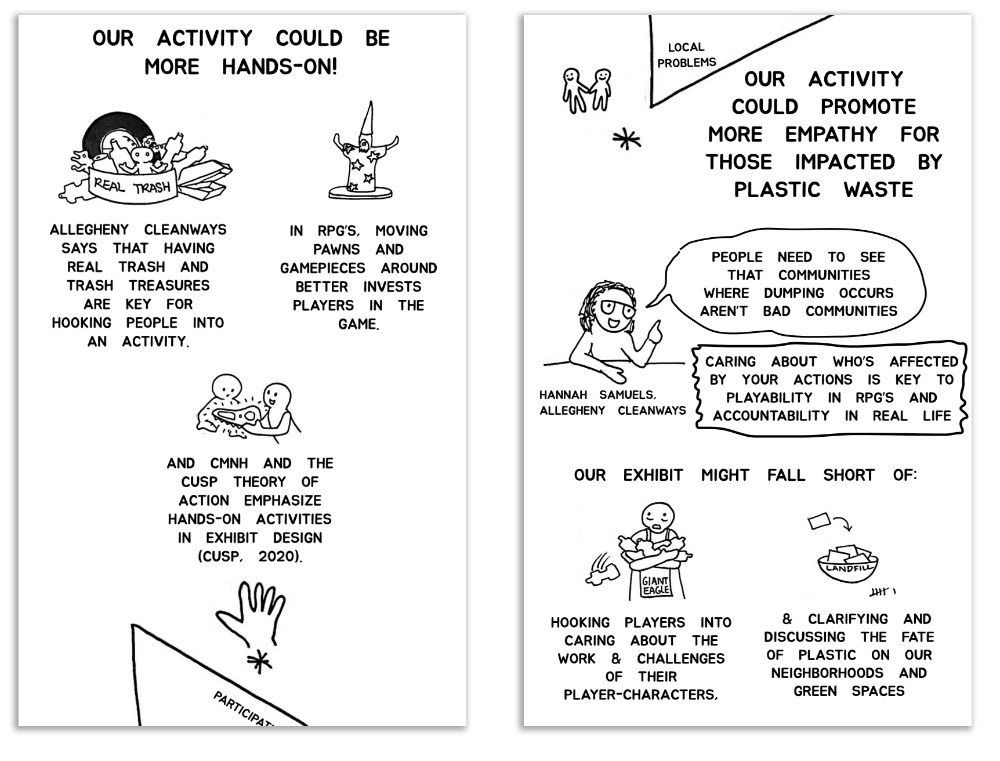

#User Interface Design & Unity Development

<cover-img>

</cover-img>

<design-meta>

###MEDIUM

Virtual Tabletop Game

###WHEN

May, 2020

###CLIENT
Carnegie Museum of Natural History

###MY ROLE

Design, Research, Evaluation

###TEAM

Olivia Keller\
Steve (Yangjian) Wang

###GOAL

Discuss plastic pollution in Pittsburgh with museum visitors

###TOOLS

Zoom\
TableTop Simulator

</design-meta>

<grid-container>

#OVERVIEW

##The Carnegie Museum of Natural History's CUSP public outreach program seeks to motivate people to act sustainably and feel empowered to tackle big environmental issues like plastic pollution.

##As part of Marti Louw's *Learning in Museums* course, we collaborated with CMNH to develop our own CUSP activity.

##We created *Plastic Patrol*, a multiplayer, role-playing board game about plastic waste in Pittsburgh.

#FINAL PRODUCT

<full-width-image>

</full-width-image>

##*Plastic Patrol* is a facilitated RPG featuring a game board and deck of cards.

It was implemented using Steam's Tabletop Simulator and played virtually over Zoom.

#GAMEPLAY

##Learning Objective:

##Visitors know actionable, **collective**, reduce&reuse based alternatives, as compared to **individualized**, recycling-based choices for reducing plastic waste.

Players begin the game by choosing to role-play as one of four actors...

..each with a location on the map of Pittsburgh.

###The goal: Reduce the amount of plastic waste on the game board.

Plastic waste is represented by cubes of different sizes, located at each of our actor sites.

In a 3-card round, players choose the best plastic-reducing decision.

In the first two rounds, players choose a decision card based on their chosen role.

###Our card design features a potential action and the revealed consequences.

Based on their card choices, players move plastic around, on or off the board.

The "Level of Action" determines how much plastic waste is moved to another location or removed from the board.

###Our facilitators then engage players in a conversation about how plastic is moved around the board.

Learning builds over 3 rounds:

At the end of the game, the facilitator tallies how much plastic was removed from the board, and marks the rest as headed for the landfill.

#BACKGROUND

##*Plastic Patrol*'s design is grounded in the CMNH's CUSP [Theory of Action](http://www.cuspproject.org/learning-science/principles#.Xxs_rPhKhQI).

This describes guidelines for CMNH to develop its public outreach activities centered on educating people about their impact on the environment, as individuals and, crucially, as communities.

CUSP emphasizes communicating the **local relevance, interconnectedness, and participatory nature** of the harm and help we do to our environment.

###From our zine:

#PLAYTESTING

##We first playtested our game with CMNH staff overseeing the CUSP program and curatorial development at the museum.

Their early insight into the issue of plastics in Pittsburgh, as well as their feedback regarding how our activity met their CUSP Theory of Action, was instrumental in refining our game and developing our evaluation strategy.

<full-width-image>

</full-width-image>

##For our formal evaluation strategy, we playtested virtually with an additional 5 participants:
- 3 experts from CMNH & 2 family members
- 2 multiplayer sessions & 1 singleplayer
- 20 to 30 minutes per session

###We wanted to measure a specific impact:

##Do players gain knowledge of the different *scopes* of impact of their decision cards?

We broken down this question into potential indicators and evaluation methods using these logic models:

Our chosen methods:
- Pre & Post-Game Surveys
- Coding recorded sessions for Affective Speech
- Coding of player in-game card decisions

###After playtesting, it became clear that we needed many more sessions to properly evaluate our design using these methods.

<quote>

"I'm kind of surprised that [this card] is the same value as the one I chose."

</quote>

But this initial strategy did highlight for us that expressions of frustration as well as surprise could be good indicators of learning. 

In addition, we learned that playing alongside others led to the richest conversations, and that a "make-your-own-card" round requires greater scaffolding. 

#NEXT STEPS

##How can we streamline this game?

Role-playing games are time-consuming!

but...

They offer a rich learning experience through conversation.

Museum staff advised us that even teens only commit 3 - 8 minutes of attention to a game on the museum floor.

And we learned from playtesting that conversations might be less rich in the first round, as players learn the game mechanics.

###How can we design for less facilitation?

Related to streamlining, playtesting taught us that players reflect on concepts learned through the gameplay mechanics, like comparing their results to their co-player’s, and big-picture thinking of how plastic moves as a system.

Museum staff recommended a self-guided exhibit, with the facilitator standing by for questions.

#ZINE

##We compiled our final report on the design and evaluation of *Plastic Patrol* into a graphic [zine](https://drive.google.com/file/d/1LoQD-OIJm-1Hoz3PXn8dQYtMRMznZ-nZ/view?usp=sharing) (18MB).

#ACKNOWLEDGEMENTS

##Special Thanks to:

Marti Louw\
Mandela Lion\
Anastasia Ward\
Patricia DeMarco\
Hannah Samuels\
Myrna Newman\
& all of our playtesters

</grid-container>