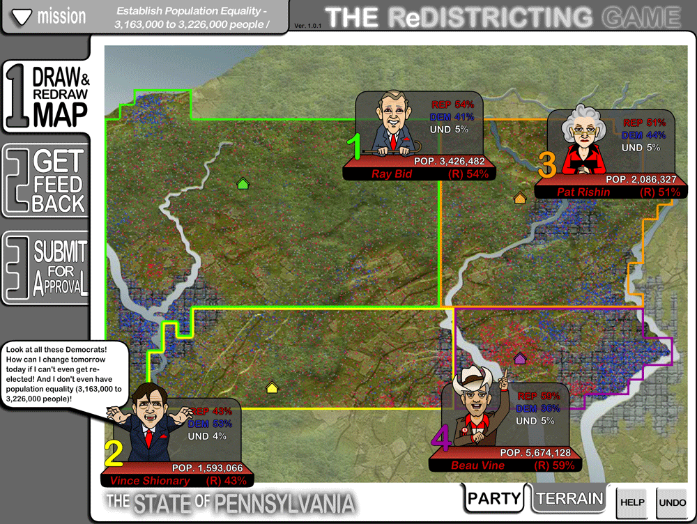
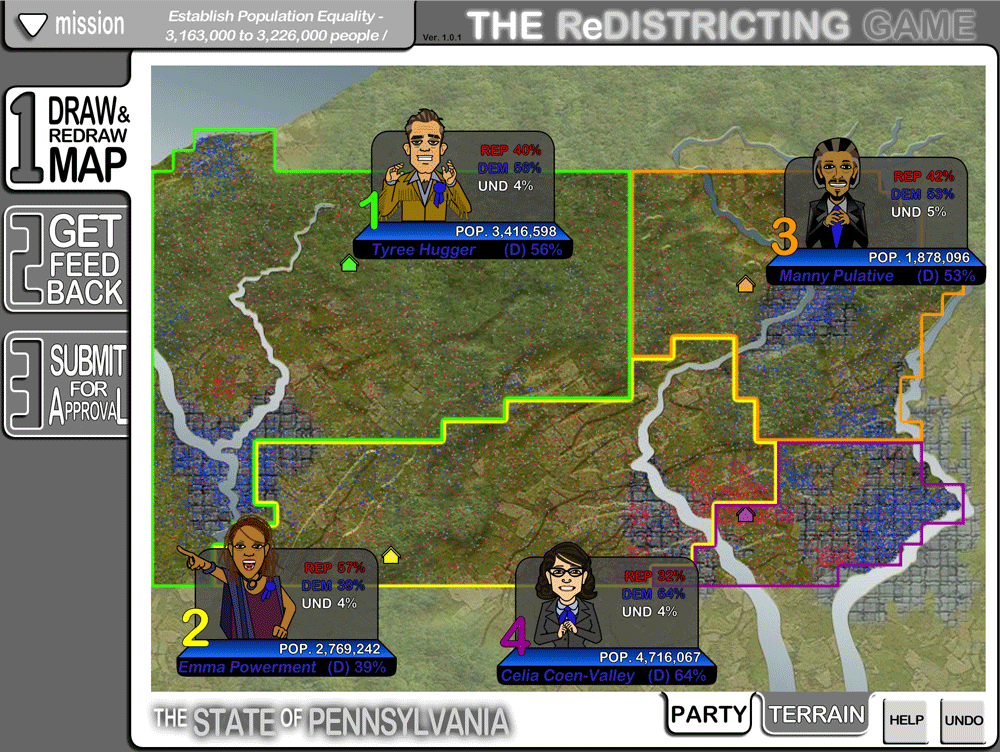
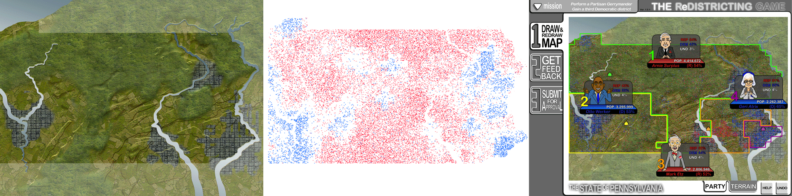
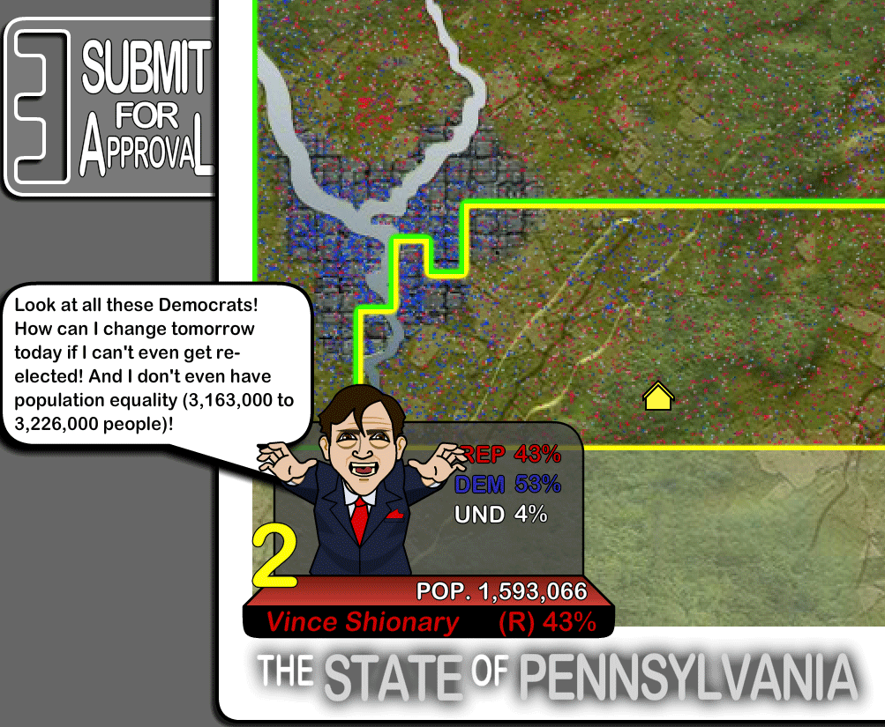
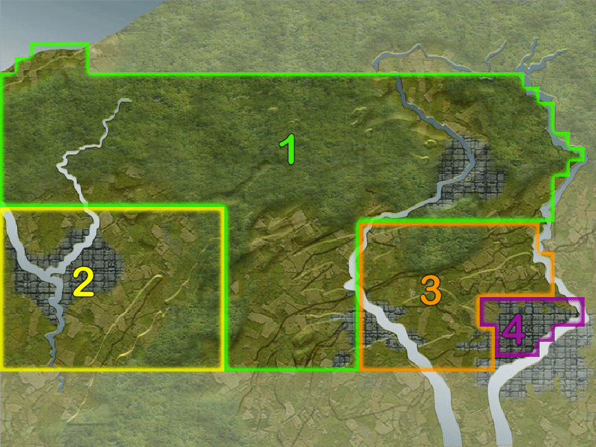

I led the update for the Redistricting Game an Adobe Flash game originally made in 2007, as part of the Committee of Seventy's Draw the Lines PA campaign to educate Pennsylvania voters about the state's heavily gerrymandered districts before the 2018 state Supreme Court vote on redrawing them.

As a team of three, we created custom graphics for the state of Pennsylvania, and integrated real census and voter distribution data into the game to teach Pennsylvania residents about gerrymandering in their home state.

The Redistricting Game invites players to redraw the voter districts for a simplified version of their state. Players opt into a few different missions, including deliberately gerrymandering to favor their chosen party and reforming a heavily gerrymandered map to ignore party demographics and reflect population only. They're guided by the voices of the representatives they're influencing, who argue for or against their decisions.

