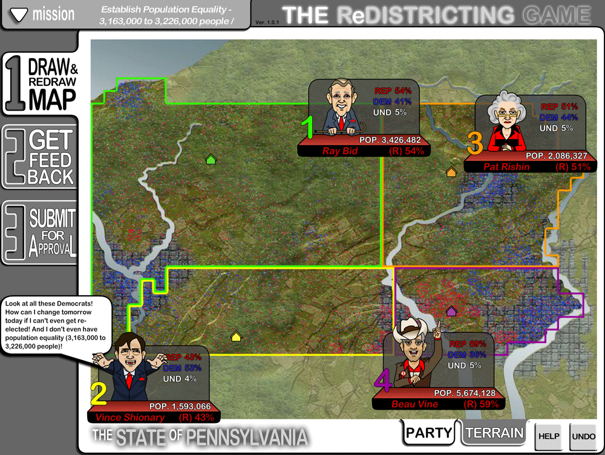
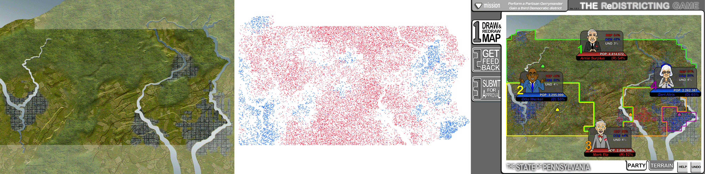
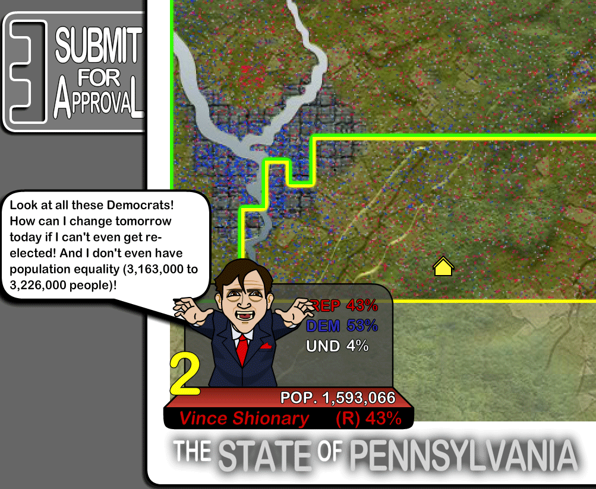
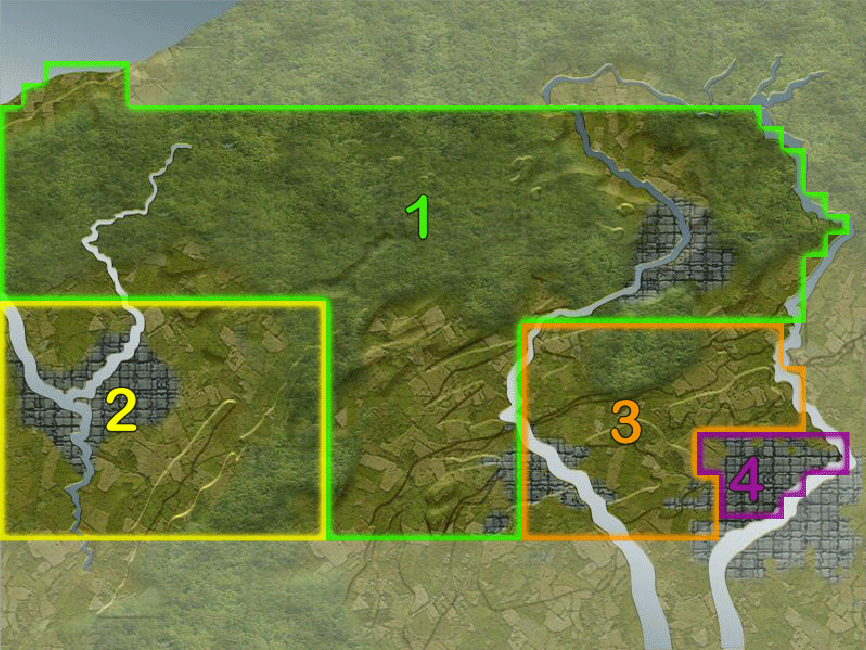

# Educational Game

<cover-img>

</cover-img>

<design-meta>

### CLIENT

Committee of Seventy

### WHEN

December 2017

### MY ROLE

PM\
Illustration\
Development

### TEAM

Ben Klingensmith\
Andrew Boyer

### GOAL

Customize the Redistricting Game for the State of Pennsylvania

### TOOLS

Adobe Photoshop, Adobe Flash

</design-meta>

<grid-container>

# OVERVIEW

In 2018, the Pennsyvlania Supreme Court was to vote on redrawing the state's district lines.

The Committee of Seventy asked us to update the Redistricting Game before this vote, to help them educate citizens about the gerrymandering that's shaped Pennsylvania's district.

I led the update for the game, which was made in 2007 in Adobe Flash.

# PROCESS

## Customizing the Game for Pennsylvania

We were asked to integrate current Pennsylvania census data into the exisiting game and adapt its graphics for the state.

As a team of three, we created custom graphics for the state of Pennsylvania, and integrated real census and voter distribution data into the game to teach Pennsylvania residents about gerrymandering in their home state.

The Redistricting Game invites players to redraw the voter districts for a simplified version of their state. Players opt into a few different missions, including deliberately gerrymandering to favor their chosen party and reforming a heavily gerrymandered map to ignore party demographics and reflect population only. They're guided by the voices of the representatives they're influencing, who argue for or against their decisions.

</grid-container>

