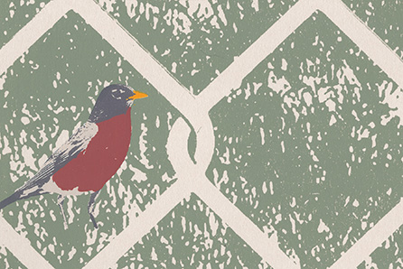

<group>
<c4>

<figcaption>Sight of Spring (Varied Edition). Screen print on paper. 12 in. x 18 in.</figcaption>
</c4>
</group>

<group>
<c3>
<textbox>
Each print in this edition is a unique variation on the positions of the robins in the image. I prepared a special set of four stencils for each robin: yellow, red, and gray colors, and a paper-color mask behind them all.
</textbox>
</c3>
</group>

<group>
<l4>

</l4>
</group>

<group>
<r3>

</r3>
</group>

<group>
<c4>

</c4>
</group>

<group>
<r4>

</r4>
</group>

<group>
<l3>

</l3>
</group>

<group>
<c4>

</c4>
</group>