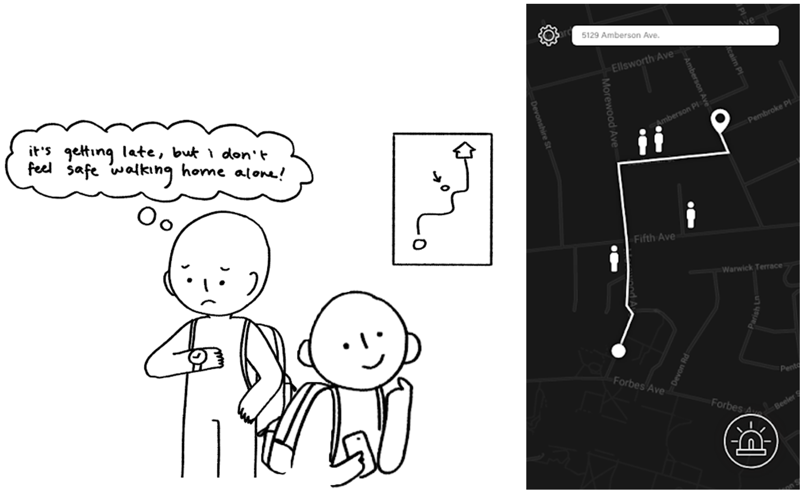
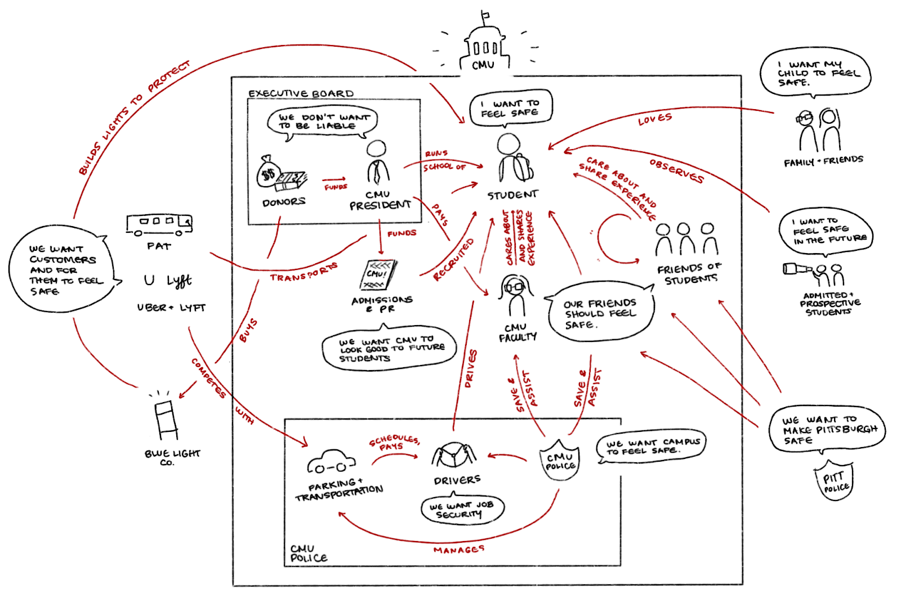
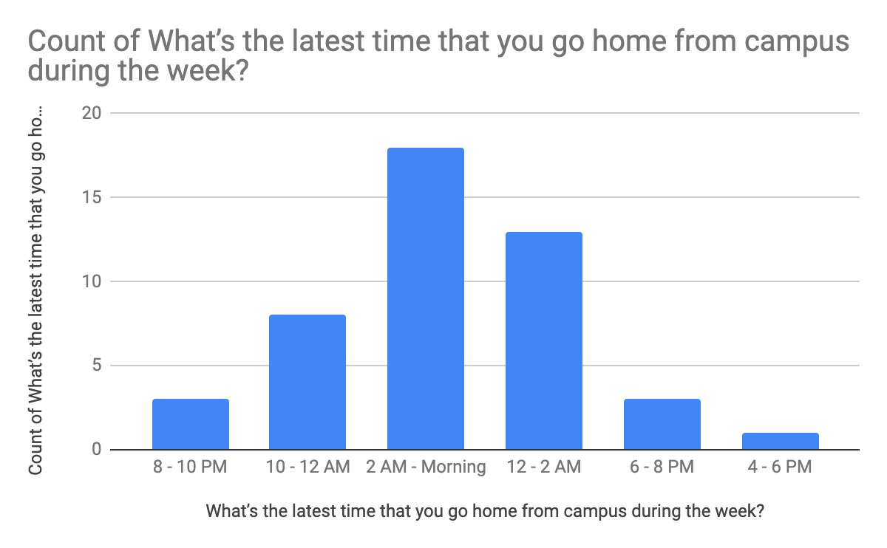
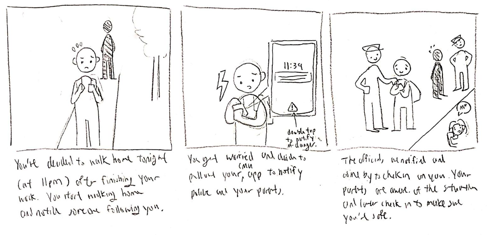
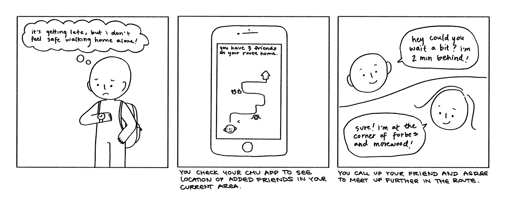
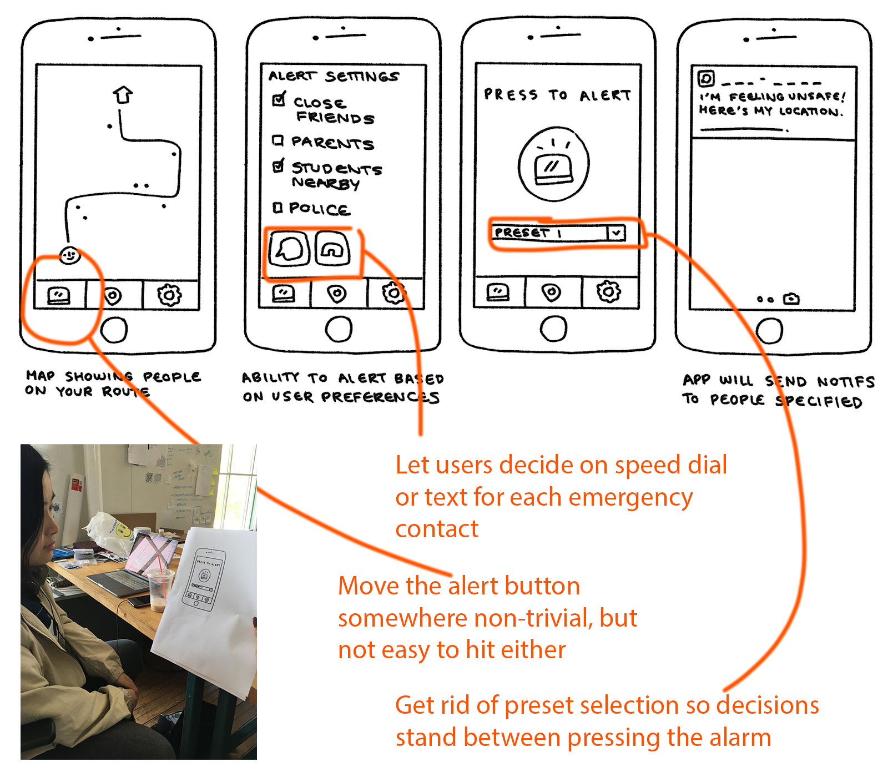
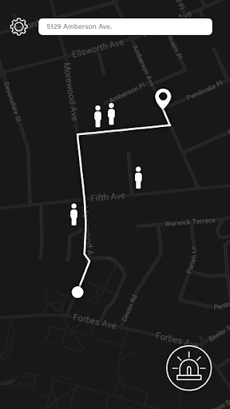
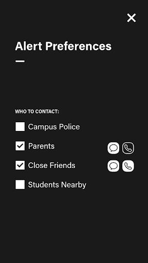
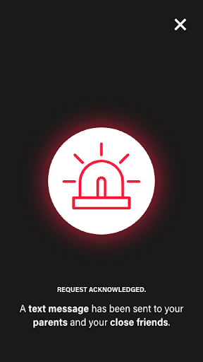

#Helping Students Feel Safe Walking Home

<cover-img>

</cover-img>

<design-meta>

###MEDIUM

Mobile Application

###WHEN

May, 2019

###MY ROLE

Research, User Testing, Design

###TEAM

Maddy Cha\
Amru Palaniyappan\
Candia Gu

###GOAL

Help students feel safer walking home at night

###TOOLS

Adobe Illustrator

</design-meta>

<grid-container>

#OVERVIEW

##An alert of attempted assault, chase, or sexual harassment in the area goes out to Carnegie Mellon University students at least once a semester.

##Existing campus safety services fall short of making students feel safe on their walks home.

##We proposed an app that helps students feel safer by connecting them to their loved ones and to students around them.

#BACKGROUND

##The CMU Graduate Student Association asked us to explore improvements to students' travel to and from school.

Our prior research into the CMU Shuttle & Escort service let us map out how **student safety** was a common concern among campus stakeholders.

<full-width-image>

</full-width-image>

#RESEARCH

<quote>

"I'd have to look up the campus police number. I don't have it memorized."

</quote>

<quote>

"I'll feel safer when I move next year. There will be more students walking down the street with me then."

</quote>

##We conducted contextual inquiry interviews and distributed a survey to learn more about how safe students feel walking home.

In our Contextual Inquiry sessions, students said they felt safest having someone they trust in contact with them, even if it was another student just ahead. 

But our surveys showed that students walk home despite feeling unsafe. They don't often plan ahead for safety, but still need reassurance in the moment.

#PROCESS

##We speed-dated several storyboards to validate two key design solutions:

###1. Put students in quick contact with emergency services, like CMU Police.

###2. Let students see if there are nearby students when walking home.

##We conducted 5-second usability tests on our wireframes to refine their layout:

#FINAL DESIGN

###Map Display

<h4>

Our final design helped students choose their route home based on where other students were walking,

</h4>

</img-pair>

###Alert Preferences

<text-pair>

<h4>

Alerted them if another user in their area felt in danger, and...

</h4>

</text-pair>

###Fast-Alert Button

<h4>

Put them in quick contact with emergency services or loved ones when needed.

</h4>

</img-pair>

#REFLECTION

This project felt like a strong end to my course on user-centered research, in which we could leverage insights we gathered from research methods like contextual inquiry to inform our design at each iteration. It was my first time using storyboarding and speed-dating as generative design tools, and I think they brought us to a mobile app that really met students' needs.

</grid-container>

