#Augmented reality. Schlumpy Funk.

<cover-img>

</cover-img>

<design-meta>

###WHAT

AR experience

###GOALS

Explore local artist's work

###WHEN

March - May 2020

###COLLABORATOR

[Michelle Cedeño](https://michellecedeno.com/)

###MY ROLE

Concept\
Research\
Design\
Development

###TOOLS

Figma\
Metashape\
Cinema 4D\
Unity

</design-meta>

<grid-container>

#OVERVIEW

##An augmented reality experience bringing you closer to the work of Pittsburgh artist [Laura Jean McLaughlin](http://laurajeanmclaughlin.com/).

##For this AR-design study, we were challenged to create a site-specific experience.

##We created Schlumpy Funk Studio, a guided digital sculpting experience to celebrate Laura's practice.

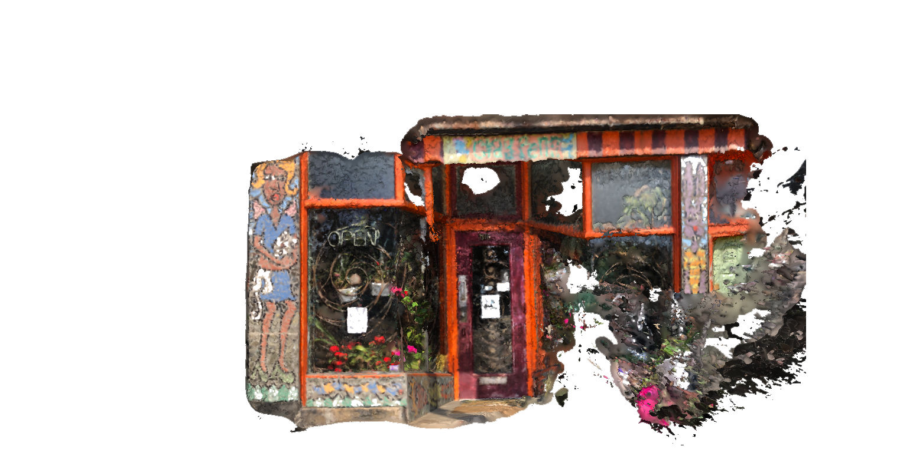

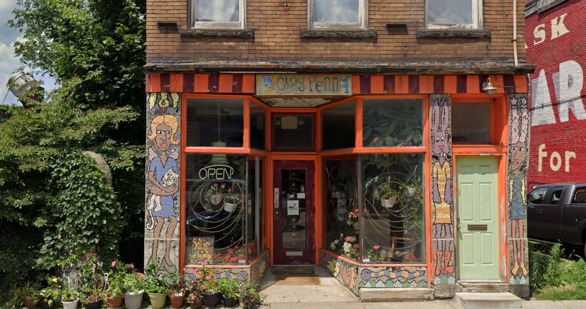

#FINAL PRODUCT

##Schlumpy Funk Studio celebrates the work of artist Laura Jean McLaughlin, pulling inspiration from her meditative studio practice and the many sites of her public artworks across Pittsburgh.

A QR code at each site of Laura’s works gives viewers access to the Schlumpy Funk Studios, where a cat named Boots will guide them to chill out, collect found objects, and bring them together into Schlumpy Funk sculptures.

</img-pair>

</img-pair>

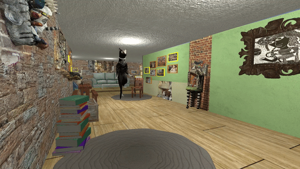

   

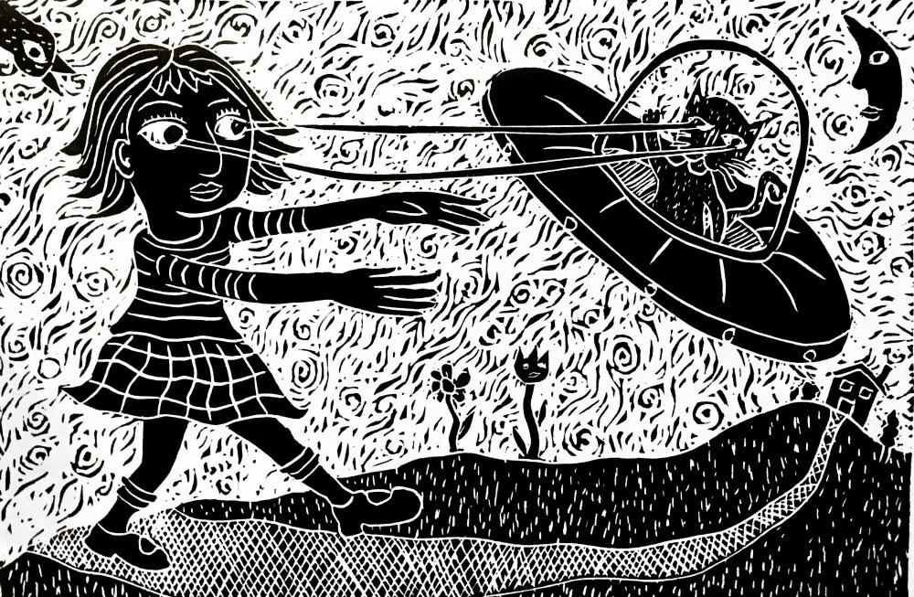

#BACKGROUND

##Schlumpy Funk Studio is both a tribute to Laura Jean McLaughlin's body of work and a design for engaging with her practice.

[Read more about Laura.](http://laurajeanmclaughlin.com/about/)

I had the pleasure of being introduced to Laura via Michelle, who lived above her studio, the Claypen, at the time of the project.

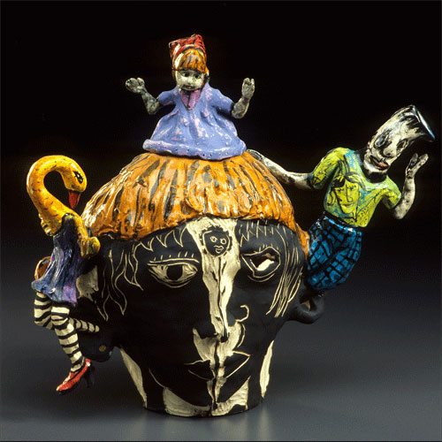

</img-pair>

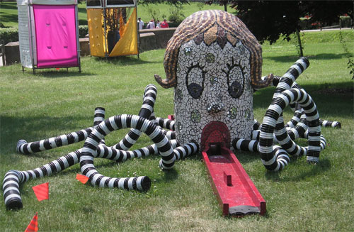

</img-pair>

##What is Schlumpy Funk?

<quote>

The word *schlumpy*, which has Yiddish origins, is often referred to as unkempt and sloppy.

The term *funk* originated from jazz artists when referring to improvisation and freestyle interludes.

</quote>

Laura started the [Schlumpy Funk](https://schlumpyfunk.wordpress.com/schlumpy-funk/) art movement.

In her words, it has "its origins based in the Surrealist, Dada and Funk movements. Clay artists [Robert Arneson](https://en.wikipedia.org/wiki/Robert_Arneson), [Peter Voulkos](https://en.wikipedia.org/wiki/Peter_Voulkos), [Beatrice Wood](https://en.wikipedia.org/wiki/Beatrice_Wood), and [George E. Ohr](https://en.wikipedia.org/wiki/George_E._Ohr) were all predecessors to the Schlumpy Funk movement, contributing free flowing, expressive and often humorous ceramic forms."

#RESEARCH

##The site of Laura's practice - The Claypen Studio on Penn Avenue - was crucial for the development of this project.

Each month, people from all over Pittsburgh stroll Penn Avenue between the 4800 and 5500 blocks to meet with artists and business owners. Visitors can bask in Penn Avenue's creative energy – experiencing a mix of photography, dance, painting, sculpture, music and spoken word performances.

##To capture the feeling of Laura's work, we transformed her studio's facade (see above) and a set of featured sculptures into 3D models using photogrammetry.

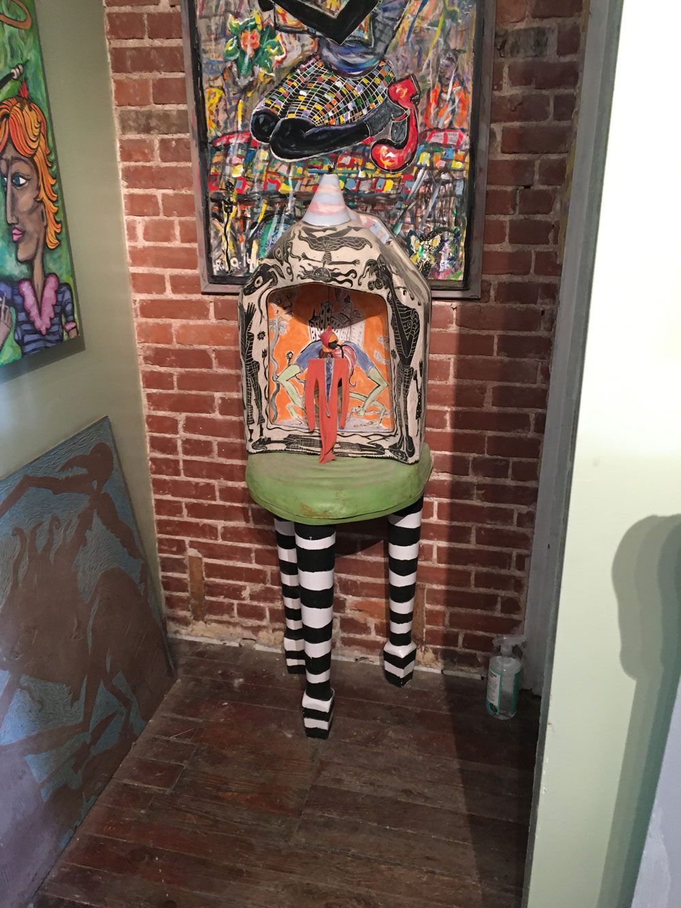

<h4>Laura's original sculpture, and below: Our photogrammetry model.</h4>

</img-pair>

  

#PROTOTYPING

##Map

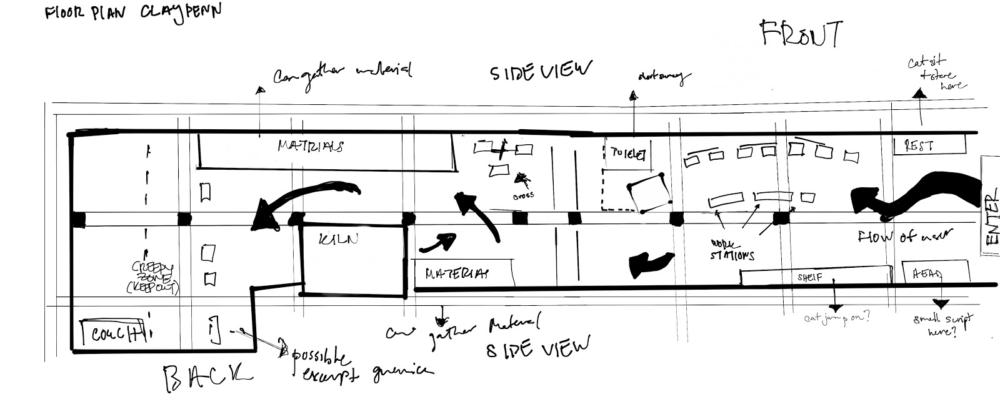

##UI

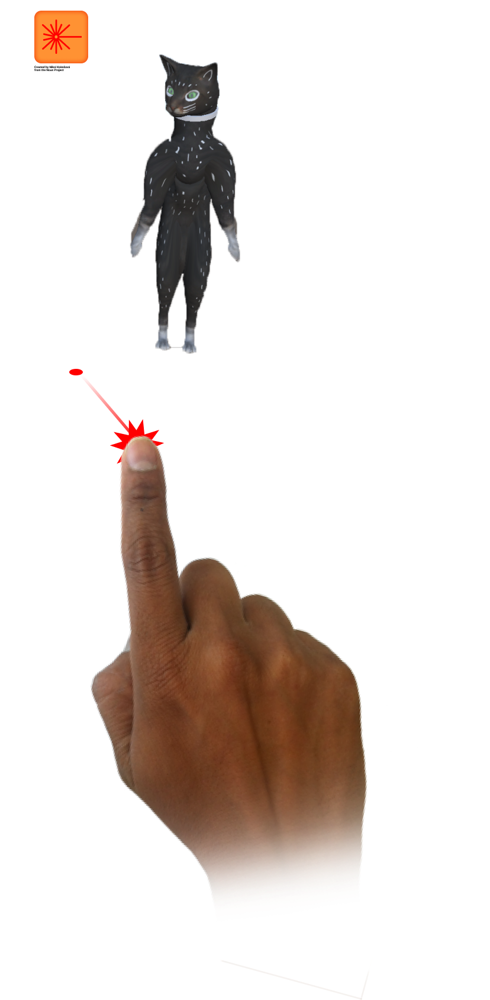

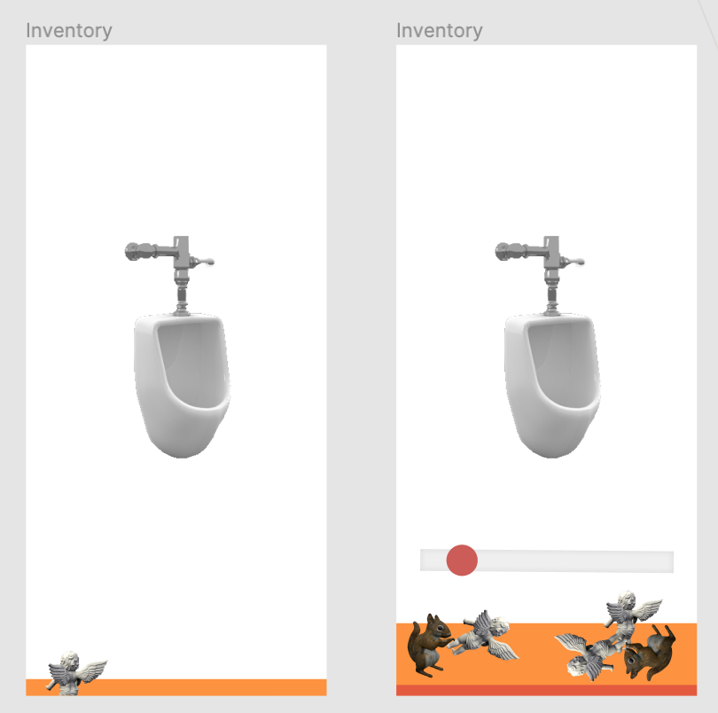

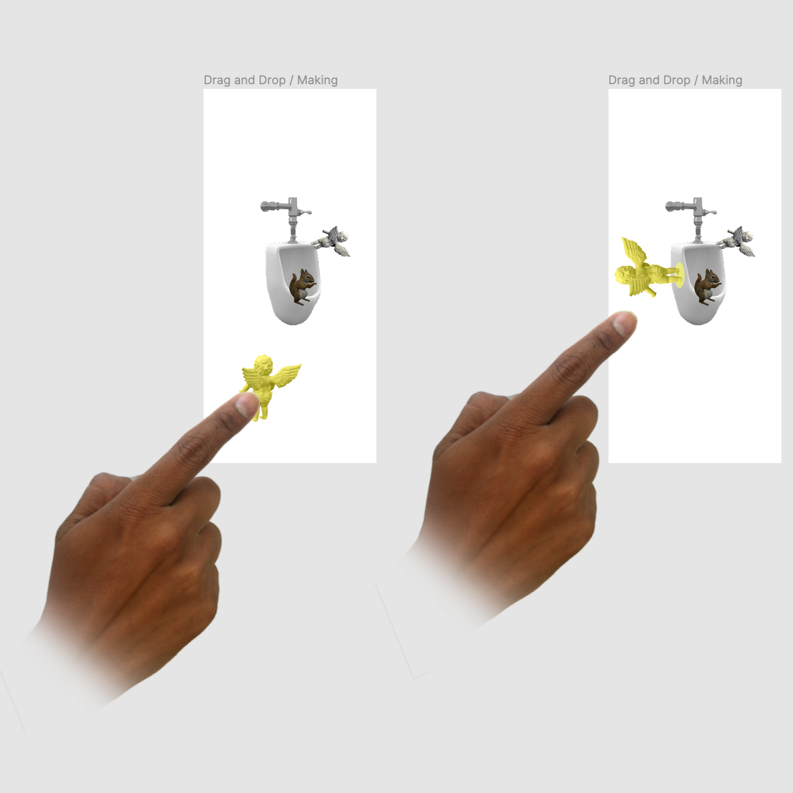

##Cat

Laura fosters over 20 cats. They are an inseparable element of the Claypen.

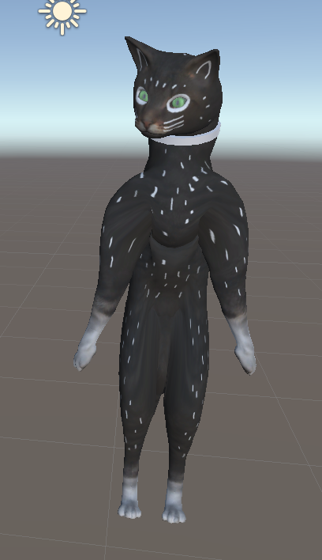

</img-pair>

</img-pair>

  

##Studio

We created a simplified version of Laura's studio for visitors to explore.

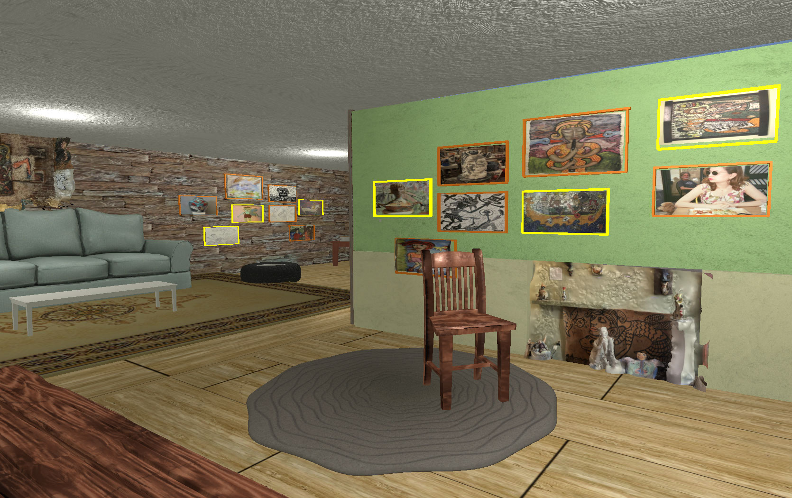

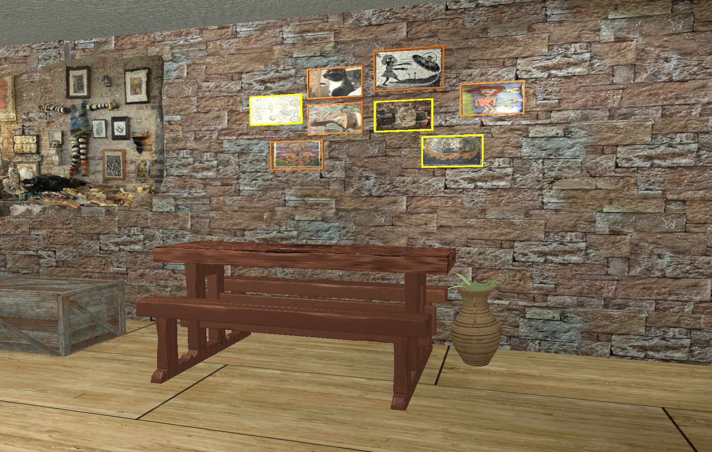

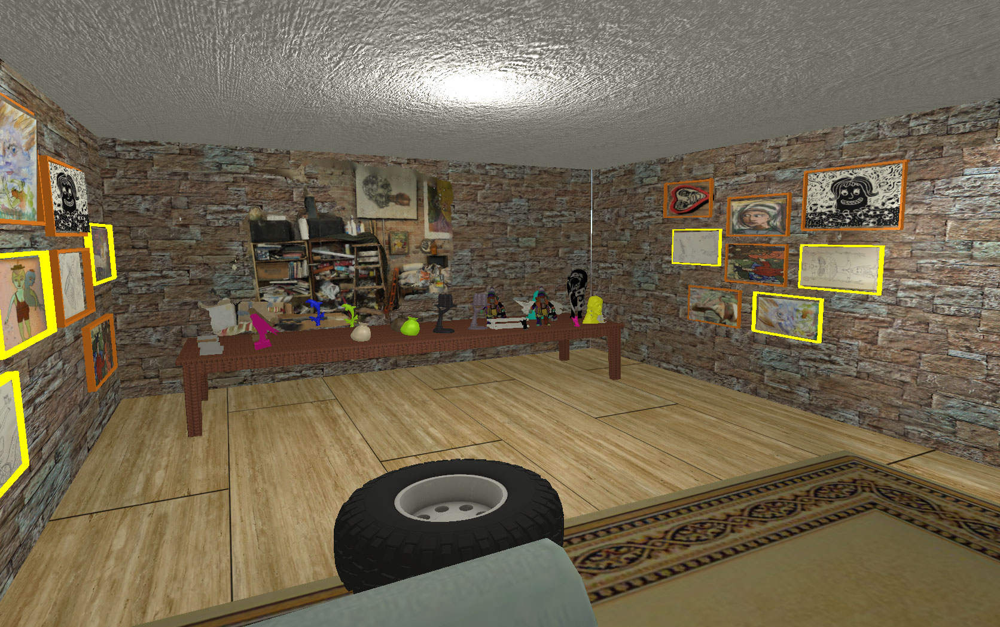

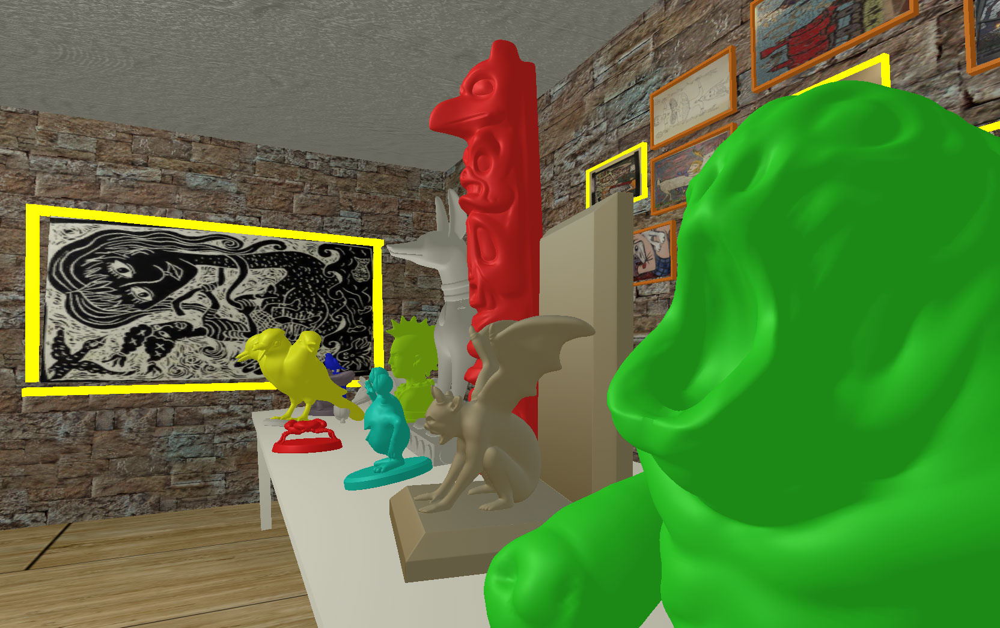

#REFLECTION

##Michelle and I were able to complete 90% of this project during the first three months of the pandemic, and for that I am very happy.

##Challenges Met

- This was our first time building a project with Cinema4D and Metashape, and I'm glad to add these tools to my artist's belt.

- It brings me joy to refer back to the UI we developed as a "urinal and cherub" interface. The drag and drop interface was challenging as both a UI design and execution in Unity C#.

- Translating Laura's work into a meaningful experience was exciting. Our visits (socially distanced) to the Claypen brought so much energy to this work, at a moment when we couldn't have felt more depleted.

   

*Thank you to Laura Jean McLaughlin for your help in creating this work.*

</grid-container>