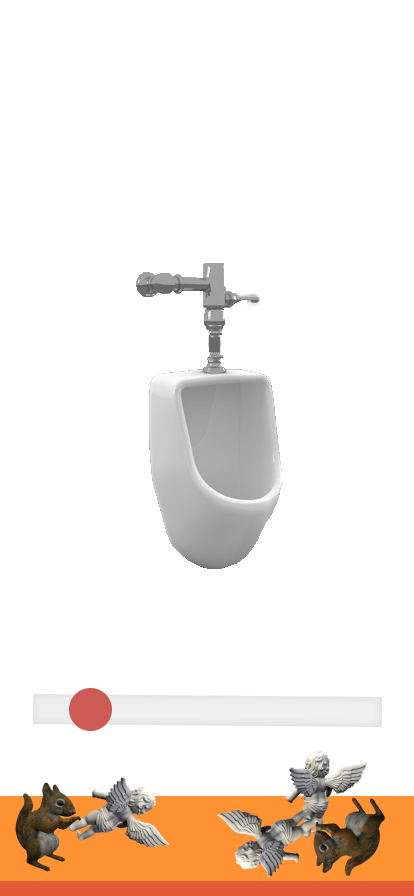
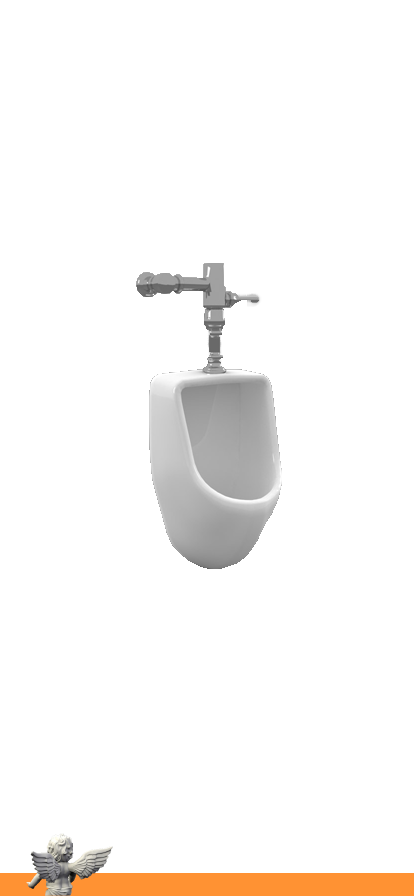
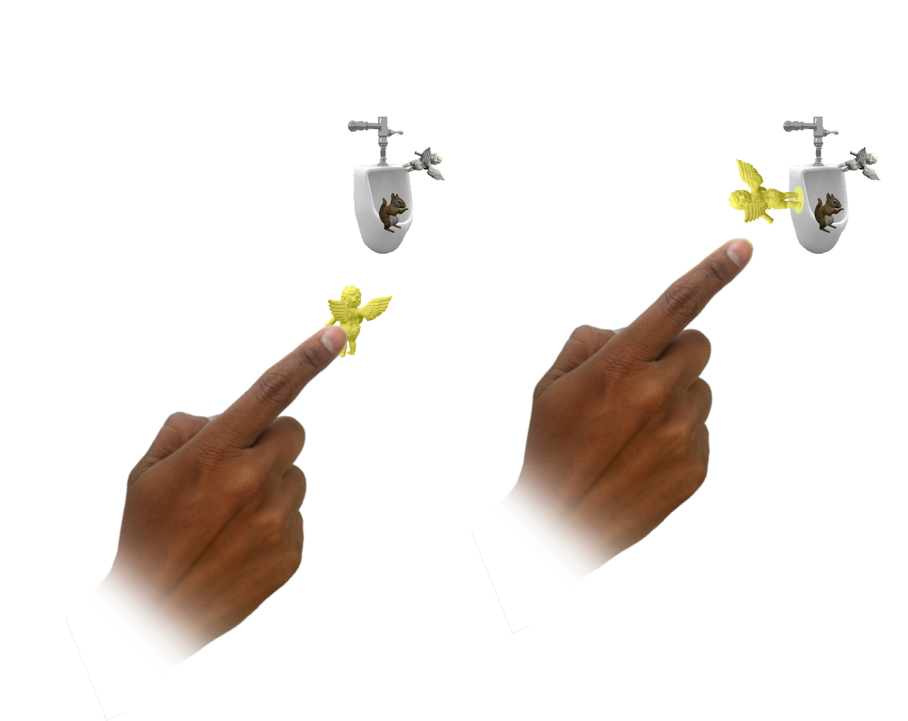

# Augmented reality. Schlumpy Funk.

<cover-img>

</cover-img>

<design-meta>

### WHAT

AR experience

### GOALS

Explore local artist's work

### WHEN

March - May 2020

### COLLABORATOR

[Michelle Cedeño](https://michellecedeno.com/)

### MY ROLE

Concept\
Research\
Design\
Development

### TOOLS

Figma\
Metashape\
Cinema 4D\
Unity

</design-meta>

<grid-container>

# OVERVIEW

An augmented reality experience bringing you closer to the work of Pittsburgh artist [Laura Jean McLaughlin](http://laurajeanmclaughlin.com/).

For this AR-design study, we were challenged to create a site-specific experience.

We created Schlumpy Funk Studio, a guided digital sculpting experience to celebrate Laura's practice.

# FINAL PRODUCT

## Celebrating Artist Laura Jean McLaughlin

Schlumpy Funk Studio pulls inspiration from her meditative studio practice and the many sites of her public artworks across Pittsburgh.

A QR code at each site of Laura’s works gives viewers access to the Schlumpy Funk Studios, where a cat named Boots will guide them to chill out, collect found objects, and bring them together into Schlumpy Funk sculptures.

  

<multi-mobile-container title="Collecting and Sculpting Actions in the App">
<mobile-container>

</mobile-container>
<mobile-container>

</mobile-container>
</multi-mobile-container>

  

   

# BACKGROUND

## Engaging with Laura Jean McLaughlin's artistic practice

I had the pleasure of being introduced to Laura via Michelle, who lived above her studio, the Claypen, at the time of the project.

</img-pair>

</img-pair>

## What is Schlumpy Funk?

<quote>

The word *schlumpy*, which has Yiddish origins, is often referred to as unkempt and sloppy.

The term *funk* originated from jazz artists when referring to improvisation and freestyle interludes.

</quote>

Laura started the [Schlumpy Funk](https://schlumpyfunk.wordpress.com/schlumpy-funk/) art movement.

In her words, it has "its origins based in the Surrealist, Dada and Funk movements. Clay artists [Robert Arneson](https://en.wikipedia.org/wiki/Robert_Arneson), [Peter Voulkos](https://en.wikipedia.org/wiki/Peter_Voulkos), [Beatrice Wood](https://en.wikipedia.org/wiki/Beatrice_Wood), and [George E. Ohr](https://en.wikipedia.org/wiki/George_E._Ohr) were all predecessors to the Schlumpy Funk movement, contributing free flowing, expressive and often humorous ceramic forms."

<button-link href="http://laurajeanmclaughlin.com/about/">READ MORE ABOUT LAURA</button-link>

  

# RESEARCH

## The Claypen

The site of Laura's practice - The Claypen Studio on Penn Avenue - was crucial for the development of this project.

Each month, people from all over Pittsburgh stroll Penn Avenue between the 4800 and 5500 blocks to meet with artists and business owners. Visitors can bask in Penn Avenue's creative energy – experiencing a mix of photography, dance, painting, sculpture, music and spoken word performances.

  

## Capturing Laura's Work with Photogrammetry

To capture the feeling of Laura's work, we transformed her studio's facade (see above) and a set of featured sculptures into 3D models using photogrammetry.

<h4>Laura's original sculpture, and below: Our photogrammetry model.</h4>

</img-pair>

  

<figure>

<figcaption>Photogrammetry model of bust on wall of the Claypen</figcaption>
</figure>

<figure>

<figcaption>Photogrammetry model of sculpture in the Claypen</figcaption>
</figure>

# PROTOTYPING

## Map of the Virtual Space

This map guided our arrangement of the 3D models in AR and served as a prototype of the user experience.

  

## Defining the UI

</img-pair>

<multi-mobile-container title="UI Mockup: Inventory Swipe Up and Horizontal Scroll">
<mobile-container>

</mobile-container>
<mobile-container>

</mobile-container>
</multi-mobile-container>

  

  

## Boots the Cat

Laura fosters over 20 cats. They are an inseparable element of the Claypen.

We decided to feature one cat, Boots, as the guide to the experience.

<multi-mobile-container title="Boots, in Unity and in a dance party at the end of the experience">
<mobile-container>

</mobile-container>
<mobile-container>

</mobile-container>
</multi-mobile-container>

  

  

## Studio

We created a simplified version of Laura's studio for visitors to explore.

# REFLECTION

## Michelle and I were able to complete 90% of this project during the first three months of the pandemic, and for that I am very happy.

## Challenges Met

- This was our first time building a project with Cinema4D and Metashape, and I'm glad to add these tools to my artist's belt.

- It brings me joy to refer back to the UI we developed as a "urinal and cherub" interface. The drag and drop interface was challenging as both a UI design and execution in Unity C#.

- Translating Laura's work into a meaningful experience was exciting. Our visits (socially distanced) to the Claypen brought so much energy to this work, at a moment when we couldn't have felt more depleted.

   

*Thank you to Laura Jean McLaughlin for your help in creating this work.*

</grid-container>