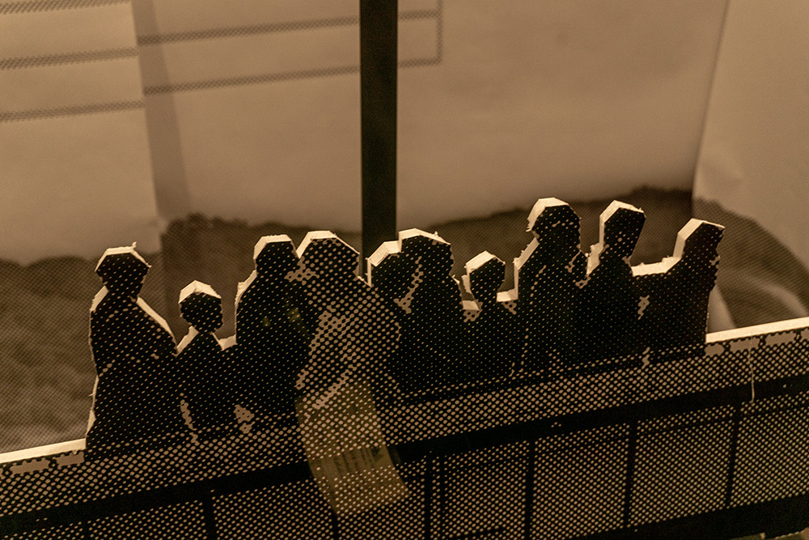
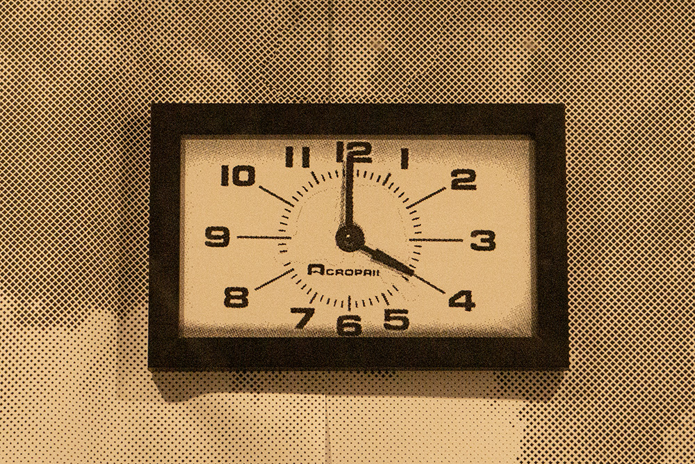
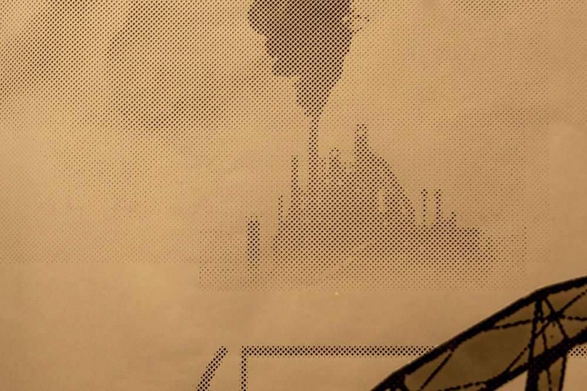

<group>

</group>

<group>
<r3>
<textbox>

“The Steel operated around the clock. I heard it. I lived close by. I heard it all the time. It was far enough away that the noise was not intrusive, but it was close enough to make us aware of when the constant clanging of metal would stop. Those pauses happened between worker shifts. …"

</textbox>
</r3>
</group>

<group>
<l3>

<l3>
</group>

<group>
<l3>
<textbox>

“It was not only the noise that signified the changing of worker shifts. It was the thousands of workers coming and going at the same time that also did it. Those shifts happened at 8:00 in the morning, 4:00 in the afternoon, and 12:00 midnight."

</textbox>
</l3>
</group>

<group>
<c3>

<c3>
</group>

<group>
<r3>
<textbox>

“I knew those times of day without ever having to wear a watch.”

~ Peter Kery, from <i>On Lost</i>, MFA Thesis Draft, Vermont College of Fine Arts

</textbox>
</r3>
</group>

<group>
<r3>

<r3>
</group>

<group>
<c3>
<textbox>

Shift Change is based on my father’s account of growing up in the shadow of Bethlehem Steel in the Lehigh Valley. It features images of the steel plant, its ore cranes and railroads, and the Minsi Trail Bridge once used by commuting steel workers.

</textbox>
</c3>
</group>

<group>
<c3>

<c3>
</group>

<group>
<c3>
<textbox>

My father, a graphic designer, and my grandfather, who drew engineering plans for the Steel, have inspired this piece.

</textbox>
</c3>
</group>

