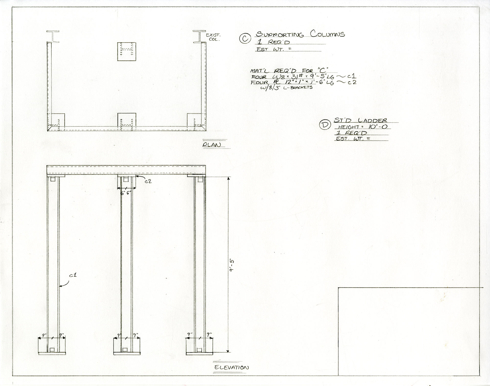

"Steel Drawings" is a learning and research project I conducted primarily over the Summer of 2019 with my grandfather, a retired designer-draftsman for the now defunct Bethlehem Steel Co. Over the course of this project, my grandfather taught me to draw in the technical style that he used in his career.

We developed a teaching process that mirrored how my grandfather worked alongside engineers at the company. To me, he submitted a concept drawing:

From this, I executed 'detail' drawings of the various elements of the structure. In the actual drafting process, these 'details' would be the actual drawings fabricators at the steel plant would reference as they built these structures.

My grandfather reviewed these drawings and offered feedback on how they could be refined. From this, I redrew and resubmitted them to him:

https://soundcloud.com/user-39152617/steel-drawings-feedback-session

My grandfather's home in Surprise, Arizona is a long way from my home in Pittsburgh, so we were frequently mailing our drawings back and forth to each other, and conducting these critiques over the phone. In the downtime between mail exchanges, I created this imaginative draft of the steel plant as a whole:

This drawing is based on an anecdote of my uncle who grew up well within earshot of the steel plant. He described to me the ceaseless work of the company as a lullaby he heard every night.

Some initial drawings as I learned:

This project began with research I conducted at the National Museum of Industrial History, much thanks to Curator of Collections Andria Zaia.

I was lucky to see many of the surviving drafts from the steel plant in the NMIH's collection and take home images to use as reference for this project:

Ilhan Citak at Lehigh University was also helpful to me in this work, and thanks to the university I stumbled across guidebooks for draftsmen that were also hugely important to me in understanding the drafting language and riffing off it in my own drawings.

Thanks of course to my grandfather and grandmother who spent hours on the phone with me, and to my Uncle Chris and my Aunt Geri, who housed me and helped me connect to people when I visited Bethlehem.

