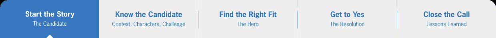
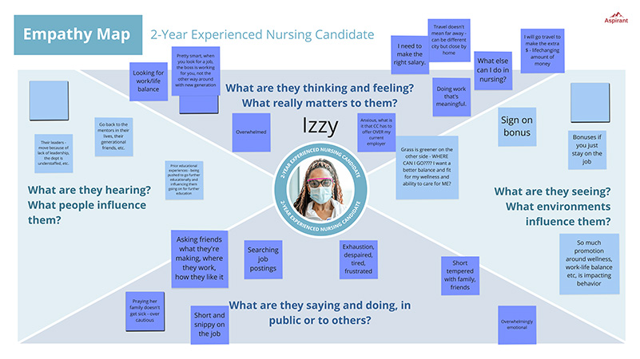

# Nurse Recruiter Storytelling Assistance

<cover-img>

</cover-img>

<design-meta>

### WHAT

Web App

### WHEN

February 2022

### MY ROLE

Discovery Research\
Design-Thinking Workshop Facilitator\
Prototyping and Evaluation

### TOOLS

Miro\
Figma

</design-meta>

<grid-container>

# OVERVIEW

[Aspirant Management Consulting](https://www.aspirant.com/) was contracted by a major hospital network to improve their nursing talent acquisition performance.

# UX CHALLENGE

## Matching Selective Nurses with a Major Hospital

Against a post-pandemic backdrop of competitor offers and travel nursing, these recruiters needed to concisely **pitch** to candidates positions that **matched** their interests in pay, benefits, and type of work.

# UX CHALLENGE

## Merging Talent and Marketing Storytelling

A collaboration between Aspirant's **Talent Consulting** and **Marking & Innovation** teams, this project needed to sell both teams' strategic brands, including M&I's **Storytelling** framework.

# UX SOLUTION

## Storytelling Pitchbook: Web App Guide for Nurse Recruiters

<browser-container isPrototype="false">

</browser-container>

We introduced the **Storytelling Pitchbook**, a bespoke web app breaking down the recruiting process into 5 major steps:

1. Start the Story
2. Know the Candidate
3. Find the Right Fit
4. Get to Yes
5. Close the Call

 

At each step, recruiters find a concise guide to **telling the story** of how their hospital is the right match for any candidate.

<button-link href="https://www.figma.com/proto/mlqGot0VpHod11CwmYNjJF/For-Sharing%3A-Storytelling-Pitch-Book?node-id=139-10626&t=mGtk5rNCHIztYdWj-1" target="_blank">VIEW FIGMA PROTOTYPE IN NEW TAB</button-link>

 

<iframe style="border: 1px solid rgba(0, 0, 0, 0.1);" width="800" height="450" src="https://embed.figma.com/proto/mlqGot0VpHod11CwmYNjJF/For-Sharing%3A-Storytelling-Pitch-Book?node-id=139-10630&node-type=canvas&scaling=min-zoom&content-scaling=fixed&page-id=139%3A10626&starting-point-node-id=139%3A10630&share=1&embed-host=share"></iframe>

# UX SOLUTION

## Information Filtering

Leveraging the web format, two sections offer filters to help recruiters drill down to the most pertinent info:

In "**Find the Right Fit**," recruiters apply what they learned in 'Know the Candidate' to identifying the candidate's **best match of nursing units**.

<browser-container isPrototype="false">

</browser-container>

In "**Get to Yes**," recruiters filter through a library of talking-points to discuss **benefits most likely to win over a candidate**.

<browser-container isPrototype="false">

</browser-container>

# UX PROCESS

## Semi-Structured Interviews

We conducted **over 20 hours** of interviews cumulatively with 40 recruiters, hiring managers, and nurses on the recruitment process and what new candidates are looking for.

<quote>

New grads might be drawn to our prestige, but they're not all going to be satisfied on a Med-Surg unit.

Some of them only want Critical Care or Pediatrics and they know they can be selective about where they go.

</quote>

<quote>

Nurses coming from smaller hospitals are wary of being lost in such a big one.

The application process has got to reflect that we have both lots of resources and a strong family feel.

</quote>

I analyzed their responses via affinity diagramming and collaborated with Aspirant's [Digital Discovery](https://www.aspirant.com/digital-discovery) team to use their proprietary AI tool to assess and extract further insights from our interview notes.

I used that analysis to structure activites in our collaborative design thinking workshop.

# UX PROCESS

## Journey Map

We further synthesized our analysis into a journey map to validate our understanding of the recruiting process with our stakeholders:

# UX PROCESS

## Design Thinking Workshop

**18** recruiters, hiring managers, nurses, recruiting administrators, and designers.

**3 x 2hr** sessions using Miro and Zoom.

Together, we **co-created** a suite of design artifacts to define nursing candidates' motivations and actions in the hiring process.

### Empathy Maps

The workshop broke out into 3 smaller groups for its design-thinking exercises. Each group focused on an archetypical candidate of a specific level of experience.

### Personas, Mind Maps, Task Maps

These three further exercises helped us thoroughly define the candidate experience.

### Storytelling

Participants wrapped up the workshop by **mapping their insights** onto the **Storytelling framework** from Aspirant's Marketing & Innovation team:

# UX PROCESS

## Lo-fi Prototypes

I produced two iterations of lo-fi prototypes to validate our design direction.

We showed the first, below, to our workshop participants in an informal *I think, I like, I wish* exercise.

<browser-container isPrototype="true">

</browser-container>

<browser-container isPrototype="true">

</browser-container>

The second we validated with a Think-Aloud protocol with a subset of recruiters and hiring managers from our workshop.

Their feedback informed our final designs.

<button-link href="https://www.figma.com/proto/mlqGot0VpHod11CwmYNjJF/For-Sharing%3A-Storytelling-Pitch-Book?node-id=139-10626&t=mGtk5rNCHIztYdWj-1" target="_blank">VIEW FIGMA PROTOTYPE IN NEW TAB</button-link>

</grid-container>