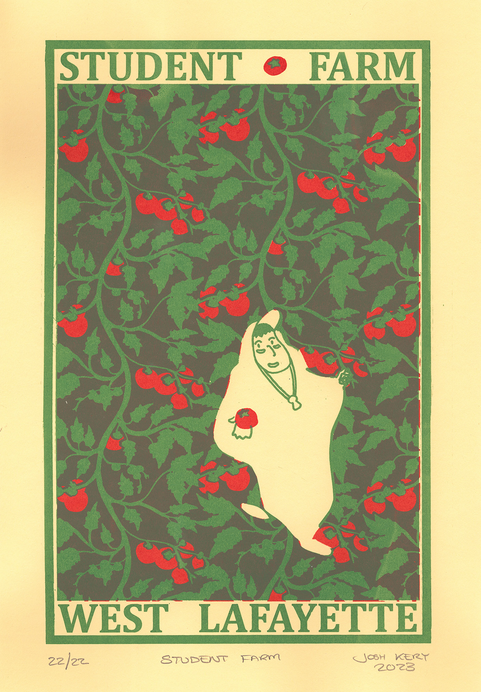
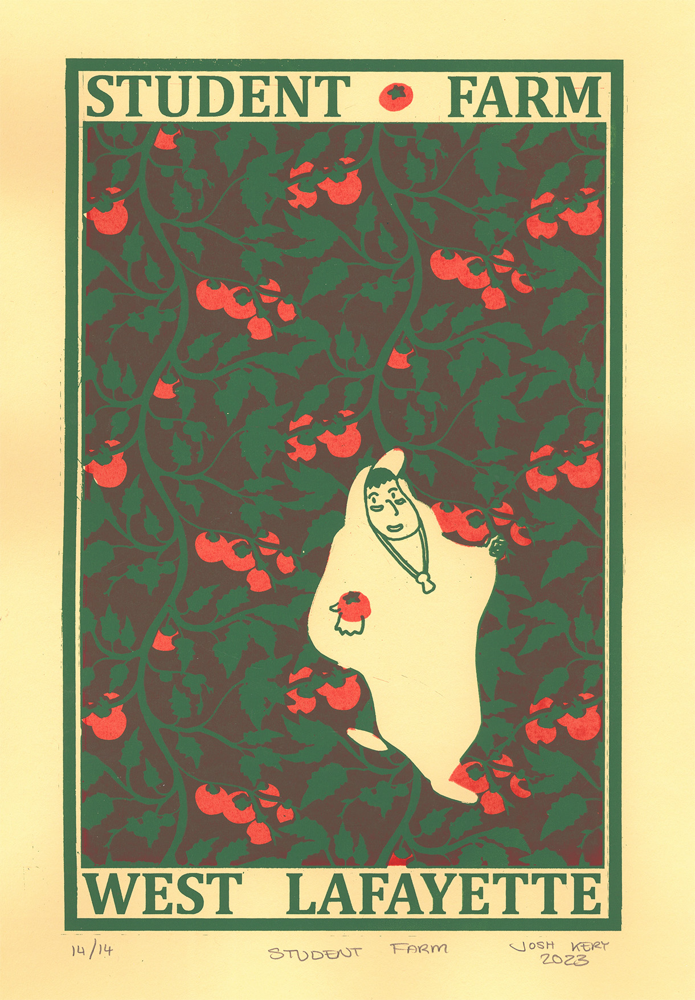

<group>
<c3>

</c3>
</group>

<group>
<c3>

</c3>
</group>

<group>
<c3>
<textbox>
Inspired by my friend Nathan, who took me to the student farm at Purdue University and shared with me the best tomato I've ever tasted. Design inspired by William H. Bradley's lithograph poster for <i>The Inland Printer, Christmas 1895 issue.</i>
</textbox>
</c3>
</group>