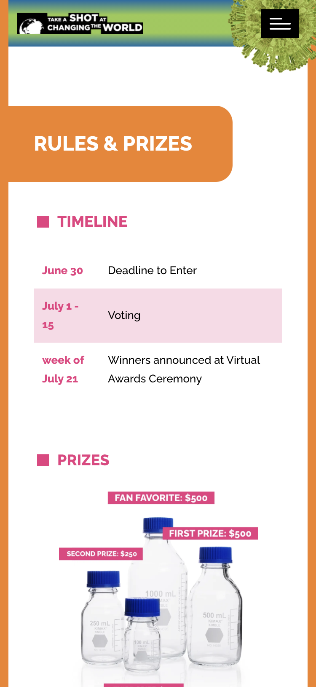

# Responsive Website for Educators

<cover-img>

</cover-img>

<design-meta>

### MEDIUM

Responsive Website

### WHEN

March - April 2021

### MY ROLE

Design,\
Full-Stack Development

### GOALS

Celebrate science with teens through a video contest.

### TOOLS

Adobe Illustrator\
Wordpress

</design-meta>

<grid-container>

# OVERVIEW

To celebrate science and vaccine research alongside the documentary film, <a href="https://www.creative.pitt.edu/pittsburgh-lens/chasing-covid" target="_blank" rel="noreferrer"><i>Chasing Covid</i></a>, producer Carl Kurlander and the <a href="https://www.aiu3.net/" target="_blank">Allegheny Intermediate Unit</a> commissioned me to build a video contest website.

The contest asks teens grades 6 - 12 to make their own videos and help good information about science **go viral**.

  

<button-link href="https://www.takeashotatchangingtheworld.org">VISIT THE TAKE A SHOT WEBSITE</button-link>

  

# UX PRODUCT

## Responsive Web Interface

<browser-container>

</browser-container>

<multi-mobile-container title="Mobile Landing Page">
<mobile-container>

</mobile-container>
</multi-mobile-container>

  

<browser-container>

</browser-container>

<browser-container>

</browser-container>

<multi-mobile-container title="Mobile Rules & Prizes and Educational Resources Page">
<mobile-container>

</mobile-container>
<mobile-container>

</mobile-container>
</multi-mobile-container>

# BACKGROUND

## Inspired by the Documentary

[*Chasing Covid*](https://www.creative.pitt.edu/pittsburgh-lens/chasing-covid) tells the story of the research team at the [Center for Vaccine Research](https://www.cvr.pitt.edu/) at the University of Pittsburgh as they worked to develop a vaccine for COVID-19 in 2020.

To engage schools in celebrating the work of vaccine researchers everywhere, *Take a Shot at Changing the World* invites students to submit their own videos to a contest with a cash prize.

To do so, the contest creators needed a website that could:

1. Share the film *Chasing Covid* and information about the contest
1. Accept and feature video submissions
1. Share educational resources with teachers looking to add this program to their curricula

# DESIGN PROCESS

## Mood Board and Concept Sketching

While discussing functional needs with the contest's project managers, I began by assembling a mood board over Pinterest and by sketching aesthetic features for the site.

  

## Collaborative Outline

Together with the contest's project managers, we created the following outline for the site:

- Main Page
    - General Information about Contest
    - Link or Embed: Chasing Covid film
- Other Pages
    - Resources for Educators
        - Lesson Plans
        - Links to Covid-19 Resources
        - articles
        - additional videos 
        - Historical Information on polio and history of vaccines
    - Video Competition Rules
    - Submission Form
    - Galleries
        - Gallery: Middle School Videos**
        - Gallery: High School Videos**
    - My Info (if logged in) OR Login & Register (if logged out)
        - Logout
        - Profile Details
        - Change Password
        - My Video

  

## Mid-fi Mockups

I produced two concepts at this stage to gather feedback about the aesthetic direction of the site.

<browser-container isPrototype="true">

</browser-container>

<browser-container isPrototype="true">

</browser-container>

  

## Hi-fi Mockups

<browser-container isPrototype="true">

</browser-container>

<browser-container isPrototype="true">

</browser-container>

<browser-container isPrototype="true">

</browser-container>

<browser-container isPrototype="true">

</browser-container>

With the graphics prototyped at a high fidelity, and with the website leveraging traditional interaction patterns, I decided to move into development rather than create a clickable prototype.

<button-link href="https://www.takeashotatchangingtheworld.org">VISIT THE TAKE A SHOT WEBSITE</button-link>

</grid-container>

