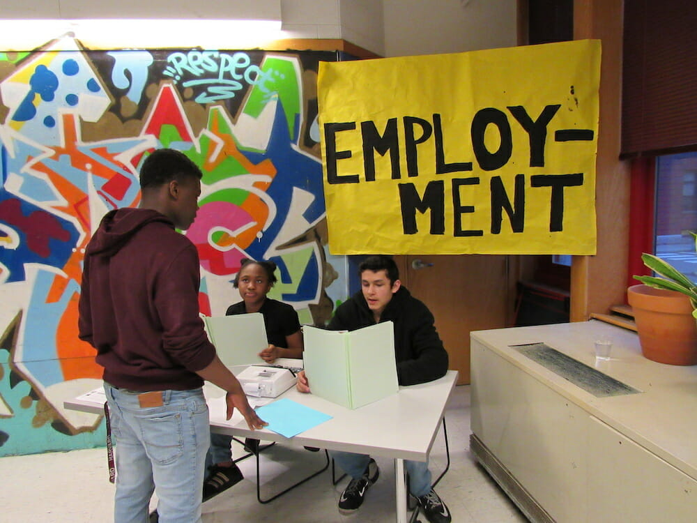
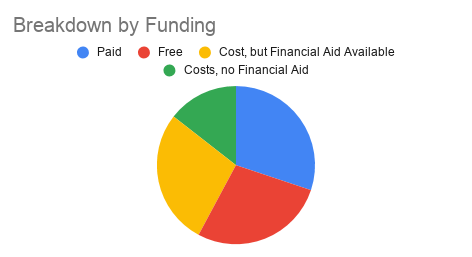
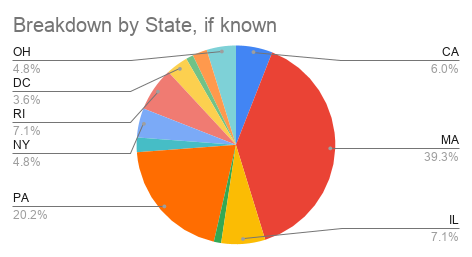
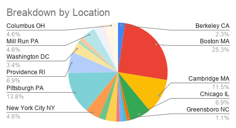
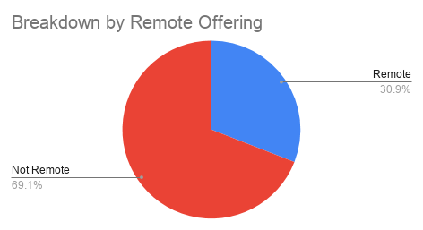
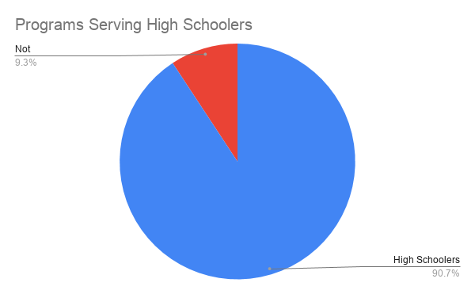
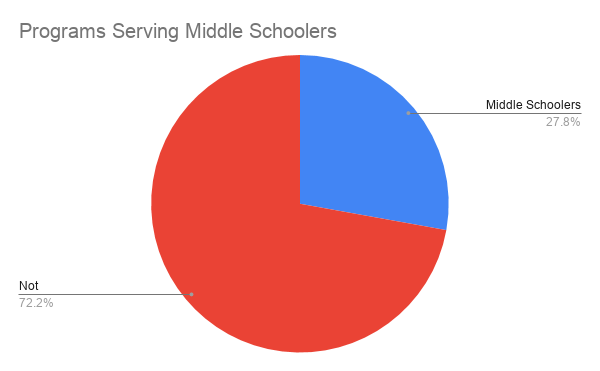

#Resource List

<cover-img>

</cover-img>

<design-meta>

###WHAT

Tool to find design programs for teens

###WHEN

April 2021

###WHERE

Design Museum Everywhere

###MY ROLE

Research\
Design\
Development

</design-meta>

<grid-container>

#OVERVIEW

##A way to browse 90+ teen programs in design fields

##For teens interested in design across the United States

##Prepared with a focus on teen participants in the [Neighborhood Design Project with Design Museum](https://designmuseumfoundation.org/program/neighborhood-design-project/)

#FINAL PRODUCT

##Built with React and Material UI.

<iframe src="https://joshuakery.github.io/teen-design-programs/" height="800"></iframe>

<a target="_blank" href="https://joshuakery.github.io/teen-design-programs/"><h2>Or see the project in a new tab here.</h2></a>

#RESEARCH

##In addition to being a resource for teens looking to pursue work in design, the list of programs serves as a benchmarking tool for Design Museum to evaluate its education programs, like Neighborhood Design Project and [Summer Design Project.](https://designmuseumfoundation.org/program/summer-design-project/)

##Teen participants were financially compensated for their time in Neighorhood Design Project—a model that sets Neighborhood Design Project and its peer programs apart from the majority of youth education programs centered on design.

##Neighborhood Design Project was piloted for two years with the Cambridge Department of Human Service Programs in 2020 and 2021. The program targeted middle and high school students.

</grid-container>