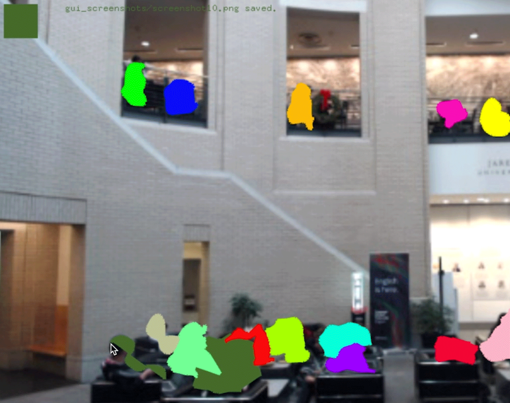
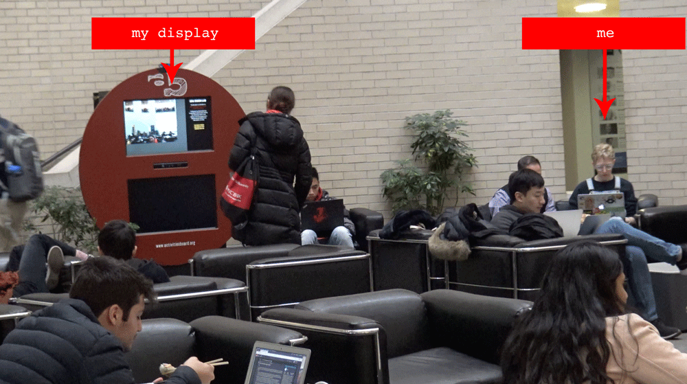
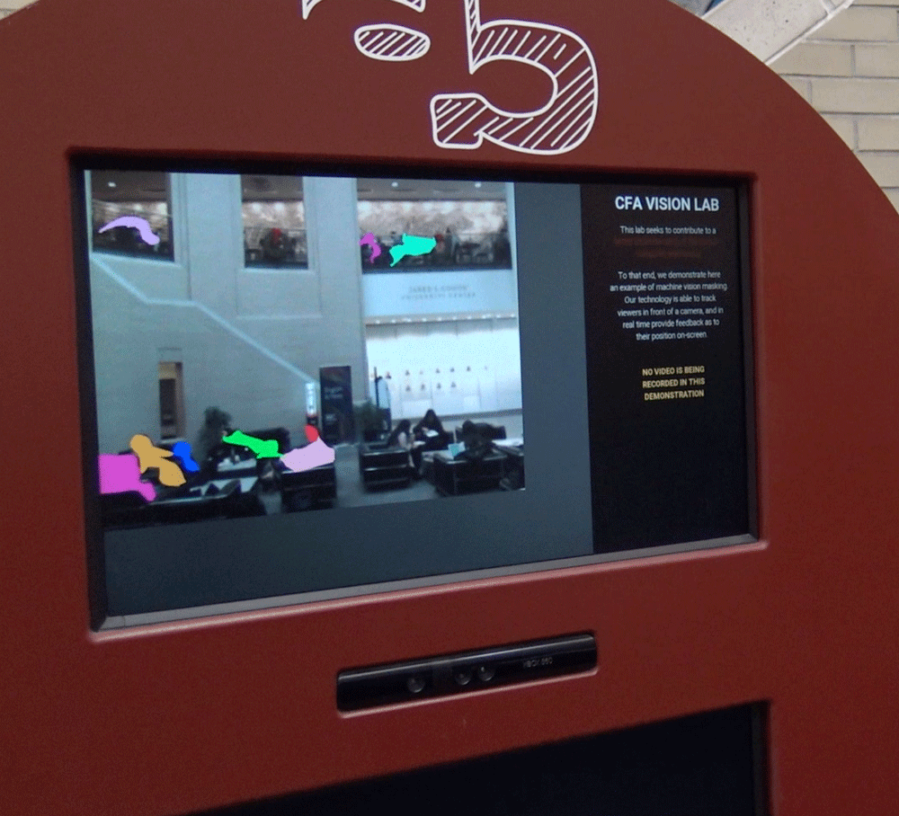
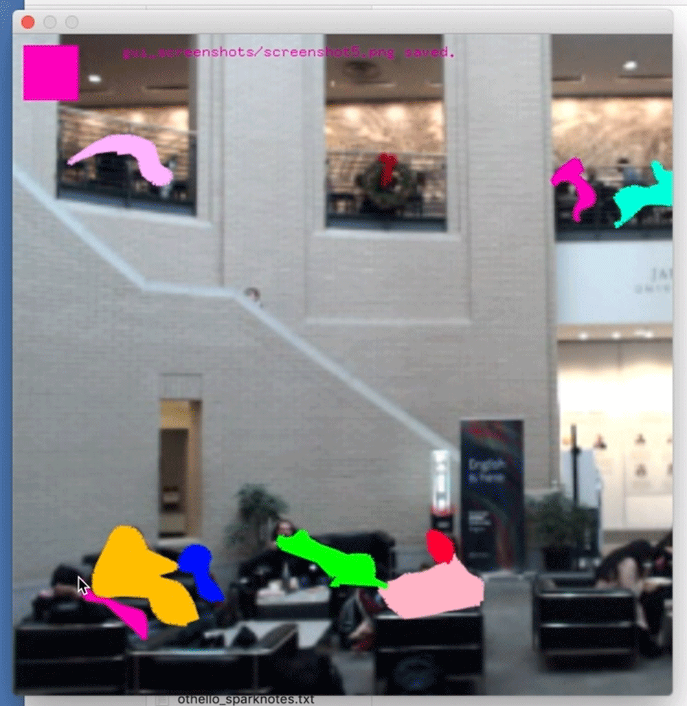
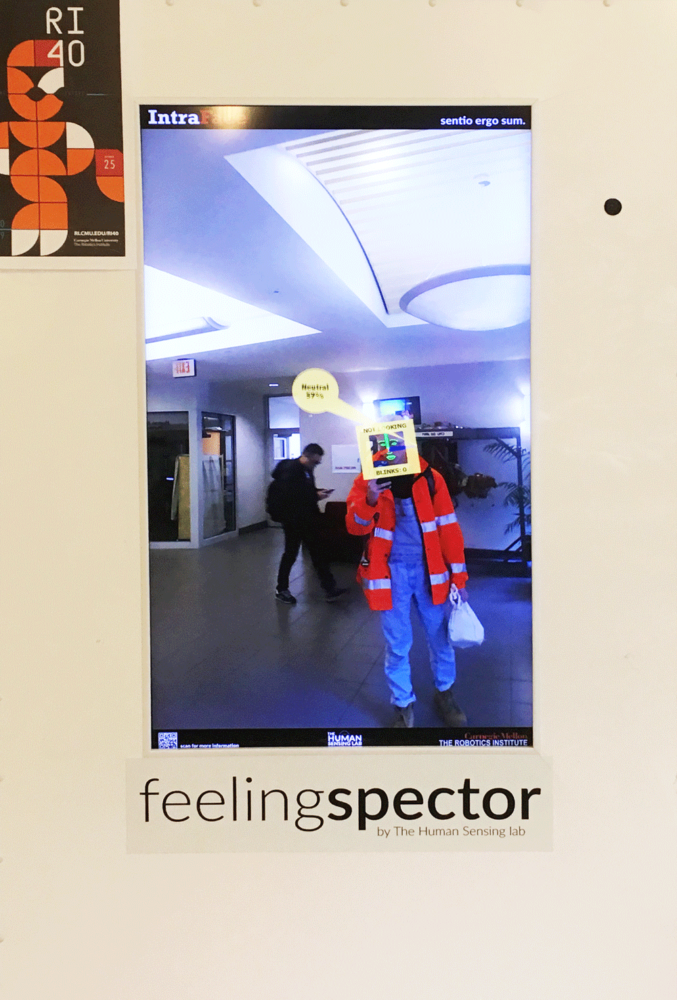
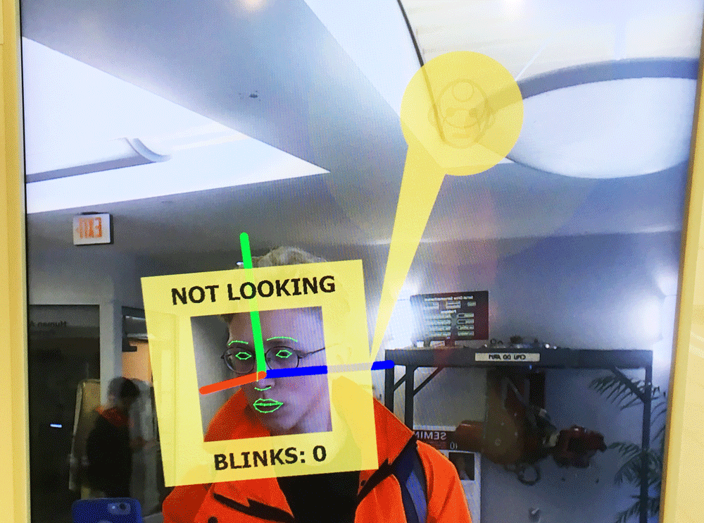
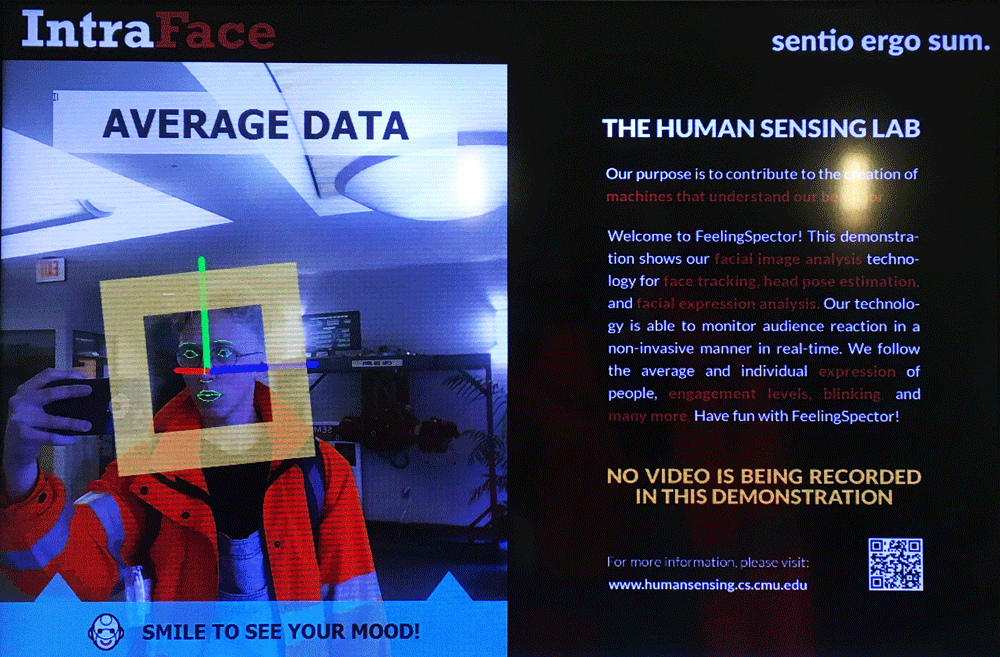
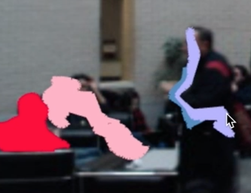

`youtube: https://www.youtube.com/watch?v=dvM-dZlUVSQ`

CFA Vision Lab was a durational performance as an AI. For three hours in the Cohon University
Center at Carnegie Mellon University, I performed the job of a machine vision demo, drawing
solid color masks over human bodies and objects in a live video feed of the room. My work was
shown on an existing screen in the University Center, so that passersby might believe that the
masking was a demonstration of a genuine machine learning algorithm. But not if they looked
over to their right; I sat just a few feet away from my display, quietly but frantically tracing them
with my mouse.

This performance was intended to blend in with existing machine vision demos on the Carnegie
Mellon campus, notably feelingspector on display in Newell-Simon Hall. To that end, I chose the
existing AB Tech display in CMU University Center to show this work. These demonstrations
are, for CMU students, so commonplace that they hardly attract notice.

CFA Vision Lab was developed in C++ with OpenFrameworks, and uses optical flow to “stick”
my pixels to the subjects that I masked. Please note in the demo video that I struggled with the
effect of this on people walking quickly through the room, because they would walk away with
my colors which I had so carefully drawn over the people sitting more still.

I want this performance to live among the work of other people acting as machines. Machine
learning attracts great attention, from the design industry to insurance. But where businesses
lack the training data or the resources to acquire it to produce a machine learning model, they
may fall back on human laborers to pretend to be the bots and do the machines’ work of
labelling images or steering vehicles. Amazon’s Mechanical Turk is then aptly named. As a
service that organizes laborers to sometimes perform this ruse, it fulfills the role of the original
mechanical turk, a chess player who disguised himself as a machine that plays chess. Both
involve the work of humans sold as the work of machines at higher value.

My performance is an interrogation of the on-campus machine vision demo, which stands for
this sale of human labor as machine labor, spearheaded by the university. To perform as this
AI—university touted—is to acknowledge that the accomplishments of the machine-learning
science are often overstated at the expense of crediting human laborers.

That in the context of CMU in particular machine vision demos go unremarked allows my
performance to walk this line between bringing attention to the machine without remarking on
the human behind it. Where AI is on display but unremarkable stands for the paradox between
sensationalizing AI while de-emphasizing the human labor behind it. We must address that the
human actor and the AI are not separate entities, but one and the mask that it wears.

