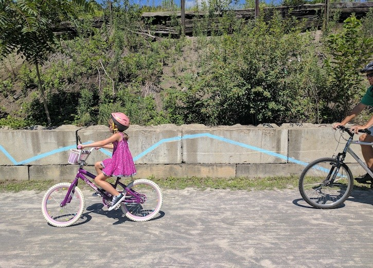

`youtube: https://www.youtube.com/watch?v=-2wOi8ma14s&t=2s`

“Waterline” encourages responsible water use by drawing a line of where water would flow if you kept pouring it on the ground in front you.

Waterline is an app with the goal of demonstrating all the areas that you affect with your daily use of water, to encourage habits that protect the natural environment and the public health of everywhere downstream of you. The app is designed for the Allegheny Watershed around Pittsburgh. Here, it maps the flow of water downhill from your current location to the nearest of the city’s three rivers, and from there continues the line downstream. The app provides a compass which always points downstream, making your device a navigation tool to be used to follow the flow of water in the real world. By familiarizing you with the places that you might affect when your wastewater passes through them, Waterline encourages you to adjust your use of potential pollutants and your consumption of water to better protect them.

Waterline was inspired by Water Walks, organized by Zachary Rapaport, which began in Spring 2019, as well as by Ann Tarantino’s piece, Watermark, in Millvale this past year. Both of them are raising awareness about the role water plays in our lives in the Pittsburgh area, with a focus on critical issues that affect entire towns in Pittsburgh.

Some of my sketchbook work for this piece:

