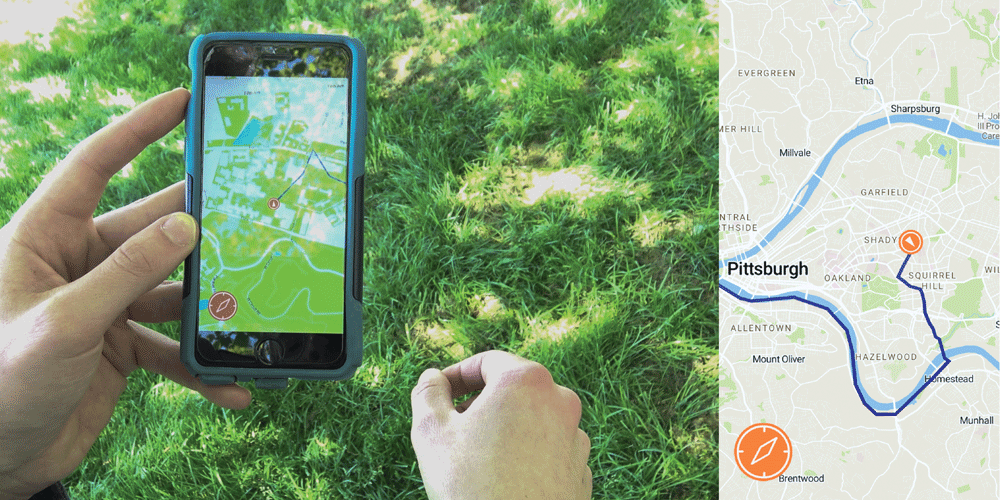

#Water Visualization App

<cover-img>

</cover-img>

<design-meta>

###MEDIUM

Mobile Application

###WHEN

May, 2019

###WHAT

Design, Development

###GOAL

Encourage Clean Water Practices at their Source

###TOOLS

Adobe Illustrator, Unity, Mapbox SDK

</design-meta>

<grid-container>

#OVERVIEW

##Pittsburgh's water issues revolve around an *abundance* of rainwater: Where does it all go, and what does it carry with it? Flooding, sewage overflow, and industrial pollution are critical issues for a city that prides itself in its rivers.

##“Waterline” is a mobile app that encourages responsible water use by showing users who is affected by the downstream journey of their water. The app draws a line that starts at the user's current position and travels in the direction that water and contaminants would flow downhill to reach the nearest river.

#FINAL PRODUCT

`youtube: https://www.youtube.com/watch?v=-2wOi8ma14s&t=2s`

#BACKGROUND

##Pittsburgh's civil servants, local leaders, and artists have for a long time tackled flooding and pollution in the city's water system. 

Waterline was specifically inspired by Zachary Rapaport's Water Walk in Larimer, PA (2019) and Ann Tarantino’s Watermark (2019) in Millvale, PA. Both artworks chart the flow of water through two of the neighborhoods hit hardest by flooding in the city, raising awareness for the impact of this issue in our daily lives.

But the question of how water moves through our neighborhoods during a flood can also answer the question of where it's picking up pollutants along the way.

#DESIGN

##Waterline was built in Unity using the Mapbox SDK. It features two main screens:

<h4>

A compass, which directs the user downhill from their current location.

</h4>

</img-pair>

<text-pair>

<h4>

And a map, which shows the user the path charted from their current position downhill to the nearest river.

</h4>

</text-pair>

</grid-container>