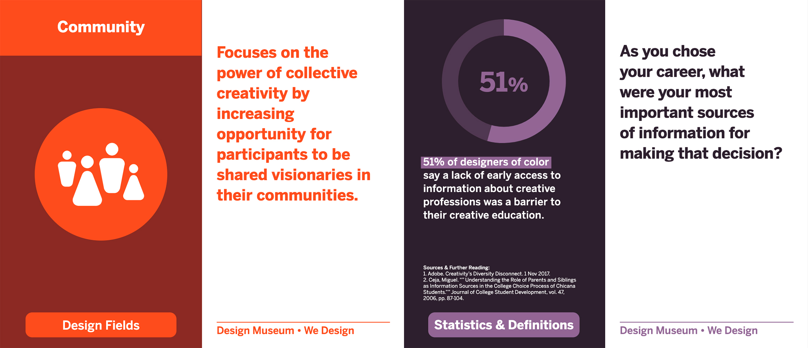
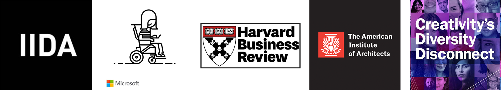

#An Educational Card Deck Accompanying Design Museum Everywhere's [We Design Exhibition](https://designmuseumfoundation.org/we-design-online-exhibition/)

<cover-img>

*sample of two cards*

</cover-img>

<design-meta>

###WHAT

Educational Card Deck

###USE

Diversity, Equity, and Inclusion Education

###WHEN

Sept - Oct 2020

###MY ROLE

Research, Writing, Source Checking

###TEAM

Mimi Shalf\
Diana Navarrete-Rackauckas

</design-meta>

<grid-container>

#OVERVIEW

##This We Design Exhibition card deck is designed to accompany [Design Museum Everywhere](https://designmuseumfoundation.org/)'s online exhibition, [We Design](https://designmuseumfoundation.org/we-design-online-exhibition/). 

From the exhibition:

<quote>

"Our latest exhibition brings together creatives from a wide range of backgrounds to examine and celebrate the range of career paths, applications, and impact in design."

</quote>

##This card deck pairs the exhibition content with written prompts that invite reflection on our career paths and our relationship to the communities in which we design and live.

#RESULTS

##The Design Museum Education Programs team revised a minimally sourced, original card deck to produce this latest deck, featuring 20 new cards researched, written, and source-checked.

For more information regarding my work on this project, please reach out to me.

#REFERENCES

The statistics and vocabulary definitions on our cards were sourced from the following:

1. Adobe. Creativity’s Diversity Disconnect. 1 Nov 2017.

2. The American Institute of Architects. Diversity in the Profession of Architecture. The American Institute of Architects, Jan 2016. 

3. Carroll, Antionette. “Diversity & Inclusion in Design: Why Do They Matter?” AIGA, 1 Jul 2014.

4. Ceja, Miguel. "" Understanding the Role of Parents and Siblings as Information Sources in the College Choice Process of Chicana Students."" Journal of College Student Development, vol. 47, 2006, pp. 87-104."

5. Collins, Cory. ""What is White Privilege, Really?: Recognizing white privilege begins with truly understanding the term itself."" Teaching Tolerance, no. 60, 2018.

6. Creative Reaction Lab. https://www.creativereactionlab.com/our-approach

7. Curbed. “On Race and Architecture: Facing the design profession's diversity problem—and its changing future.” Curbed, 22 Feb 2017.

8. Fairs, Marcus. ""Survey of top architecture firms reveals 'quite shocking' lack of gender diversity at senior levels."" Dezeen, 16 Nov 2017.

9. Fernandes, Catarina R., and Jeffrey T. Polzer. ""Diversity in Groups."" Emerging Trends in the Social and Behavioral Sciences: An Interdisciplinary, Searchable, and Linkable Resource, edited by Robert A. Scott, et al., Wiley, 2015.

10. Give A Grad A Go. ""What is Diversity in the Workplace?"" Give A Grad A Go, 21 Aug 2019, www.giveagradago.com.

11. Hewlett, Sylvia Ann, et al. ""How Diversity Can Drive Innovation."" Harvard Business Review, Dec 2013."

12. ""Implicit Bias."" Perception Institute. perception.org/research/implicit-bias. Accessed 16 Sep 2020."

13. International Interior Design Association. Design & Diversity. International Interior Design Association, 2016."

14. Kendall, Frances E. ""Understanding White Privilege."" Understanding White Privilege: Creating Pathways to Authentic Relationships Across Race, 2nd ed., Routledge, 2013."

15. Ladson-Billings, Gloria. “But That's Just Good Teaching! The Case for Culturally Relevant Pedagogy.” Theory Into Practice, vol. 34, no. 3, 1995, pp. 159–165. JSTOR, www.jstor.org/stable/1476635. Accessed 24 Sept. 2020.

16. Microsoft. Inclusive Design. Microsoft Design. microsoft.com/design/inclusive. Accessed 16 Sep 2020."

17. Miller, Claire Cain. “Opening a Gateway for Girls to Enter the Computer Field.”  The New York Times, 2 Apr 2013.

18. National Association of Independent Schools. ""Kimberlé Crenshaw: What is Intersectionality?"" YouTube, uploaded 22 Jun 2018."

19. ""QuickFacts United States."" The U.S. Census Bureau. census.gov. Accessed 16 Sep 2020."

20. Rhode Island School of Design. Bridging STEM to STEAM: Building New Frameworks for Arts/Science Pedagogy. Rhode Island School of Design, 20-21 Jan 2011."

21. Sackeyfio, Christina. ""Empathy: A Key Ingredient in Effective Diversity, Equity, and Inclusion."" Charity Village, 3 Feb 2020.

22. Snowden, Kristin. ""Equity vs. Equality vs. Liberation: First Steps Toward Inclusive Classroom Discussions."" Teachers Workshop. 10 Jul 2019.

23. ""Social Identity Wheel."" University of Michigan LSA. https://sites.lsa.umich.edu/inclusive-teaching/sample-activities/social-identity-wheel/, Accessed 16 Sep 2020."

24. ""The problem with that equity vs. equality graphic you’re using."" Cultural Organizing, 1 Nov 2016."

25. ""What does it Mean to be Culturally Responsive?"".  The Latino Family Literacy Project.  https://www.latinoliteracy.com/mean-culturally-responsive/"

26. ""What is intersectionality, and what does it have to do with me?"" YW Boston, 29 Mar 2017.

</grid-container>